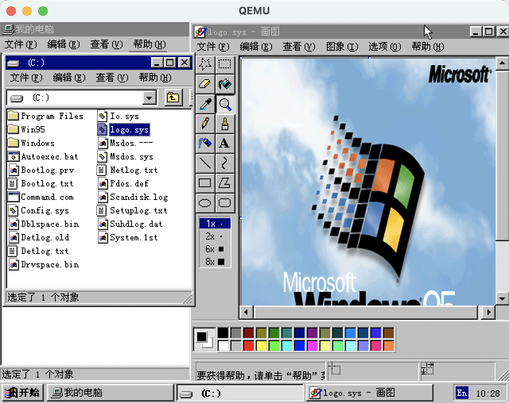
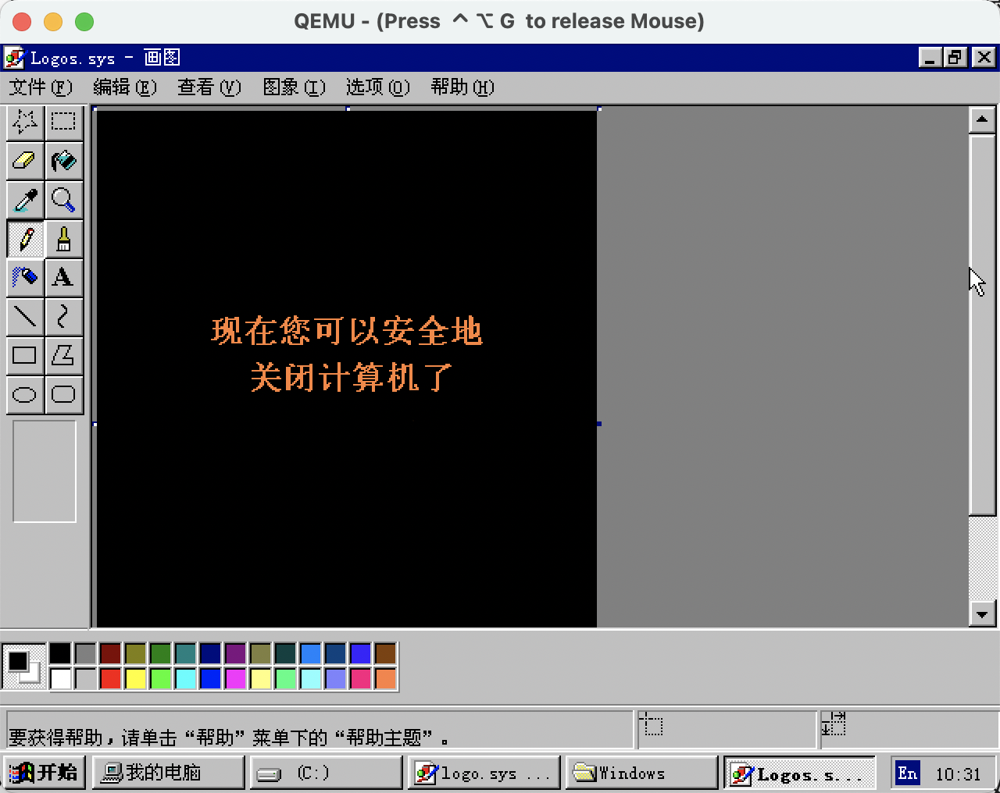
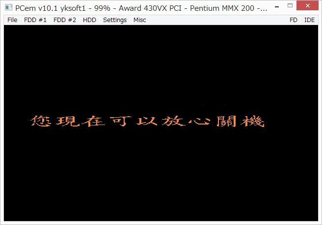

# Windows 9x启动画面下方的进度条是如何动起来的

也不知道还有多少人记得 Windows 95 或 Windows 98 的启动画面。

马上就 2025 年了，或者应该这样问，你见过 30 年前 Windows 95 的启动画面吗？

Windows 经典的多彩窗口徽标漂浮在蓝天白云中。

“你看，多么蓝的天。走过去，你可以融化在那蓝天里。一直走，不要朝两边看……“。

但请往底部看，那里有一个动态的状态条（点阵形式的进度条），用来显示系统加载的进度，以减少用户等待时的焦虑。

底部的状态条看似是覆盖在背景图之上的小动画，但实际上却只是静态背景图的一部分。微软的美工和程序员们用了一个十分巧妙的方法，实现了状态条在流动的效果（错觉）。

这个技巧就是所谓的**调色板动画**。

动画通常意味着图形的形状、位置、尺寸等发生了变化。而调色板动画只是通过改变特定区域的颜色来产生“动画”效果，实际上所有图形都没有“动“，还都是静止的。

下面就以 Windows 95 为例，一起来看一看调色板动画这个小戏法的原理。

---------

Windows 95 的启动画面存储在 `C:\logo.sys` 这个文件中。不要被扩展名 `.sys` 迷惑了，这就是一个可以用画图程序打开的 BMP 位图文件，而且尺寸还有点奇怪，是 320 × 400 像素。当年有不少用户通过调整或替换该文件来自定义启动画面，展现自己的创意（但不一定都实现了进度条动画）。

BMP 位图文件的结构比较简单，主要由 4 部分构成：
* 文件头（Bitmap File Header）
* 信息头（DIB header）
* 调色板
* 像素数据

文件头和信息头包含了文件尺寸（占多少字节）、宽度和高度以及水平和垂直分辨率等信息。

当图片的最大颜色数小于等于 256 色时，图片中用到的颜色会先存放在调色板中（和画水彩画一样，先把要用的颜色挤到调色碟中），这样一来就不用存储每个像素的 RGB 颜色信息（至少需 8 × 3 = 24 比特）了，而只需要存储所用颜色在调色板中的编号（仅需 8 比特）即可。这很像那种数字油画填色，画板上的空白区域里写有一个数字，我们只需要用数字对应的颜色填充这些区域就能完成一幅作品。

**调色板动画的关键就在于调换颜色**，例如把 1 号颜色换成 2 号颜色，2 号换成 3 号，3 号换成 4 号……。其次是能够产生动画效果或错觉的图案。

那么问题来了，怎么知道哪些颜色是专用于形成动画、可以调换的，哪些是不能任意改变的。毕竟随意调换的话就会破坏背景图。

这就需要用到信息头（DIB header）中的信息了。这里面有一个字段用于说明图片中用了多少种颜色。对于 Windows 95 的启动画面，调色板中有 256 种颜色，减去该字段中的颜色数，剩余的那些颜色就是可以调换的。而且，这些颜色全部位于调色板的尾部。

已知 Windows 95 的启动画面用了 236 种颜色，所以有 256 − 236 = 20 种颜色用于创建底部的状态条动画，并且这 20 个颜色是调色板的最后 20 个颜色。

> 通过读取 `logo.sys` 的第 50 个字节即可知道图片中用了多少种颜色。另一种更方便的方法是使用 `file` 命令输出 BMP 文件的信息。
>
> $ file logo.sys
> logo.bmp: PC bitmap, Windows 3.x format, 320 x 400 x 8, resolution 230 x 6 px/m, 236 important colors, cbSize 129078, bits offset 1078
>
> 注意这里的“236 important colors”

----

知道了原理后，只需要一段小程序来操作调色板就大功告成了，即用第 255 种颜色替换第 256 种颜色，用第 254 种替换第 255 种……最后用第 256 种颜色替换第 237 种颜色，相当于这些颜色都向后移动一个“格子”，被挤出去的第 256 种颜色挪到第一个“格子”。循环往复，每调整一次这 20 种颜色的位置，就单独存储一幅位图，最后按一定时间间隔“播放”这些位图文件，即可复现 Windows 95 的开机画面。

请看复现效果。

注意带橘黄色边框的色块的变化，蓝色的色块像贪吃蛇一样，在最后两行穿梭。

知道了其中的原理就能实现更加复杂的“调色板动画”，比如颜色渐变、反转，或是让状态条先向左流动，再向右流动。

有些 FC 游戏也使用了调色板动画这个技巧，如《月宫桌球 Lunar Pool》的开始画面。可以对照着游戏画面，观察右下方不断变化的色块。只不过这里只有霓虹灯闪烁的效果，没有明显的“动画”。

---

最后说点题外话。Windows 9x 除了有启动画面，还有关机画面。因为早期电脑的电源不支持自动断电，所以需要告诉用户，您现在可以按机箱上的开关或拔电源了。关机画面也是幅位图，存储在`C:\Windows\Logos.sys`中。

“现在您可以安全地关闭计算机了”，英文版 Windows 95 中的提示语是“It's now ***safe*** to turn off your computer”。总感觉这句翻译得太过生硬，“安全地”总给人一种电脑是个危险品的感觉，操作不当人身就会受到伤害。而海峡对岸翻译的”放心“就要好很多。

