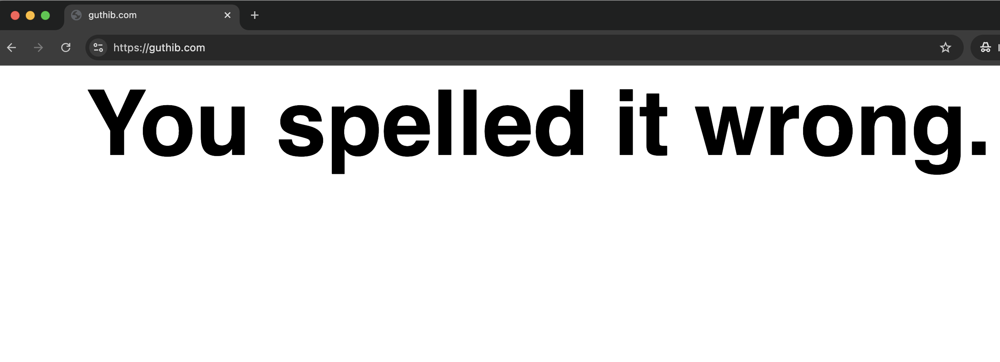
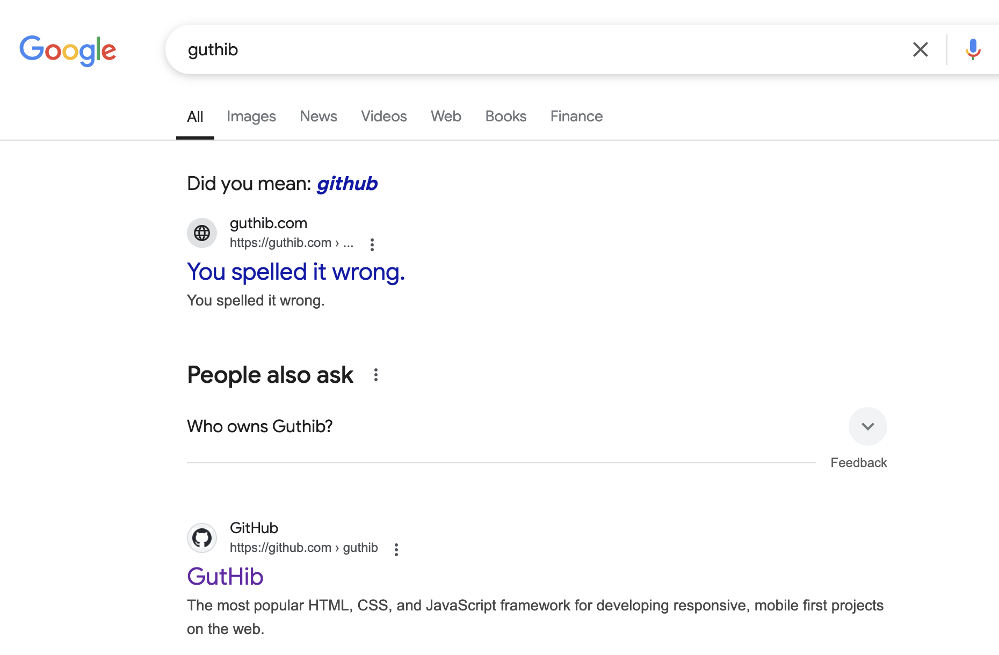

# 有人注册山寨域名只是为了说一句“你错了”

山寨域名背后通常都隐藏着某种恶意目的。或是为了进行钓鱼攻击，欺骗用户输入密码、信用卡信息等敏感内容，或是为了诱导用户下载恶意软件，要么就是通过展示广告或误导性内容来牟利。

但 **guthib.com** 这个山寨了 github.com 的域名没有广告，没有自动跳转，仅仅就是为了说一句“You spelled it wrong.”——你错了。

据说这个山寨域名是 github.com 为了防止相似域名被滥用而注册的，但无从考证。

相似的“你错了”域名还有🔗[https://gatlib.com/](https://gatlib.com/) 和🔗 [https://butbicket.org/](https://butbicket.org/)。
