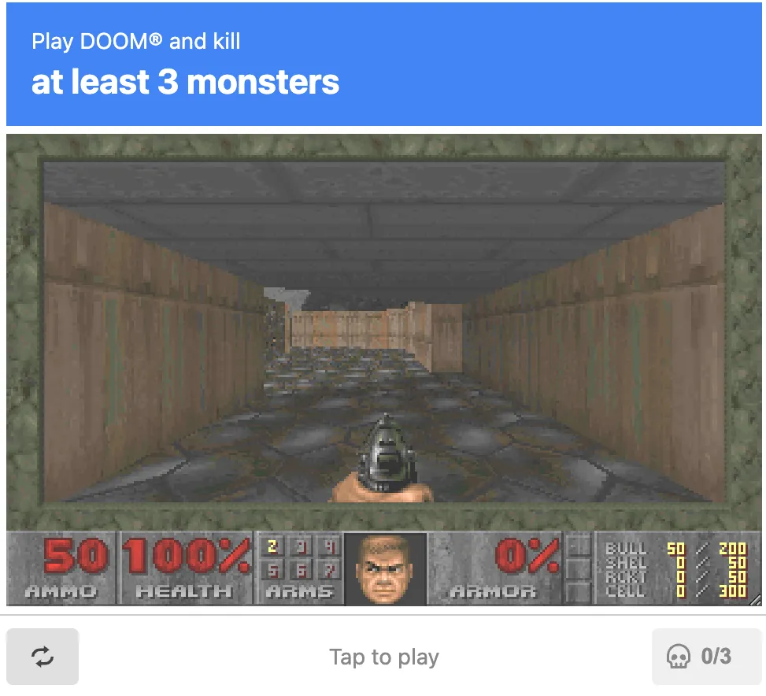
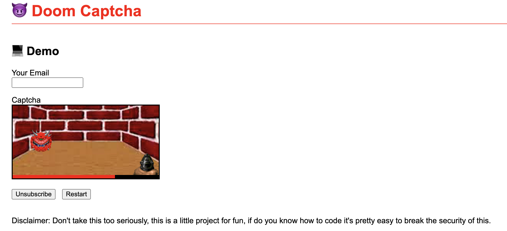
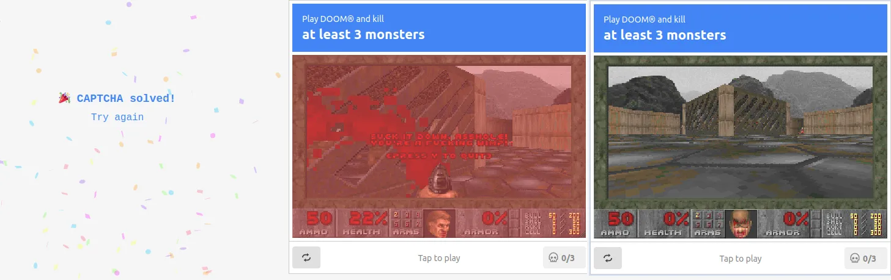

# DOOM游戏风格的验证码——能杀死3个怪物你就不是自动化程序

20 世纪末，随着互联网（似乎国内常用“互联网”指代 Web）的普及，网络爬虫和恶意脚本等自动化程序开始大规模滥用网络资源，引发了虚假账户、垃圾评论、暴力破解、内容盗取等一系列问题。

2000 年，卡耐基梅隆大学的研究人员提出了一种防止自动化程序滥用 Web 的方法——CAPTCHA，即俗称的验证码。验证码的种类繁多，从最初的扭曲字符验证码，到简单的加减法计算题，再到图像选择验证码和拖动碎片完成拼图。但无论是哪一种，给我们的感觉都是”怎么又出来了，烦死了“。

然而近日，专注于 Web 前端开发技术的 Vercel 公司推出了一种全新风格而且相当有趣的验证码——玩一局经典的第一人称射击游戏 DOOM，如果能杀死至少 3 个怪物，就证明你不是自动化程序。

https://doom-captcha.vercel.app/

不过，这不是首个 DOOM 主题的验证码，早在 2021 年，一名叫作 Miquel Camps Orteza 的开发者就展示过类似的创意。

https://vivirenremoto.github.io/doomcaptcha/

更有意思的是，这两款验证码甚至还支持了 iddqd 和 idkfa 这两条 DOOM 的秘籍代码。

---

如果能设计出一种**人类能够轻松完成**，但**计算机难以解决**的问题，那么能够回答出这类问题的“用户”即可视为人类。这就是验证码朴素的原理。

人们正在玩一款新的以 DOOM 为主题的 CAPTCHA

用于确定网站访问者是人还是机器人的 CAPTCHA 程序采用非常标准的格式。想想文本扭曲（用户在其他波浪线之间的框中输入他们看到的字符）；图像识别（例如，选择带有自行车图像的网格中的所有方块）；和复选框验证（单击那个写着“我不是机器人”的框）。

> 拖动拼图碎片补全图片；小学数学题

human web / programatic web

CAPTCHA 是网站用来确保您是人类而不是机器人的小型技能测试。有时他们会要求您重新输入屏幕上显示的一些模糊文本，有时他们会向您显示九张图片并希望您点击包含船的图片。目前有很多不同类型的 CAPTCHA，但它们都至少有一个共同的特点：很烂。

但是，如果我们生活在一个 CAPTCHA 不烂的世界里会怎样？开发人员 Miquel Camps Orteza 大概是唯一一个问自己这个问题的开发人员，通过这样做，他创建了一个射击小魔鬼的 CAPTCHA，实际上解决起来很有趣。

但前端即服务产品 Vercel 的首席执行官 Guillermo Rauch 刚刚使用该公司的 [AI 网站构建器](https://v0.dev/chat/4X85A52Dzde#vZBwKTIde4ZPopW5ExYEzIi38oM6vJzm) 对 CAPTCHA 进行了新的改动，邀请用户玩经典的单人游戏 DOOM 并杀死至少三个怪物。您可以在此处查看。

这不是一个[完全原创](https://www.pcgamer.com/captchas-are-annoying-but-this-doom-themed-one-is-actually-fun/) 的想法（DOOM 作为 CAPTCHA 部分）。但它仍然在 Hacker News 上名列前茅，其主要由开发人员组成的受众[有注释](https://news.ycombinator.com/item?id=42566112)，一些人抱怨它太难了，另一个人称赞这个项目“太金属了”，还有人评论道：“有这么多怪物，我试了 3-4 次……就像真正的验证码一样！”

它被称为 DOOM CAPTCHA，要求在很短（几乎太短）的时间内射杀三个 Doom 小鬼。奇怪的是，小鬼存在于 Wolfenstein 宇宙中，但这种不一致并不重要，因为无论它们在哪里，射杀小鬼都很有趣。

Camps Orteza 在 [CAPTCHA 的 Github 页面](https://vivirenremoto.github.io/doomcaptcha/) 上写道，他们“本周五有了这个想法，周六早上开发了第一个版本，当晚发布，周日上线。”还指出，“破坏” CAPTCHA 的安全性非常容易，而且该项目主要是为了好玩。为了与主题保持一致，如果您在 CAPTCHA 处于活动状态时输入 IDDQD，则可以完全跳过它。

不过，它确实让您想到了另一个世界，在那里 CAPTCHA 并不是令人筋疲力尽、令人困惑、有时令人难以置信的东西。如果您想尝试一下，请前往 [Camps Orteza 的 Github 页面](https://vivirenremoto.github.io/doomcaptcha/)。

https://doom-captcha.vercel.app/

> https://news.ycombinator.com/item?id=42566112
> "iddqd 有效吗？ ;)
> "太难了
> "太金属了
> "有这么多怪物，我试了 3-4 次……就像真正的验证码一样！”
> 鼠标和侧扫
