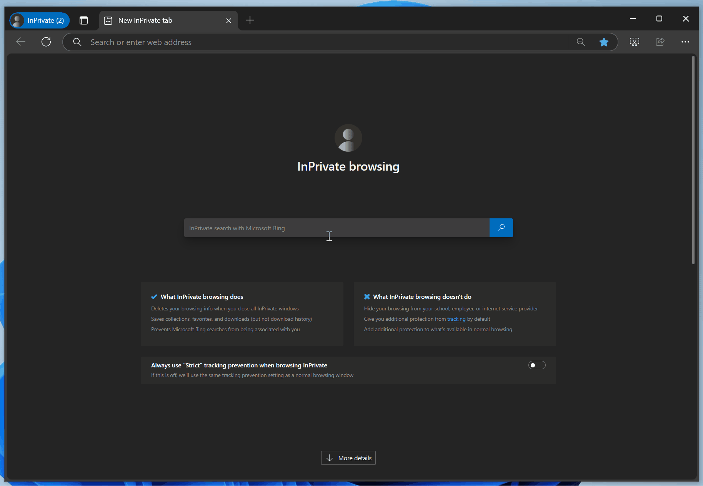
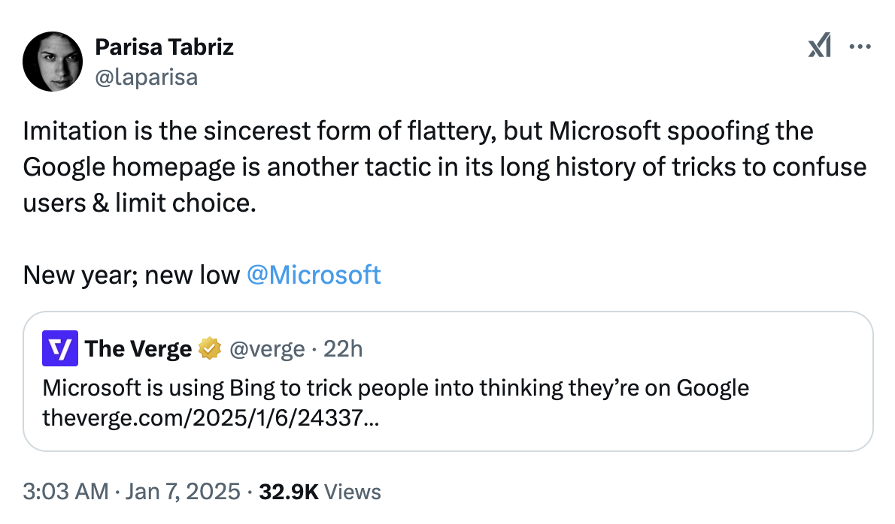

# 为了留住用户，微软的 Bing 搜索引擎开始挂羊头卖狗肉了

Microsoft Edge 是 Windows 上的默认浏览器，而 Bing 又是 Edge 上的默认搜索引擎。当想要去谷歌搜索时，对于懒着修改这些默认设置的用户，为了少输入“.com”这么几个字母，他们可能会先在 Bing.com 中搜索“google”，然后通过点击首条搜索结果进入 Google.com 继续搜索。

为了防止用户去竞争对手 Google.com 搜索，近日（2025 年 1 月 6 日左右）微软的 Bing 搜索引擎可真是想出了个挂羊头卖狗肉的“高招”。

用户在 Bing.com 搜索“google”后，Bing 现在​​会显示一个风格与 Google.com 非常相似的页面。

这个页面完全是在模仿谷歌的首页，布局简洁，中间有一个搜索栏，搜索栏上方有类似 Google Doodle 的插图。这个页面还故意隐藏了顶部，用户需要滚动页面，才能看到 Bing 的 logo 和搜索栏。

很多用户并不关心实际使用的到底是什么搜索引擎，所以微软的这个伎俩看似很愚蠢，但很可能非常有效。这种相似的风格会让部分用户感觉自己正在使用谷歌搜索。

Google Chrome 的负责人 Parisa Tabriz 对这一“天才的创举”进行了尖锐的批评。她表示：模仿是最真诚的奉承，但微软仿造谷歌主页的伎俩又一次迷惑了用户并限制了用户的选择。微软在新的一年再创新低。

为了防止用户流失，微软此前也采取了不少骚操作，比如使用 Edge 访问 Chrome 下载网站时，弹窗提示用户继续使用 Edge、在 Microsoft Store 中难以找到 Google 应用等等。
