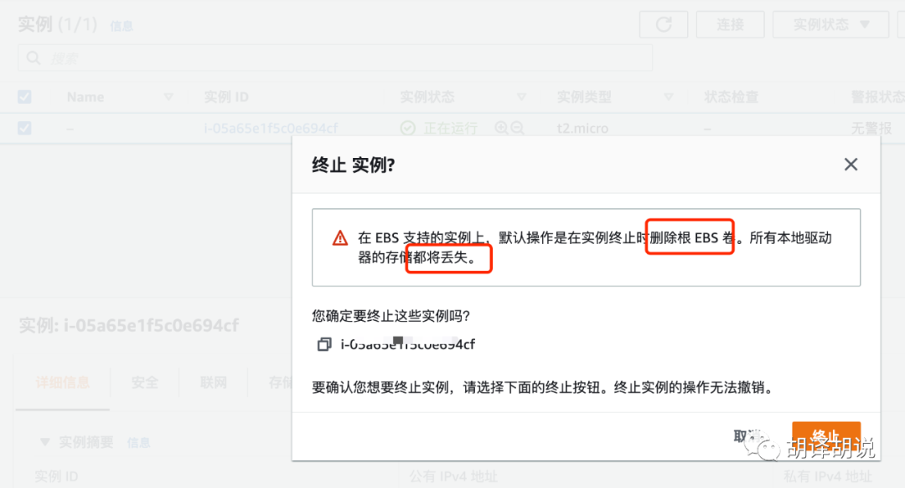

今天来说一说 **ephemeral** 这个术语。

在计算机中，说到“临时”，可能最先想到的词是 **temporary**。Windows 中的临时文件夹 `Temp` 和 Linux 中的 `tmp` 目录应该就是来源于这个词吧。

不过，也有用 **ephemeral** 表示**临时**的时候，比如网络中的**临时端口（Ephemeral port）**和云环境中的**临时存储（Ephemeral storage）**。

临时存储（Ephemeral storage）比较好理解，就是虚拟机（如 AWS 的 EC2）中的一块临时性磁盘，一旦虚拟机实例被停止或销毁，这些临时性的磁盘空间也将一起被销毁。

在 AWS 中创建和销毁虚拟机（EC2 实例）时，都会看到类似“数据不是永久的、数据将会丢失”的提示。

这是创建虚拟机时的提示。



这是终止虚拟机时的提示。


相对于临时存储，**临时端口（Ephemeral port）**可能不是那么常见。我们可以先通过下面一段小程序直观感受一下。

```go
func main() {

  for i := 0; i < 1<<31; i++ {

    conn, err := net.Dial("udp", "127.0.0.1:55555")

    if err != nil {

      fmt.Println("udp", err)

      break

    }

    fmt.Fprintf(conn, "Hi UDP Server, How are you doing?")

    p := make([]byte, 2048)

    _, err = bufio.NewReader(conn).Read(p)

    conn.Close()

    if err == nil {

      fmt.Println("OK!")

      break

    } else {

      fmt.Printf("Error %d: %v\n", i, err)

    }

  }

}
```

如果本地没有监听 `55555` 端口的 UDP 服务器，这段程序最终会输出 `OK!` 并退出吗？另外，只需这条命令就可以创建出监听 `55555` 端口的 UDP 服务器 `nc -ul -p 55555`。

执行结果如下：

```
// 第1次执行

...

Error 26321: read udp 127.0.0.1:48373->127.0.0.1:55555: read: connection refused

OK!

// 第2次执行

...

Error 18214: read udp 127.0.0.1:48900->127.0.0.1:55555: read: connection refused

OK!

// 第3次执行

Error 48479: read udp 127.0.0.1:35313->127.0.0.1:55555: read: connection refused

OK!
```

虽然失败次数有多有少，但最终还是会成功，可为什么会 OK 呢，我们打开 tcpdump 抓包看一下发生了什么。

```
tcpdump -i any icmp or udp


11:02:09.075192 IP localhost.49963 > localhost.55555: UDP, length 33

11:02:09.075197 IP localhost > localhost: ICMP localhost udp port 55555 unreachable, length 69


11:02:09.075505 IP localhost.50020 > localhost.55555: UDP, length 33

11:02:09.075511 IP localhost > localhost: ICMP localhost udp port 55555 unreachable, length 69


11:02:09.075809 IP localhost.44737 > localhost.55555: UDP, length 33

11:02:09.075815 IP localhost > localhost: ICMP localhost udp port 55555 unreachable, length 69


11:02:09.076009 IP localhost.55555 > localhost.55555: UDP, length 33
```

请注意最后一行，源端口号和目的端口号都为 `55555`，自己和自己连上了！而在此之前，从其他源端口号发出的数据都失败了（这是通过 ICMP 协议实现的，ICMP 会告诉 UDP，“localhost udp port 55555 unreachable”）。

`for` 循环每执行一次，UDP 数据包中的源端口号都是**临时端口（Ephemeral port）**。至于操作系统选择临时端口的方法还不得而知。但宏观上来看，是有几率选中目标端口的。

要避免自己和自己连上也很简单，比如可以绑定源地址和源端口，

```
// conn, err := net.Dial("udp", "127.0.0.1:55555")

localAddr := &net.UDPAddr{IP: net.ParseIP("127.0.0.1"), Port: 30000}

remoteAddr := &net.UDPAddr{IP: net.ParseIP("127.0.0.1"), Port: 55555}

conn, err := net.DialUDP("udp", localAddr, remoteAddr)
```

技术的内容就说到这里，接下来再来说说**临时**和**红颜薄命**有什么联系。

相对于计算机中冷冰冰的“临时端口/临时存储”，词典中**ephemeral**的解释还是多少有些感情色彩的，就以苹果自带的词典为例

中英词典

> ephemeral adjective
> 
> ① figurative (short-lived) 短暂的 duǎnzàn de _‹pleasures,__sunshine,__season›_
> 
> ② Botany,Zoology 短生的 duǎnshēng de _‹insects,__animals,__plants›_

英日词典

> e･phem･er･al | ɪfém(ə)r(ə)l, -fíːm- | 形容詞
> 
> (切符のように)短い期間しか使われない;
> 
> 〈昆虫･植物などが〉1 日限りの, 短命の, はかない(transitory).

可以看到，**ephemeral**还有一个生命转瞬即逝，朝生夕死的含义。

日文翻译中还用了**はかない**（发音 hakanai，类似哈卡那一）这个词，这个词用汉字写是【儚い】。即使没学过日语的朋友，要是关注日本动漫和歌曲，对【儚い】可能也不陌生。比如灌篮高手的主题曲《直到世界终结_（世界が终るまでは…）_》里就出现了这个词

> はかなき想い…
> 
> 渺茫的思念
> 
> このTragedy Night
> 
> 在这个悲剧的夜

(はかなき就是はかない，只是个语法上的变换，不影响词义)

【儚い】这个词的含义可就多了，这些含义彼此关联，覆盖的范围又很广：

- 短暂的

- 脆弱的、无常的

- 虚幻的、渺茫的、不可靠的

- 可怜的、悲惨的


甚至还可以根据上下文再做延伸，带入更多感情色彩，比如“徒劳的、无果的”。

这个词还可用于形容恋情，比如樋口一葉的小说《青梅竹马》，女主人公和男主人公之间的情愫就可以叫**儚い恋**。

从单单只是客观上的短暂性，到心理感受上的短暂、无常，进而认为做的一切都是徒劳无功没有结果的，这么看来，说的是不是就是红颜薄命的“薄”字呢。