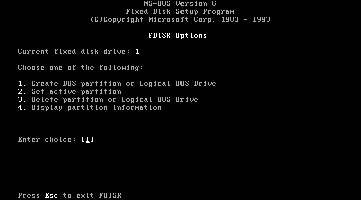
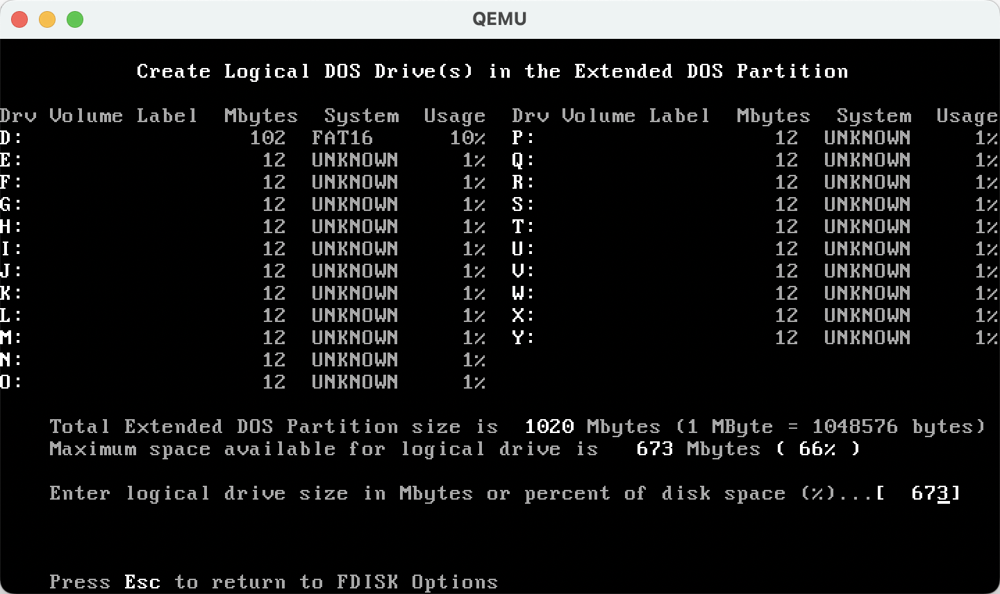
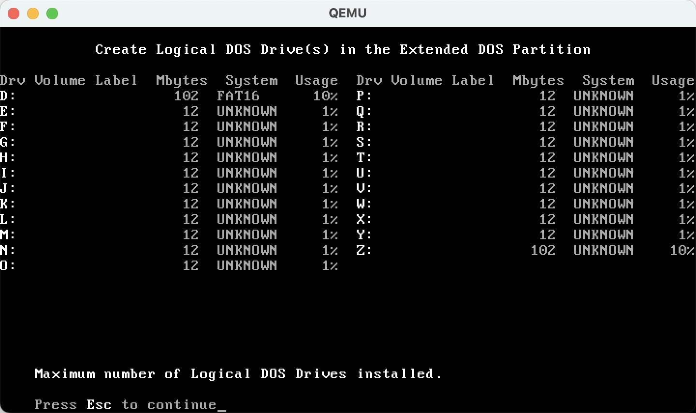
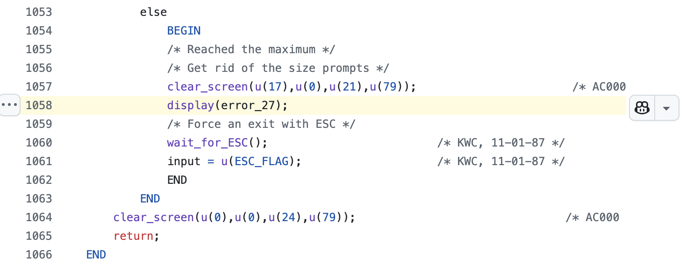
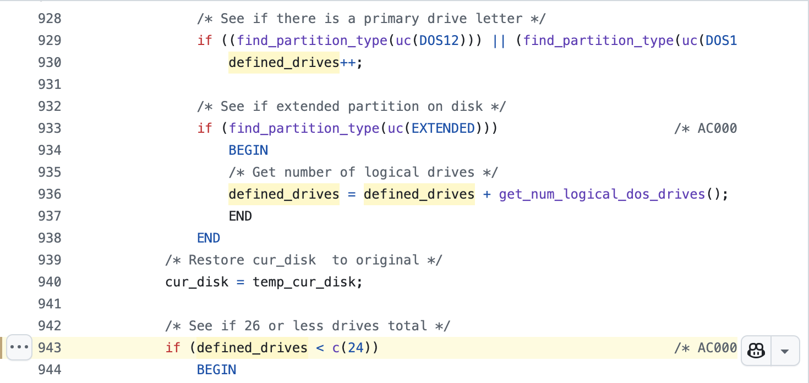
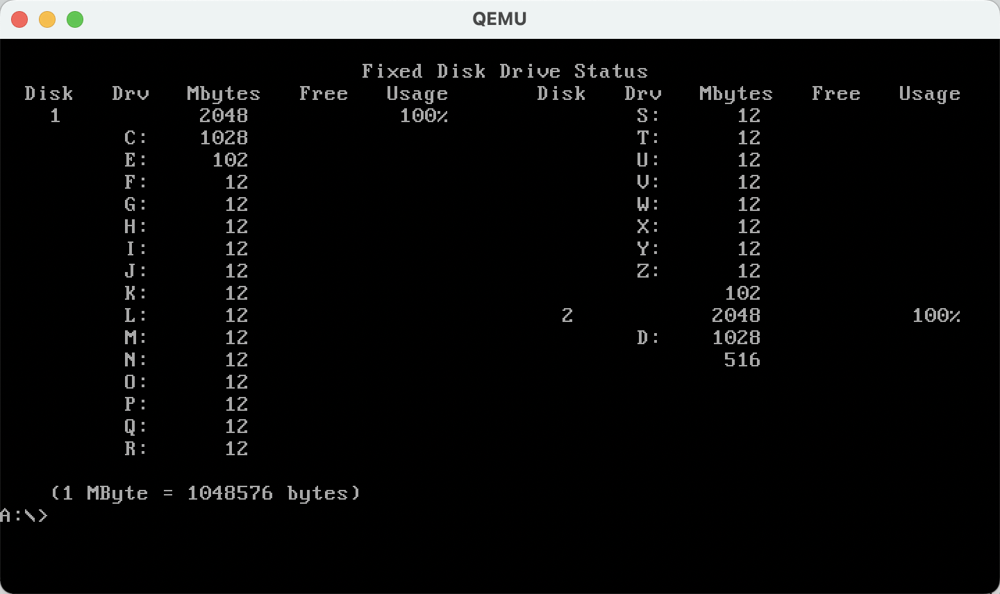
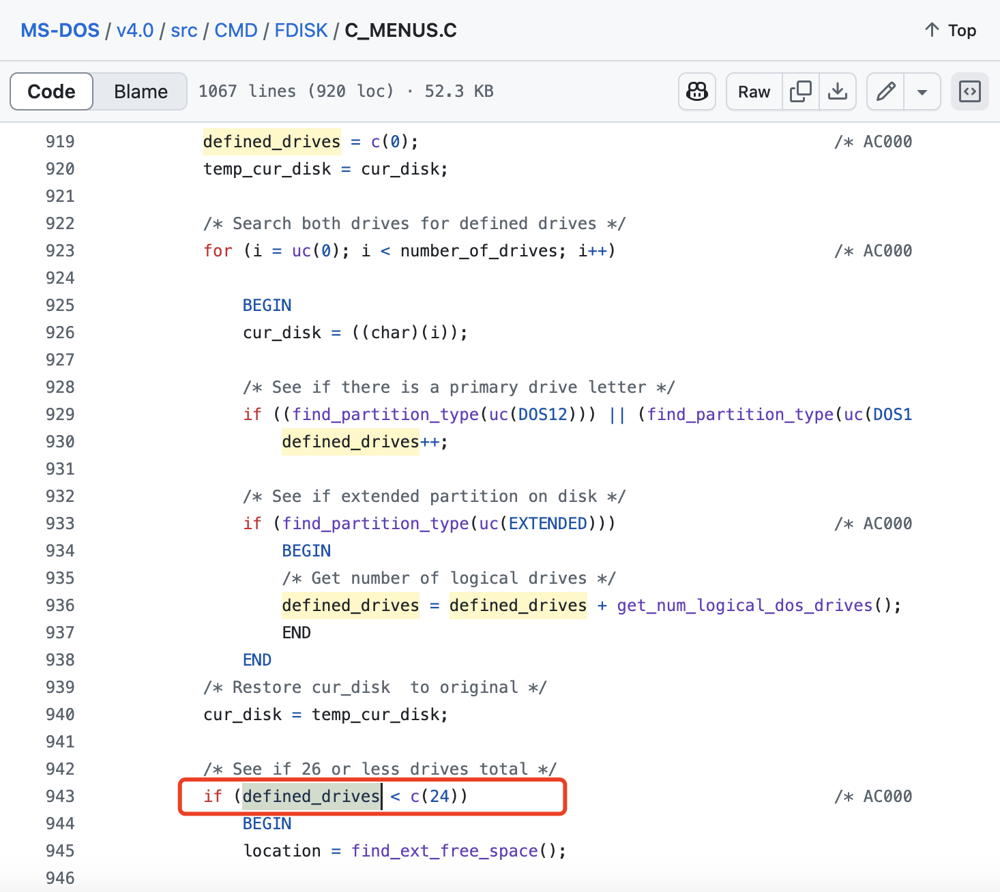

# 在 2000 年前后，硬盘分区把 26 个字母都用完会怎样？——c(24)来自 DOS v4.0 源代码的答案

2000 年前后，主流的 Windows 95/98 并未提供图形化的硬盘分区工具，人们不得不先使用一个叫作**fdisk**的命令来创建分区，再格式化 C 盘，然后才能开始安装 Windows。

如下图所示，**fdisk**命令仅有黑底白字的交互式文本界面，用户需要根据一系列提示，通过输入作为选项的数字来完成磁盘分区的管理。



那时的硬盘不但贵，而且容量还很小（几 G 到小几十 G），自然也就没有必要创建过多的磁盘分区了，一般 3～5 个分区足以。

我们知道，在 DOS/Windows 9x 中（那时还不支持将分区映射为文件夹的操作），每个分区都对应一个大写英文字母，第 1 个分区对应 C，第 2 个分区对应 D，以此类推。假设已经有很多分区了，一直用到了字母 Z，但还有空闲的磁盘空间。那么，此时继续使用 **fdisk** 新建分区会发生什么呢？

好在现在利用虚拟机软件就可以轻松进行这个试验。



如图所示，我们一口气创建了 D～Y 共 22 个分区，还有最多 673MB 空闲空间可以分配给 Z 盘。

若将 100MB 作为 Z 盘的大小。尽管此时还有 500 多 MB 的空闲空间，但 **fdisk** 报错了：Maximum number of Logical DOS Drives installed.



可见，使用 **fdisk** 最多只能创建 1 个主分区 C 加上 D～Z 23 个逻辑分区。

---

2024 年 4 月 25 日，微软开源了 MS-DOS 4.0 的源代码（🔗 [https://github.com/microsoft/MS-DOS/tree/main/v4.0](https://github.com/microsoft/MS-DOS/tree/main/v4.0)）。以“Maximum number of Logical DOS Drives installed.”这个错误信息为线索，就可以跟踪到是哪里限制了最多只能创建 24 个分区（1 个主分区+23 个逻辑分区）。


> https://opensource.microsoft.com/blog/2024/04/25/open-sourcing-ms-dos-4-0/

这条错误信息存储在一个叫作 `error_27` 的变量中，而使用了这个变量的地方是



> https://github.com/microsoft/MS-DOS/blob/main/v4.0/src/CMD/FDISK/C_MENUS.C#L1058

从 1055、1056 这两行的注释可以看出，执行到这个 `else` 分支就说明分区的数量达到了最大值，并不再提示用户指定新分区的大小，而是显示“Maximum number of ...”这条错误信息。

那这个 `else` 分支对应的 `if` 判断条件是什么呢？


> https://github.com/microsoft/MS-DOS/blob/main/v4.0/src/CMD/FDISK/C_MENUS.C#L943

请看 943 行。没想到啊，堂堂微软的高级工程师也直接写死（hard code）了一个`24`啊。说好的“常量是编写健壮、可维护和可读代码的重要实践”呢？这里 `c()` 的作用是类型转换，`#define c(c) ((char)(c))`，即将 `24` 转换成 8 位无符号整数。

所以，就是这么简单粗暴地限制了分区的最大数量，避免了 26 个字母（除去预留给软驱的 A 和 B，还剩 24 个字母）不够用的情况。

不过，有这么一种情况可以“绕过” `defined_drives < c(24)` 这个检测条件——有多块硬盘，每次只对其中一块进行分区，并创建数量小于 24 的分区，最后再同时安装这些硬盘。毕竟 **fdisk** 没有上帝视角，不可能知道总共有几块硬盘。

真这样做的话就会发现，系统启动时会出现“*Warning: Logical drives past Z exist and will be ignored.*”的警告信息。并且会优先为每块硬盘中的主分区分配盘符。例如，这里第 1 块硬盘单独使用时有 C～Z 共 24 个分区；第 2 块硬盘单独使用时有 C、D 这两个分区。同时安装这两块硬盘后，D 被分配给了第 2 块硬盘的主分区，第 1 块硬盘原本 D～Y 的各个盘符分别变为 E～Z；原本的 Z 盘不再分配盘符。




---


```
➜  MS-DOS-main fgrep -rn 'error_27' .
./v4.0/src/CMD/FDISK/C_MENUS.C:1058:            display(error_27);
./v4.0/src/CMD/FDISK/FDISKMSG.H:111: extern char far *error_27 ;                                            /* AN000 */
./v4.0/src/CMD/FDISK/PROFILE.C:418:        display(error_27);
./v4.0/src/CMD/FDISK/FDISKMSG.C:1091: char far *error_27 =
./v4.0/src/CMD/FDISK/FDISK.MSG:1089: char far *error_27 =

```


## 多块硬盘


## Partition Volume Drive 混用

NTFS 挂载到目录
