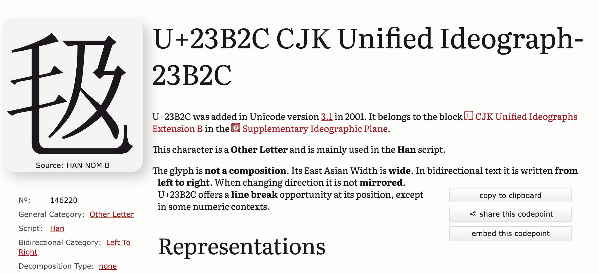

# 《红楼梦》、王小波与隐秘在Unicode角落里的两个汉字

我要说的这两个汉字可不常见啊（但常有人说）。

《红楼梦》里就有这两个字。可在《红楼梦》的众多版本中，出现过这两个字的却是寥寥无几。多数版本完全没有这两个字的踪影，有些版本甚至把这两个字所在的整句话都删除了。

这两个字还化身为别字，出现在王小波的《革命时期的爱情》中。

涵盖了世界上几乎所有语言文字和符号的Unicode将这两个字隐藏在称为“中日韩统一表意文字扩展区B”的区域，若没有使用合适的字体或软件，连这两个字的真容都无法显现，只能看到块“豆腐”。

**这两个字就是U+23B20和U+23B36。**

> Unicode字符常采用以 `U+` 开头，后面跟随4～6个十六进制数的表记方法。如字母“A”可表示为 `U+0041`。

为什么说是块“豆腐”呢？是因为若我们在浏览器中搜索U+23B20或U+23B36，很可能只能看到这样一个个像豆腐的字符。（我使用的是 macOS 上的 Chrome 浏览器）

别卖关子了，你说了半天到底是哪两个字啊？

我们翻开《红楼梦》的重要版本之一《脂硯齋重評石頭記》的第九回。请注意下面这两页，特别是右边那页的最后一行和左边那页的第一行。

找到那两个汉字了吗？没找到的话再看看王小波笔下的王二是怎么说的：

> ……毡巴这孩子很好学，上班时经常问我些问题，有时是几何题，有时是些典故，我都尽所能回答他了。有一次他问我：什么叫“一个毡巴往里戳”，这可把我难倒了。我问他从哪儿看来的，他还不告诉我。后来我自己想了出来，准是红楼梦上看的！……从此我就管他叫毡巴，阿毡，小毡等等。有一天晚上我在短波上听了一支披头士的歌，第二天上班就按那个谱子唱了一天：毡毡毡毡毡毡毡……

这下该猜出是哪两个字了吧。

好了，别坏笑了，还是想想为什么这两个字显示不出来吧。难道是因为太脏了？

其实不止这两个汉字，很多位于“中日韩统一表意文字扩展区B”（以及扩展区C、D、E等）的汉字都会显示为“豆腐”。

为了弄清哪些文字能正常显示，哪些不能，我们需要先了解两个术语。

在计算机和排版领域中，有两个与文字有关的概念——**字符（character）和字形（glyph）**。在日常生活中，我们可能不太区分它们，常常把看到的（特别是在电子屏幕上看到的）文字和符号统称为字符。

字符其实是一个挺抽象的概念，是一种书写符号或语义单位。例如，字母“A”、汉字“你”、符号“@”都是字符。

字符还是信息编码的基础，ASCII、Unicode 等编码系统为每个字符都分配了一个唯一的数字，称为code point。例如，在 Unicode 标准中，字符“A”对应的数字就是65（十六进制的0x41）。

而字形是字符的具体的（视觉上的）表现形式。一个字符可能有多种不同的字形，即多种不同的书写或印刷样式。例如，字符“g”在不同字体中的样式就不太一样。

你可能也注意到了，这里还有一个关键因素——字体。字体（font）可视作将字符和字形联系起来的重要桥梁。既然如此，那换一种字体是不是就能把那两个字显示出来了？答案是肯定的。例如 Windows 上的 SimSun-ExtB 字体。

若字体这座桥梁不够坚固，没能提供字符对应的字形会发生什么呢？

这个问题就比较复杂了，可以说若不限定条件就没有统一的答案。会显示什么既与字体有关，还和软件有关。有些软件会自动为我们找到含有对应字形的字体，有些则不会。可以试着在 Windows 的写字板中依次输入`23B20`，然后按下`Alt + x`组合键，看看发生了什么。注意当前字体的变化，是不是由默认的“宋体”自动变成了“SimSun-ExtB”。

而且“豆腐”也不是唯一的“兜底”字形，找不到对应字形时的兜底方案还有，

等。若安装了 **Last Resort 字体**（https://github.com/unicode-org/last-resort-font），说不定还能看到下面这些符号呢：

王小波提到的“一个毡巴往里戳”出自《红楼梦》第二十八回，有意思的是，有些版本（如戚序本）中用了另外两个“豆腐”汉字。

想知道它们的 Unicode 编码吗？

现在电子设备无处不在，我们能从屏幕中看到万事万物，似乎远比古人的见识多得多。然而，古人可是翻开纸张就能看到那两个汉字啊。

----

> 编辑部的故事 戈玲

https://www.quora.com/What-symbol-is-the-square-box-shown-for-non-representable-Unicode-characters What-symbol-is-the-square-box-shown-for-non-representable-Unicode-characters

> 介绍Unicode这个区域

https://unicode.org/faq/unsup_char.html

U+23B20 : https://codepoints.net/U+23B20?lang=en

https://codepoints.net/U+23B36

U+23B2C 毛及

https://zi.tools/zi/%E2%BF%BA%E6%AF%9B%E5%85%AB 毛八 20262 

CJK_Unified_Ideographs_Extension_B https://en.wikipedia.org/wiki/CJK_Unified_Ideographs_Extension_B

仅在特定版本的红楼梦中出现，以别字的形式出现在王小波的作品中

P215 脂砚斋重评 

28回 http://www.guoxue123.com/hongxue/0001/scjs/091.htm

https://www.fileformat.info/info/unicode/char/23b20/index.htm
https://www.fileformat.info/info/unicode/char/23B36/index.htm

https://blog.wenxuecity.com/myblog/5439/200507/4214.html 红楼梦中的粗话雅谈

https://en.wikipedia.org/wiki/Private_Use_Areas

## Unicode

--> PHP 5.2 json_decode 有没有bug？

https://learn.microsoft.com/en-us/globalization/encoding/unicode-standard

https://medium.com/free-code-camp/a-beginner-friendly-guide-to-unicode-d6d45a903515

https://pro.arcgis.com/en/pro-app/latest/help/data/geodatabases/overview/a-quick-tour-of-unicode.htm A quick tour of Unicode—ArcGIS Pro

https://learn.microsoft.com/en-us/globalization/encoding/unicode-standard Microsoft The Unicode standard

https://medium.com/free-code-camp/a-beginner-friendly-guide-to-unicode-d6d45a903515 A Beginner-Friendly Guide to Unicode 😎

**红楼梦中竟然还有未收录在unicode中的汉字**

  

前两个是作家、硬要说有关系，王小波程序员老前辈，C++，自研输入法

三者之间的联系  

第九回 打闹小学堂

王小波 毡巴

unicode 组合字符 能打出来吗

Windows造字程序；活字 旋刻之

显示为“豆腐”的字

给unicode写信

http://www.xn--fiqw8a84fj7obs4b.com/html/news/yanjiu/20237/news_1356.html