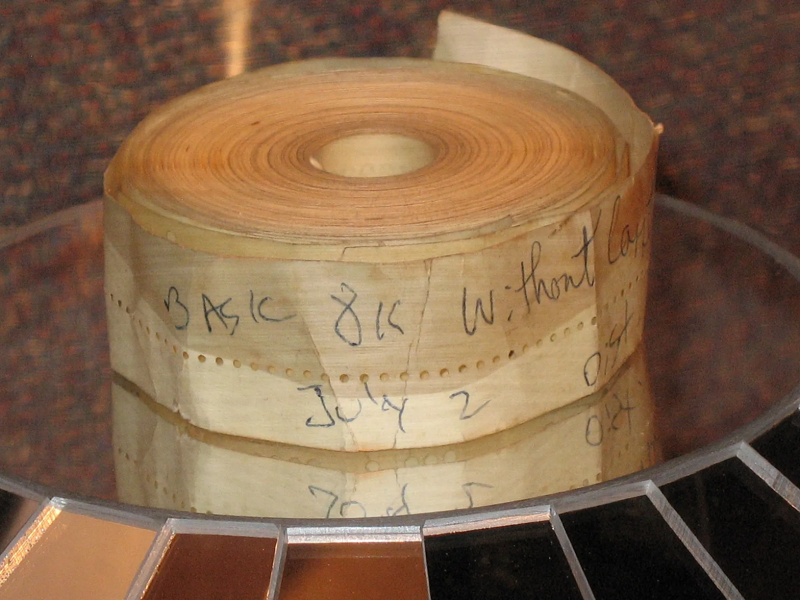
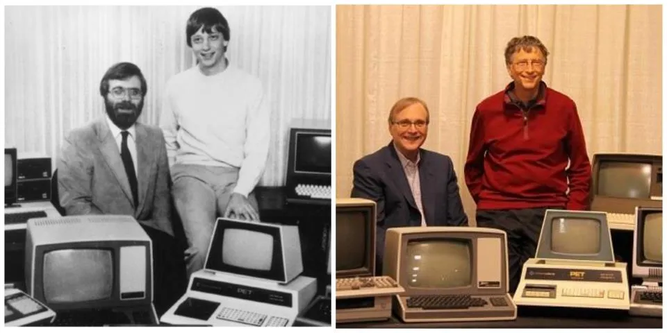

# 也许错过了这期杂志就没有今天的微软公司了

1974 年 12 月，冒着剑桥市清晨刺骨的寒风，保罗·艾伦兴奋地捧着一本《Popular Electronics》（大众电子）杂志，像跑步冠军一样飞奔到哈佛大学去找好友比尔·盖茨。谁能想到，这本 1975 年 1 月刊的杂志，竟然促成了微软公司的诞生。

杂志封面上赫然展示了一个金属盒子，上面一排排开关和 LED 指示灯使得这个仪器看起来更像是某个疯狂科学家的试验设备，而不是一台今天我们印象当中的计算机。可这正是名为 Altair 8800 的微型计算机。照片顶部的文字霸气十足：“世界上第一台匹敌商用计算机的微型计算机！”

Altair 8800 的价格比当时的商用计算机亲民多了，但它有个致命的缺陷——缺乏软件。保罗和比尔一合计，决定发挥自己的编程特长，为这款机器开发一款软件：BASIC 编程语言的解析器。这样其他程序员就能更方便地在这个铁盒子上开发所需的应用程序了（当时现成的软件很少，往往需要自己动手编写）。

于是，比尔和保罗打了个电话给 MITS（Altair 的制造商微型仪器遥测系统公司）的创始人艾德·罗伯茨，表示他们可以为 Altair 8800 开发 BASIC 解析器。艾德听了很感兴趣，并欢迎他们带着写好的 BASIC 过来展示。

问题来了——比尔当时只是个穷学生，保罗也只是刚步入职场的打工仔，根本买不起 Altair 8800 来做实验。但这没有难倒二人，他们凭借丰富的编程经验，以及仅有的那期杂志上零星信息和 CPU 规格说明，借用了哈佛大学的 PDP-10 大型机，用了整整两个星期，做出了一个 Altair 8800 的模拟器，等于把 PDP-10 变成了 Altair 8800！模拟器搞定后，二人开始昼夜不停地编写 BASIC 解析器。经过两个月的奋战，程序终于完成了。

由于比尔还没毕业，他只能让保罗带上存储着 BASIC 解析器的纸带，孤身飞往新墨西哥州的 MITS 公司。当保罗第一次走进那里的实验室，才看到真正的 Altair 8800。用了两个多月的模拟器，今天终于见到“本尊”了。

> 存储着 BASIC 解析器的纸带

保罗把装有 BASIC 解析器的纸带插入读取器，忐忑地等待 Altair 8800 的反应。几分钟过去了，机器还是一片死寂。就在所有希望似乎要破灭的瞬间，Altair 8800 终于开始工作了，电传打字机打出了 `READY` 的字样。保罗随即输入了 `PRINT 2+2`，机器立刻回应：`4`。

成功了！保罗兴奋得像中了彩票，他回忆说：“这家公司能造出计算机，却无法让它运作。而我们的程序居然让它听从了我们的命令！”

保罗连忙打电话给比尔，兴奋地告诉他成功的消息。比尔听后立刻意识到，BASIC 不仅能让 Altair 8800 “飞起来”，更能改变整个计算机行业。微型计算机的时代即将到来。

1975 年 7 月，20 岁的比尔和 22 岁的保罗在新墨西哥州的阿尔伯克基正式成立了微软公司，开始向 MITS 公司销售他们为 Altair 开发的 BASIC 语言解释器。

> 比尔•盖茨和保罗•艾伦

说得夸张一点，如果没有 1975 年 1 月刊的《Popular Electronics》，可能就没有今天的微软公司了。比尔回忆说，当他和保罗在那个寒冷的冬日清晨读到杂志上有关 Altair 8800 的文章时，便意识到，计算机的价格很快就会下降，销售软件到时将成为一门有利可图的生意。

这期杂志不仅为比尔和保罗指明了方向，还对另两个科技巨头，苹果公司的创始人乔布斯和沃兹尼亚克，也产生了深远的影响。有趣的是，《乔布斯传》的作者居然把这本杂志的名字给写错了，写成了《Popular Mechanics》（大众机械师）。

《乔布斯传》第 5 章《Apple I》第 1 节《慈爱的机器》结尾处写道：

> 他们受到了 **《大众机械师》（Popular Mechanics）** 杂志 1975 年 1 月刊的启发，这期杂志的封面照是第一台个人计算机——阿尔泰（Altair）。阿尔泰其实没什么——只是价值 495 美元的一堆零部件，还必须被焊接到一块电路板上才能执行非常少的任务，但对于业余爱好者和黑客们来说，它预示着一个新纪元的来临。比尔•盖茨和保罗•艾伦（Paul Allen）看了那一期杂志后，就开始研发用于阿尔泰的 BASIC 语言版本。乔布斯和沃兹尼亚克也被这期杂志深深吸引了。……

