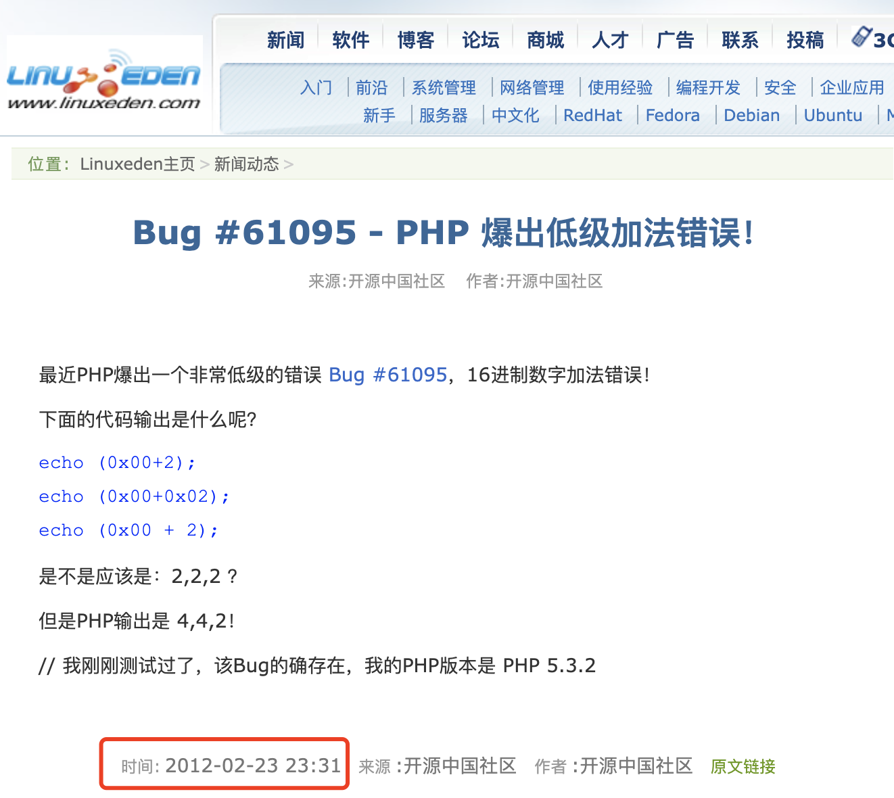
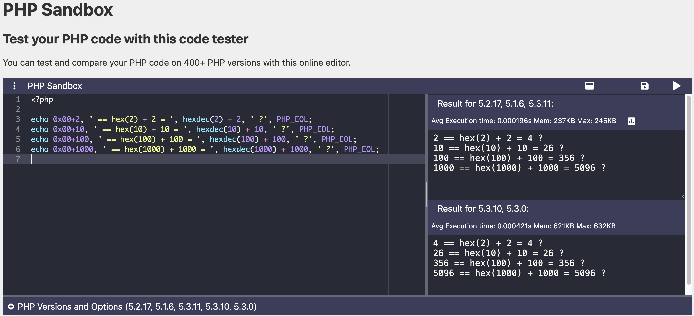
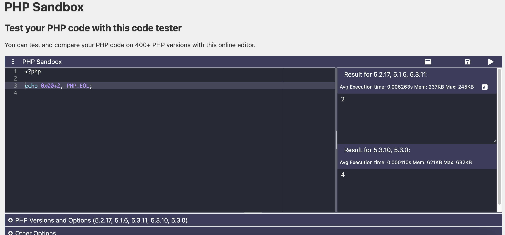
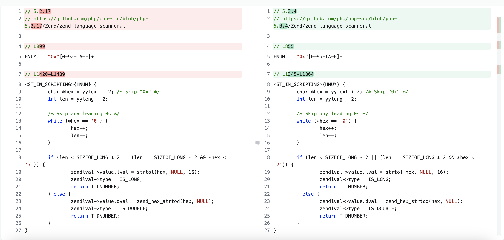
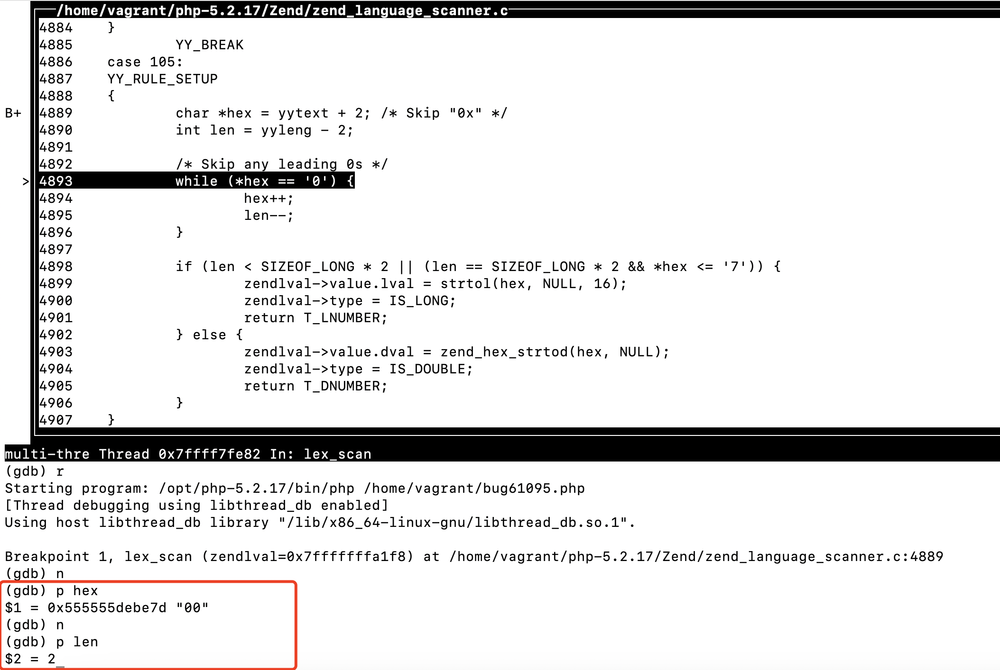
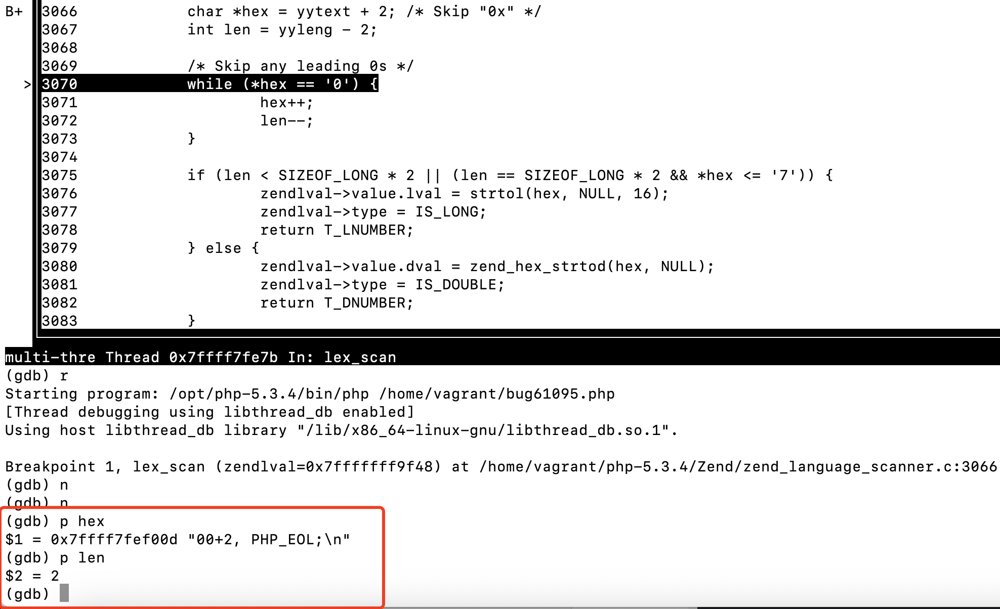
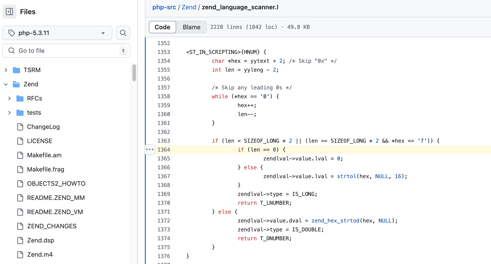

# 还记得十几年前 PHP 那个 0x00+2=4 的 Bug 吗

十几年前，在还能因“PHP 是最好的语言”而争论起来、还能在上海举办 PHPCon 的那个时代，记得看到过 `0x00+2=4` 这么一个有关十六进制加法的 Bug（https://bugs.php.net/bug.php?id=61095）。



那时，CRUD 似乎就是技术的全部，能自制 PHP MVC 框架（还不是用 C 语言写 PHP extension）就如同站在 PHP 工程师的最高峰了。正如 Redis 的作者 antirez 在一篇名为《What we lost (now that web programming is mainstream)》（当 Web 编程成为主流后我们失去了什么）的博文中的吐槽：

> It was mostly a boring task about constructing web interfaces with a DB as back end, and the actual data processing (that's the computer science part of algorithms and great code) was minimal. ... The most interesting thing remains to write a framework :) (this is why there are so many frameworks around, people like to write them more than actual applications)……
>
> —— http://oldblog.antirez.com/post/what-we-lost.html 2008-04-20
>
> （Web 开发）主要的任务是构建以数据库为后端的 Web 界面，相当无聊，而实际的数据处理工作很少（这才是有关算法和优秀代码的部分，才算是计算机科学）。最有趣的事情是编写框架 :)（这就是为什么有那么多框架，人们更喜欢编写框架而不是实际的应用程序）……

在当年那种扭曲的认知下，并没有动力深入挖掘这个 Bug 的原因。今天再回过头来
分析个中来由，没想到还挺有意思。

## TL;DR 省流

原因如下。对于表达式 `0x00+y`，当 `+` 前后都没有空格时，整个表达式首先会被误识别成一个十六进制数 `y`，随后 `+` 之后的 `y` 又被正常识别为一个十进制数，导致最后的结果为 `y（十六进制） + y（十进制）`。于是就会有 `0x00+2 -> 2（十六进制）+ 2（十进制）= 4` 的错误。更多的示例如下图所示。



## 详细的分析过程

先来确定一下这个 Bug 都影响了哪些版本。在 https://onlinephp.io/上，选择

* 5.1.6
* 5.2.17
* 5.3.0
* 5.3.10
* 5.3.11

这 5 个版本，运行代码 `echo 0x00+2, PHP_EOL;`。



可见，受影响的版本范围是 5.3.0～5.3.10，从 2009-06-30 到 2012-04-25，一直存在了小 3 年，直到 5.3.11 才修复。不过老版本 5.1.x 和 5.2.x 倒是没有这个 Bug。那 5.3.0 发布时修改了什么呢？

> 由于没有下载到 PHP 5.3.0 的 tar 包，下面改为分析 5.3.4

最先想到的原因是词法分析中识别十六进制数的规则发生了改变。于是，对比 5.2.17 和 5.3.4 两个版本词法分析器的相关代码，



除了行号不同，代码竟然一模一样！

不过在 5.3.4 中，在定义 `HNUM` 的位置，多了这样两行代码，

```c
/*!re2c
re2c:yyfill:check = 0;
```

这说明 5.3.4 使用了 re2c 作为词法分析器的生成器（lexer generator）。而从这段代码所在的 `zend_language_scanner.l` 这个文件的扩展名 `.l` 可以推断出，在之前的版本中，PHP 应该使用的是 lex 或 flex。

查看 5.3.0 版本的 ChangeLog，果然从这一版本开始，PHP 用 re2c 替换了 flex。

> Replaced all flex based scanners with re2c based scanners. (Marcus, Nuno, Scott)
> —— https://www.php.net/ChangeLog-5.php#5.3.0

八成问题就出在这里吧，先用 gdb 跟踪一下解析十六进制数的代码。

对于 5.2.17，十六进制数的字符串 `hex` 和其长度 `len` 的初始值分别为 `"00"` 和 `2`，这没错，从 `"0x00"` 中去掉开头的 `"0x"`，剩下的确实是长度为 `2` 的字符串 `"00"`。



接下来，经过 `while` 循环去掉所有前导 0 后，`hex` 变为了空字符串，`len` 相应变为 0，再经过 `strtol()` 转换为整数，结果自然为 0。看起来一切正常。

然而到了 5.3.4 中，同样的代码却得到了不同的结果。



请注意，改用 re2c 以后，`hex` 的初始值不再是 `"00"`，而是从 `"00"` 到行尾的所有代码 `+2, PHP_EOL;\n`。`len` 的初始值倒是没错，还是 `2`。问题就出在这个 `hex` 的初始值上，经过 `while` 循环去掉所有前导 0 后，`hex` 的值不再是空字符串，而是 `"+2, PHP_EOL;\n"`。

尽管 `"+2, PHP_EOL;\n"` 不是一个仅包含数字的字符串，但 `strtol()` 的特性是尽量将字符串开头部分的数字转换成对应的整数，直到遇到第一个非数字字符为止。也就是说 `strtol("+2, PHP_EOL;\n") = 2`。这就是为什么 `0x00 + 2 = 4` 会比正确答案多了 2。

知道了问题所在就很好修复了。5.3.11 中，在调用 `strtol()` 之前加入了 `if (len == 0)` 的判断条件。



但还有一个疑问，为什么同样的赋值语句 `char *hex = yytext + 2;`，能产生不同的 `hex` 的初始值呢？其实这里的 `yytext` 是个宏，实际的值是 `struct _zend_php_scanner_globals` 结构体中的 `yy_text` 字段的值。

在使用了 re2c 的 5.3.x 中，`yy_text` 字段的值是 `YYCURSOR`（指向输入串中与规则匹配的 token 的首个字符）。而在使用了 flex 的早期版本中，`yy_text` 字段的值由 flex 来维护，是一个包含了构成 token 所有字符且以空字符 `\0` 结尾的字符串。

总之，这个 Bug 是由用 re2c 替代 flex 引起的，最根本原因是这两个工具在如何返回匹配的 token 上的差异——是返回首字符的指针，还是直接返回一个字符串。看似通过结构体 `struct _zend_php_scanner_globals` 和宏来加入抽象层，能够抹平这两个工具的差异，然而并非如此，开发者不得不结合 `yyleng`，判断异常情况。

---

0x00+2=4 这个 Bug 修复后（2012-02-24）没多久，PHP 5.4.0 就要发布了。由于 5.4.0 新增了对二进制数字面值（如 `0b001010`）的支持，这个 Bug 又以另一个形象梅开二度了（https://bugs.php.net/bug.php?id=61225），这回是 0b0+1=2 了。


---

## 资料

https://bugs.php.net/bug.php?id=61225

http://www.linuxeden.com/html/news/20120223/120628.html Bug #61095 - PHP 爆出低级加法错误！

## zend_language_scanner

### 5.2.17

```c
./Zend/zend_language_scanner.c:16:#define yytext zendtext
./Zend/zend_language_scanner.c:311:#define yytext SCNG(yy_text)

```

### 5.3.x

```
./Zend/zend_ini_scanner.l:311:	SCNG(yy_text) = YYCURSOR;
```


## lex vs re2c 分析输入中的十六进制数

lex

```l
%{
// 使用 flex 识别标准输入中的十六进制数
// $ sudo apt install flex
// $ flex lex_hex.l && gcc -ll -o lex_hex lex.yy.c
// $ echo "<?php echo 0x00+2, 0x00+0x02" | ./lex_hex

#include <stdio.h>      /* printf */
#include <stdlib.h>     /* strtol */
%}

%option noyywrap

HNUM	"0x"[0-9a-fA-F]+

%%
.      { /* ignore all other characters */ }

{HNUM} {
printf("Found hex: 0x%lx(%ld)\n", strtol(yytext, NULL, 16), strtol(yytext, NULL, 16));
}

%%

```

re2c

```

```


---
class="google_inline_ad"

https://groups.google.com/g/comp.infosystems.www.authoring.cgi/c/PyJ25gZ6z7A Announce: Personal Home Page Tools (PHP Tools)


十六进制加法遗留 bug

https://bugs.php.net/bug.php?id=61095


https://boscono.hatenablog.com/entry/20120227/p1 # [PHPの足し算のバグ](https://boscono.hatenablog.com/entry/20120227/p1)

https://www.reddit.com/r/PHP/comments/196q7o/ive_got_an_interview_tomorrow_for_a_senior_php/

https://github.com/i-MSCP-deb-packages/php/blob/master-5.3/NEWS#L2705 30 Jun 2009, PHP 5.3.0  Replaced all flex based scanners with re2c based scanners.

```bash
./configure --prefix=/opt/php-5.2.17 --enable-debug --disable-dom --disable-simplexml

set args /home/vagrant/bug61095.php
b lex_scan
b /home/vagrant/php-5.2.17/Zend/zend_language_scanner.c:4889
# ---

./configure --prefix=/opt/php-5.3.4 --enable-debug --disable-dom --disable-simplexml


https://github.com/php/php-src/blob/php-5.3.4/Zend/zend_language_scanner.c
set args /home/vagrant/bug61095.php
b lex_scan
b zend_language_scanner.c:3066
```


![[Pasted image 20241225213815.png]]
