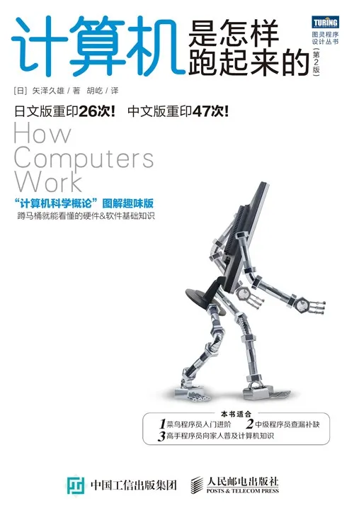
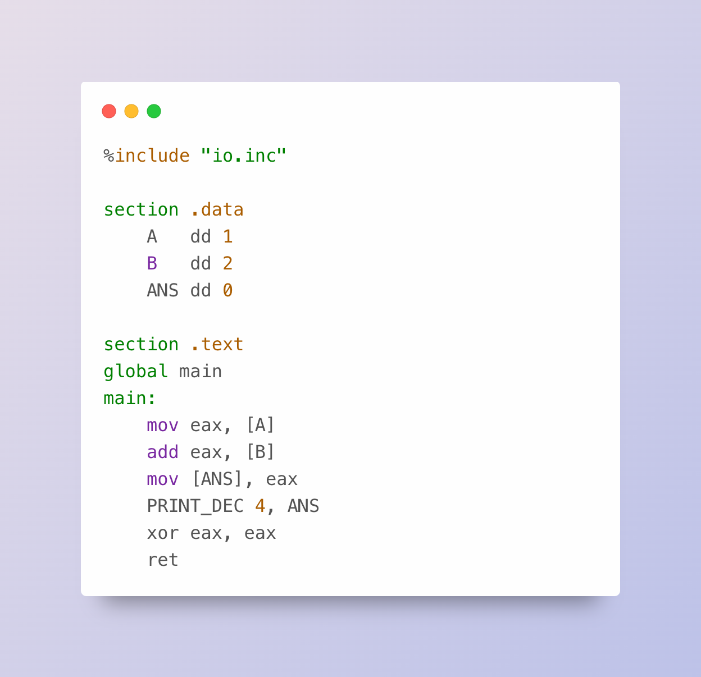
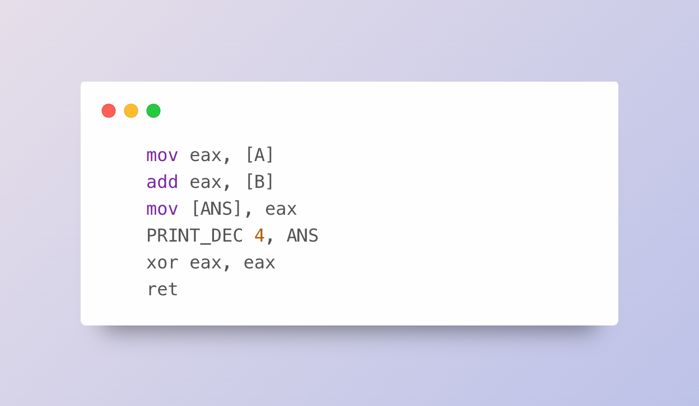
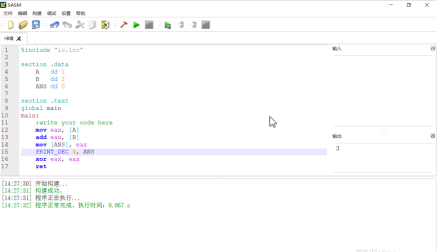

# 【文末赠书】用汇编语言编写计算两整数之和的程序（上）

> 本文节选自《计算机是怎样跑起来的（第2版）》第 3 章“体验汇编语言”的**草稿**。在翻译本章时，我们发现原书所使用的软件仅提供日文界面，并且介绍的是主要用于日本计算机相关考试的 **CASLⅡ 汇编语言**，其通用性相对较低。为了让内容更广泛适用，并便于读者实践操作，与作者及编辑老师商议后，决定采用更为通用的 **NASM 汇编语言** 重新编写本章，以提升学习体验。

----

> 留言点赞数量排在前 3 位的读者将获赠《计算机是怎样跑起来的（第2版）》纸质书籍一本（包邮到家）！
> 
> 截止时间：2025 年 3 月 10 日上午 12 点。欢迎大家积极留言互动！



如何编程计算两个整数的和呢？恐怕无论使用哪一种主流编程语言，甚至是从未接触过的新语言，解决这个问题都不费吹灰之力吧，除了 `num1 + num2` 还能有其他写法吗？

不过，为了加深对计算机的理解，我们特意自讨苦吃，看看如何用 NASM 这种汇编语言编写程序，并借助一款名为 SASM 的软件剖析该程序的运行情况。

## 汇编语言属于低级语言

编程语言大致可以分为**低级语言**和**高级语言**两大类。低级语言包括**机器语言**和**汇编语言**。使用低级语言书写的程序能够直接操作计算机硬件。

在机器语言中，任何指令和数据都要用二进制数表示。由于使用机器语言编程很不方便，人们发明了汇编语言。汇编语言使用英语单词的缩写来表示指令，使得程序员无须再记忆指令对应的二进制数字。

不过，**用汇编语言编写的程序需要先转换成机器语言的程序**才能由 CPU 解释执行。**汇编语言的指令和机器语言的指令是一一对应的**。
## 必备的硬件知识

使用汇编语言编程时必须了解一些硬件知识。对于计算两整数之和这个程序，我们只需要了解一些有关 CPU 的寄存器和内存存储单元的知识就足够了。虽然这个程序最后会在屏幕上输出计算结果，但这是通过调用预设的指令（称作**宏**）实现的，并没有直接操作 I/O。

### 寄存器

CPU 内部有多个寄存器，每个寄存器都有一个唯一的名字。例如，在 Intel CPU 中，寄存器的名字是 eax、ecx、edx、ebx 等。我们可以将这些寄存器视作变量，使用它们来执行运算。

eip 寄存器是一个很关键的寄存器，其中存储的是正在执行的指令的地址（存储着指令的内存单元的地址）。每执行完一条指令，eip 寄存器的值都会自动更新为下一条指令的地址。
### 内存

内存中的每个存储单元都有一个唯一的地址，存储单元之间通过地址加以区分。内存地址多用十六进制数表示。

## 汇编语言的语法只有一条

用汇编语言（这里使用的是 NASM）编写的计算两整数之和（这里是计算 1+2）的程序代码如下所示。

> 汇编语言其实是 NASM、MASM、FASM 等一类计算机语言的统称，本文选用了语法上较为简单的 NASM 汇编语言。

```asm
%include "io.inc"

section .data
    A   dd 1
    B   dd 2
    ANS dd 0

section .text
global main
main:
    mov eax, [A]
    add eax, [B]
    mov [ANS], eax
    PRINT_DEC 4, ANS
    xor eax, eax
    ret
```



汇编语言的代码乍看之下非常晦涩，可实际上并非如此。因为汇编语言的语法基本上只有一条，即 `指令 指令的对象`。指令既可以没有对象，也可以带一个或两个对象。两个指令的对象之间要用逗号分隔。指令也称作操作码（opcode，operation code），即表示操作的代码，指令的对象也称作操作数（operand）。

例如，`mov eax, [A]` 这一行代码中的 `mov` 是指令，`eax` 是该指令的第一个对象，`[A]` 是第二个对象。又如最后一行代码，`ret` 这个指令就没有对象。

在汇编语言中，操作数通常是 CPU 中的寄存器或内存中的存储单元，这是因为汇编语言正是用于描述以下操作的编程语言：

* 对存储在 CPU 的寄存器中的数据进行计算
* 将存储在内存的存储单元中的数据读取到寄存器中
* 将计算结果存储在内存的存储单元里
* 将主机与外部设备之间输入/输出的数据存储在 I/O 的存储单元里

一行汇编语言的代码（语句）除了指令本身（操作码）和指令的对象（操作数），有时还包括标签（label）和注释（comment）。

**标签**是程序员为指令或数据赋予的名称，主要用于说明指令或数据的含义。在上面的代码中，`main` 标签表示程序执行的起点，而 `A`、`B` 和 `ANS` 也是标签，分别表示第一个加数、第二个加数和计算结果（answer）。稍后我们将会看到，**标签本质上就是内存中存储空间的地址**。为了避免使用由杂乱无章的数字组成的内存地址，程序员往往使用标签指代存储空间。

**注释**是程序员为代码添加的文字说明。在本文使用的名为 NASM 的汇编语言中，注释要写在分号 `;` 之后。

## 逐行分析“计算 1+2”的代码

下面就来逐行分析代码清单中的代码。

```asm
%include "io.inc"

section .data
    A   dd 1
    B   dd 2
    ANS dd 0

section .text
global main
main:
    mov eax, [A]
    add eax, [B]
    mov [ANS], eax
    PRINT_DEC 4, ANS
    xor eax, eax
    ret
```


可以看到，两个空行将这段代码分成了三部分。第一部分只有 1 行，`%include "io.inc"` 表示包含一个名为 `io.inc` 的文件，这样我们就可以调用其中的预设指令 `PRINT_DEC`，向屏幕输出计算结果了。

汇编语言的代码通常会分为几个**段（section）**，最常见的段是**代码段（.text section）** 和 **数据段（.data section）**，前者包含了程序中的指令，后者包含的是数据。

`section .data` 表示数据段的起点，其中包含三条“指令”，各条指令的作用如下：
* `A dd 1`：把整数 `1` 存储到由 4 个连续的存储单元（4 字节）构成的存储空间中，并为这块空间贴上一个叫作 `A` 的标签，表示这是第一个加数。相当于高级语言中的 `A = 1`
* `B dd 2`：把整数 `2` 存储到由 4 个连续的存储单元（4 字节）构成的存储空间中，并为这块空间贴上一个叫作 `B` 的标签，表示这是第二个加数。相当于高级语言中的 `B = 2`
* `ANS dd 0`：把整数 `0`（初始值）存储到由 4 个连续的存储单元（4 字节）构成的存储空间中，并为这块空间贴上一个叫作 `ANS` 的标签，表示这是计算结果。相当于高级语言中的 `ANS = 0`

至此，数据段就结束了，空行之后的 `section .text` 表示接下来要进入代码段了。

代码段中的第一条指令是 `global main`，其中的 `main` 是一个标签，下一行的 `main:` 正是这个叫作 `main` 的标签本身，这是一个特殊的标签，表示程序执行的起点。也就是说，CPU 将从贴有 `main` 标签的指令，即下一行的 `mov eax, [A]` 开始解释执行程序。虽然 `main` 和数据段中的 `A`、`B` 和 `ANS` 都是标签，但因为 `main` 单独占了一行，所以习惯上要在结尾处加上冒号，以明确表示这是一个标签，而不是一条叫作 `main` 的指令。

前面的代码都是在为“计算 1+2”做准备，从 `mov eax, [A]` 这一行开始，才真正开始进入计算环节。

```asm
    mov eax, [A]
    add eax, [B]
    mov [ANS], eax
    PRINT_DEC 4, ANS
```



`mov`（move 的缩写）指令会将存储在 `A` 标签中的数据**复制**到 CPU 的 `eax` 寄存器中。这里的 `[]` 表示“存储在标签中的数据”，若不加 `[]`，这条指令就成了“将 `A` 标签本身（本质上是内存地址）复制到 `eax` 中”，这就不是我们的意图了。`[]` 有点像高级语言中的解引用（如 C 语言中的 `eax = *A`）。

下一条指令是 `add eax, [B]`，这里的 `add` 顾名思义，表示执行加法运算，参与加法运算的两个操作数分别是存储在 `eax` 寄存器中的数据和存储在 `B` 标签中的数据。该指令会把加法运算的结果存回到 `eax` 寄存器中，类似高级语言中的 `eax = eax + *B`。

接下来又是 `mov` 指令，这条指令会将存储在 `eax` 寄存器中的计算结果存储到（复制到）`ANS` 标签中（贴有 `ANS` 标签的存储单元中），类似高级语言中的 `*ANS = eax`。

“把 A+B 的结果存储到 ANS 中”，如此简单的运算看似一步就能完成，可到了汇编语言中竟然需要分三步才能实现。为了输出“好不容易”才计算出的结果，程序最后调用了预设的指令 `PRINT_DEC` 来输出 `ANS` 的值。由于 `ANS` 这块存储空间占 4 字节，所以 `PRINT_DEC` 的第一个操作数是 `4`。

## 安装汇编语言编程工具 SASM

了解了每行代码的含义后，我们再来使用 SASM 验证一下这个程序的行为，看看程序输出的结果对不对。SASM 是一款免费的汇编语言编程工具，自带调试功能，非常适合初学者用来学习汇编语言。SASM 可从以下页面获取。

http://dman95.github.io/SASM/english.html

SASM 与主流 IDE 的使用方法非常类似，代码编写好以后，点击工具栏上的“构建并运行”（图标是绿色的三角形）按钮。如果代码中没有错误，就会在窗口底部的窗格中看到一行绿色的文字 `程序正常完成`，同时会在右侧的“输出”窗格中看到正确的计算结果 `3`，如下图所示。


至此，我们终于得到了一个 NASM 汇编语言版本的“计算两整数之和”，严格说来这段程序只能计算 1+2，而不是任意的两整数之和。

汇编语言的程序需要先转换成机器语言的程序才能由 CPU 解释执行，而且汇编语言的指令和机器语言的指令是一一对应的。那“计算 1+2”这段代码对应着怎样的机器语言的代码呢？

另外，在高级语言中，计算两整数之和可以只用两个变量 `a += b`，但在汇编语言中，为什么不能写成 `add [A], [B]` 呢？

接下来，我们将利用 SASM 的调试功能探索这些问题。


> 留言点赞数量排在前 3 位的读者将获赠《计算机是怎样跑起来的（第2版）》纸质书籍一本（包邮到家）！
> 
> 截止时间：2025 年 3 月 10 日上午 12 点。欢迎大家积极留言互动！
