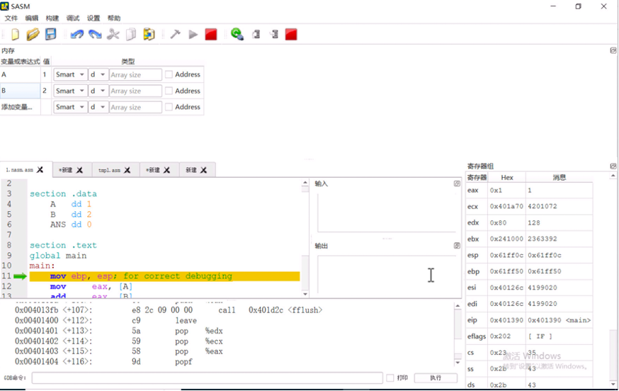

# 用汇编语言编写计算两整数之和的程序（下）

> 本文节选自《计算机是怎样跑起来的（第2版）》第 3 章“体验汇编语言”的**草稿**。在翻译本章时，我们发现原书所使用的软件仅提供日文界面，并且介绍的是主要用于日本计算机相关考试的 **CASLⅡ 汇编语言**，其通用性相对较低。为了让内容更广泛适用，并便于读者实践操作，与作者及编辑老师商议后，决定采用更为通用的 **NASM 汇编语言**重新编写本章，以提升学习体验。

----

## 在 SASM 中查看寄存器和内存存储单元中的数据

SASM 的“**寄存器组**”窗格和“**内存**”窗格分别用于查看寄存器和内存存储单元中的数据。这两个窗格都只有在调试模式下才会出现。先点击工具栏中的“调试”按钮，然后通过分别点击“调试”菜单中的“**显示寄存器组**”和“**显示内存**”这两个菜单项就可以打开这两个窗格。

如图所示，“寄存器组”窗格显示在窗口的右侧，里面列出了各个寄存器中的数据。“内存”窗格显示在窗口上方。

点击“内存”窗格中的“添加变量...”，然后输入 `A` 并按下回车键，就可以看到在“值”这一列出现了数字“1”，这正是我们在数据段中定义的、存储在 `A` 标签中的整数。“内存”窗格不仅可以监视定义在数据段中的标签的值，还可以查看 `main` 标签对应的内存地址。继续点击“添加变量...”，然后输入“`main`”，再按下回车键后就能看到 `main` 标签对应的地址了。

## 使用 SASM 逐行调试代码

下面我们在 SASM 中逐行调试这段“计算 1+2”的程序。调试时重点关注两点：

* eax 寄存器和内存存储空间中的数据
* eip 寄存器的值

点击工具栏中的“调试”按钮后，代码编辑区域的左侧会出现一个绿色的箭头。箭头此时指向了 `mov ebp, esp` 这条指令。在调试程序时，要时刻关注绿色箭头的位置。绿色箭头指向哪条指令，哪条指令就是即将执行的指令。

`mov ebp, esp` 这条指令是 SASM 进入调试模式后自动加入的，仅用于辅助调试，并不会影响程序的流程。我们可以直接点击工具栏中的“跳过”按钮，忽略这条指令。

> 为了便于还没有运行 SASM 的读者阅读下面的内容，我将汇编语言的代码和对应的机器语言的代码整理到了下面的表格中

| 汇编语言的指令          | 指令的内存地址  | 与入口指令的偏移量 | 机器语言的指令             | 反汇编后的指令                         |
| ---------------- | -------- | --------- | ------------------- | ------------------------------- |
| `mov eax, [A]`   | 0x401392 | +2        | `a1 00 20 40 00`    | `mov eax,ds:0x402000`           |
| `add eax, [B]`   | 0x401397 | +7        | `03 05 04 20 40 00` | `add eax,DWORD PTR ds:0x402004` |
| `mov [ANS], eax` | 0x40139d | +13       | `a3 08 20 40 00`    | `mov ds:0x402008, eax`          |

### 执行 mov eax, [A]

此时，绿色的箭头应该跳过了 `;write your code here` 这行注释，指向了 `mov eax, [A]` 这条指令。这条指令一旦执行，就会将存储在 `A` 标签中的整数 `1（0x1）` 复制到 CPU 的 eax 寄存器中。那现在 eax 寄存器中的值是什么呢？

有几种方式可以查看在 eax 寄存器中的值：

* 查看 SASM 中的“寄存器组”窗格
* 运行 GDB 命令：`info registers eax`

另外，这条指令的地址是“0x401392”，而此时，eip 寄存器的值也是“0x401392”，这*似乎*说明**eip 寄存器的值应该就是即将执行的指令的地址**。

这里还有一个小问题：`mov eax, [A]` 与 `mov eax,ds:0x402000` 有什么关联呢？这两条指令其实是同一条指令。前面讲过，`A` 只不过是一个贴在内存存储空间上的标签，本质上还是数字形式的内存地址，CPU 在解释执行指令时只会使用内存地址。这里的 `0x402000` 就是 A 标签对应的地址，ds 是数据段（.data section）的缩写，用于说明 `A` 标签对应的是位于数据段中的内存地址。

### 执行 add eax, [B]

继续点击“跳过”按钮，eip 寄存器的值又变为了“0x401397”，通过对比 GDB 输出的信息，这个地址正好是 `add eax, [B]` 这条指令的地址，而 0x402004 是 `B` 标签对应的内存地址。我们注意到刚刚点击“跳过”按钮使 `eip` 寄存器的值从 0x401392 变为了 0x401397，增加了 5，这说明刚刚执行的 `mov` 指令对应的机器语言代码应该占 5 字节，而 `a1 00 20 40 00` 恰好是 5 字节。

该指令的作用是将存储在 `B` 标签中的整数 2 累加到 CPU 的 eax 寄存器中。这样一来，eax 寄存器的值就应该由 0x1 变为 0x3 了。再次点击“跳过”按钮后，不出所料，eax 寄存器的值果然又变成了 0x3。

### 执行 mov [ANS], eax

现在，绿色的箭头又指向了 `mov [ANS], eax` 这条指令。eip 寄存器的值又变成了 `0x40139d`，这正是这条指令的地址。

该指令能够将 eax 寄存器中的两数之和 0x3 存储到 ANS 标签中。为了验证这条指令的作用，我们先把 ANS 也添加到“内存窗格”中，ANS 当前的值是 0（0x0），点击“跳过”按钮后，就会发现它的值真的也变成 3（0x3）了。

### 将 eax 寄存器清零后程序退出

再次点击“跳过”按钮，绿色的箭头现在指向了 `xor eax, eax`，这条指令的作用是将 eax 寄存器的值清零。因为 0 表示程序正常退出。点击“跳过”按钮后，eax 寄存器的值的确清零了。

绿色的箭头终于到达了最后一条指令。一旦执行完 `ret` 这条指令，程序就会退出。再次点击“跳过”按钮，随着程序的退出，窗口的最下方出现了一行绿色的文字“调试完成。”

通过反复观察对比 eip 寄存器中的内存地址，我们可以得出如下结论：**eip 寄存器中存储着即将执行的指令的地址。每执行完一条指令，eip 寄存器的值都会自动更新为下一条即将执行的指令的地址。而这正是程序中的指令得以按顺序执行的机制**。

读到这里，想必大家都对在执行“计算 1+2”时，计算机内部都发生了什么有所了解了吧。
