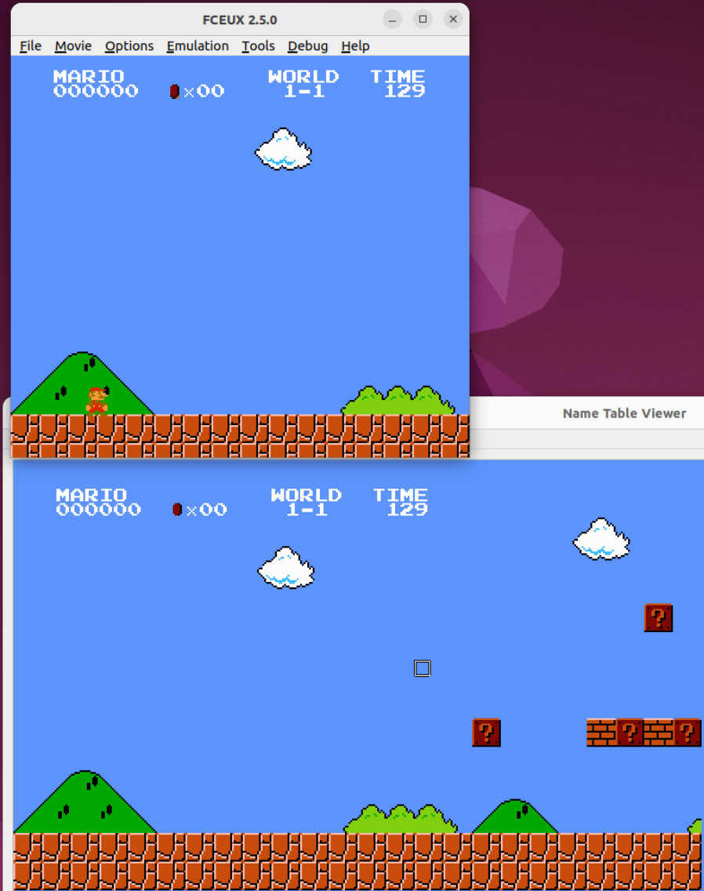
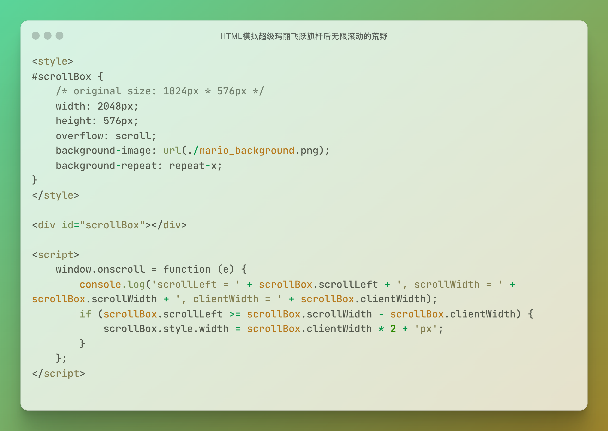
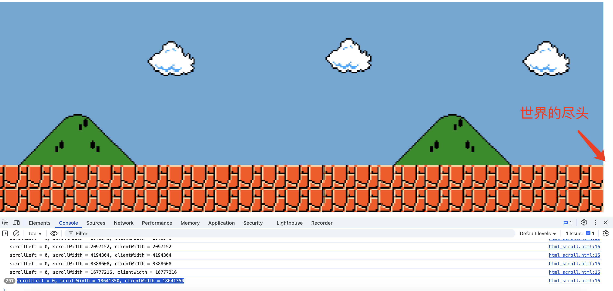
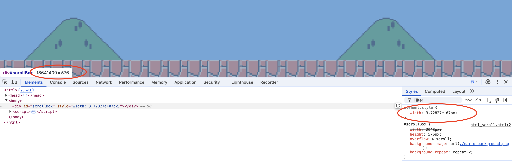
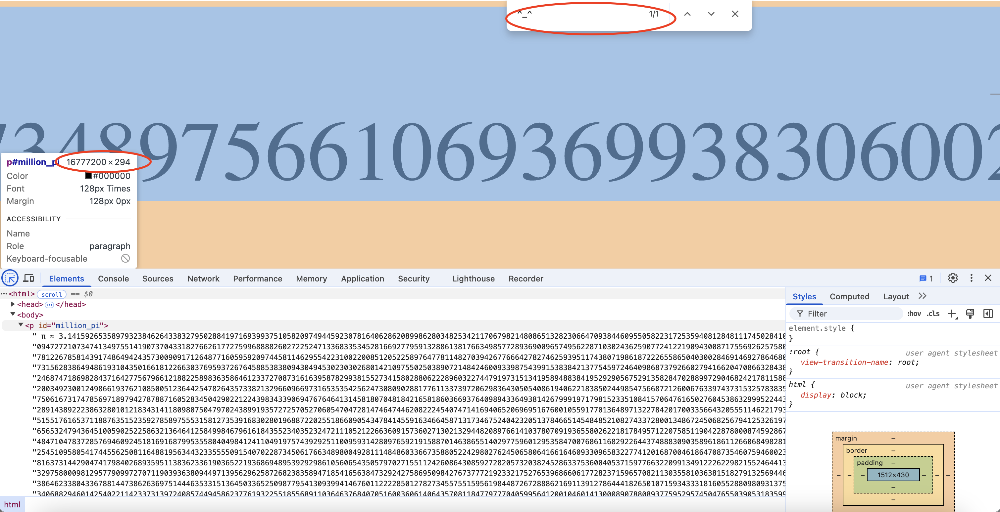

# 从 FC 超级马里奥飞跃旗杆想到：HTML DOM 元素有没有最大宽度？

最近在研究 FC 上《超级马里奥 1》的源代码（https://gist.github.com/1wErt3r/4048722）时，发现了一组参数，用于控制马里奥的跳跃力和游戏世界的重力等，稍加修改就可以让马里奥越过旗杆。只不过，如视频所示，迈过城堡的大门之后，等待玩家的不是一睹看不见的墙，更不是隐藏关卡或水管，而是一片无限滚动的背景，反反复复出现的草丛和白云。

【插入视频 1】

FC 使用了一种叫作 Name Table 的特殊空间存储背景图块的布局信息。像《超级马里奥 1》这种横版过关游戏，要使用两个 Name Table（你可以把它们想象成两幅画框）交替加载背景。程序会让一个 Name Table 负责当前画面，另一个 Name Table 负责提前加载关卡的下一帧画面。当水平滚动超过 1 个 Name Table 的宽度后，FC 会自动切换到下一个 Name Table，而被换出的 Name Table 会继续加载后续关卡数据（再下一帧画面），通过这一对 Name Table 反复交替，即可实现多帧关卡画面的无缝衔接。

基于 FC 的这种特性，没有尽头的无限场景倒是不难理解，无非是 AB、BA、AB……两幅画面“二人转”嘛。马里奥一直跑到死也看不到尽头。

但我突然想到，HTML 页面或者说浏览器是没有这种“二人转”的特性吧。像 `
`、`
` 这样的元素不太可能没有尽头吧，无论如何也应该有个最大宽度。

于是产生了**第一个疑问**：若用 `
` + 横向平铺背景图片的 CSS 属性 `background-repeat: repeat-x;` 能实现无限滚动的背景吗？

那就监听 `scroll` 事件来验证一下吧。这样来做，只要滚动条滚动到作为画框（游戏屏幕）的 `
` 的最右侧，就加倍该 `
` 的宽度，横向平铺图片的 CSS 属性应该会迅速用背景充满这个 `
`，从而实现无限滚动的背景。代码如下：

🔗 https://gist.github.com/huyi1985/6b23168b17d20bbecc3b3373b9ba4c0b

测试一下（这里使用的浏览器是 Google Chrome Version 133.0）。

【插入视频 2】

乍看之下，一切正常，但控制台中的日志信息 `scrollLeft = 0, scrollWidth = 18641350, clientWidth = 18641350` 表明，`
` 的宽度并不能无限扩张，最大扩展到 18641350。而且，拖动滚动条上的滑块到最右侧，会发现背景还是有尽头的，出现了一个白边。

再用开发者工具查看这个 `
` 的实际宽度，

结果为 18,641,400。但右侧“Styles”窗格中看到的宽度又是 `3.72827e+07px`。

紧接着，**第二个疑问**又来了，如果 `
`、`
` 等 DOM 元素中的内容非常多，比如数学中的无限不循环小数，生物的 DNA 序列，这些数据多到即使是最宽、最最宽的 DOM 元素也承载不下时，会发生什么呢？当不断滚动屏幕，一直到达这些 DOM 元素的尽头时，看到的又是什么？

继续试验。假设浏览器内部使用 32 位的 int 来存放 CSS `width` 属性的值，那么就以 `2147483647px` 作为 `
` 元素的最大宽度，然后将圆周率π的前一百万位作为 `
` 的内容。为了验证是否能显示下所有数字，在数字之后特意加上了一个笑脸符号 `^_^`。看到笑脸说明一百万位的圆周率全部能显示出来，反之则说明显示不全。

🔗 https://gist.github.com/huyi1985/49ffc637d25ce9b21669128415309c56

不出所料，真的显示不全。开发者工具中查看的 `
` 的最大宽度是 16,777,200，远比 2,147,483,647 要小。搜索网页内容，倒是能找到 `^_^`。另外，最后一个数字 `2` 没有显示全。

---

看来，DOM 元素的确有最大宽度，只是这个最大宽度的具体数值是多少呢？恐怕这只有去挖掘浏览器的源代码才能得知了。

