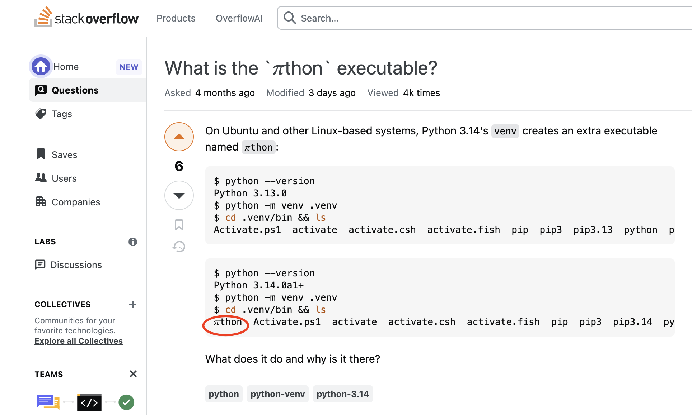
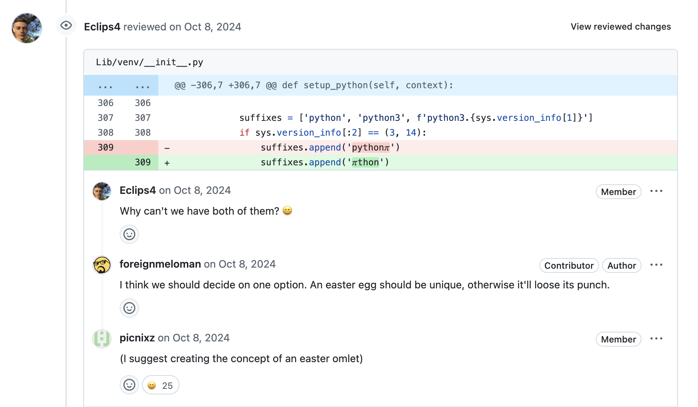

# Python 3.14 版本的彩蛋

使用 3.14 版本的 Python **创建一个虚拟环境**，会看到在虚拟环境的 `bin` 目录中，不仅有 `python3`、`python3.14` 等常规文件，竟然还存在一个特殊的文件 `𝜋thon`。




```bash
/tmp/venv/bin$ ll
total 72
...
-rwxr-xr-x  1 user  user   290B Mar  5 10:57 pip3.14*
lrwxr-xr-x  1 user  user    10B Mar  5 10:57 python@ -> python.exe
lrwxr-xr-x  1 user  user    60B Mar  5 10:57 python.exe@ -> /Users/user/Documents/code/src/cpython/build/gil/python.exe
lrwxr-xr-x  1 user  user    10B Mar  5 10:57 python3@ -> python.exe
lrwxr-xr-x  1 user  user    10B Mar  5 10:57 python3.14@ -> python.exe
lrwxr-xr-x  1 user  user    10B Mar  5 10:57 𝜋thon@ -> python.exe
```

其实，`𝜋thon` 只不过是 `python.exe` 的软链接。这显然是 Python 3.14 的一个彩蛋：**3.14 是 𝜋 的前 3 位，且 Python 中 `Py` 的发音与 𝜋 一样**。



有意思的是，Python 不是向数学常数 **π** 致敬的唯一软件，另一个把版本号和 𝜋 联系起来的软件是，计算机科学界的传奇人物 Donald Knuth（高纳德）的 **TeX** 排版系统。

TeX 3.0 于 1990 年发布，之后版本号每次更新都会更接近 π，比如 3.1、3.14、3.141、3.1415……这个模式意味着 TeX 永远不会到达 4.0，它会无限逼近 π，表达了一种“完美的极限”思想。

这当然也不是 Python 社区第一次搞怪，试试 `import this` 和 `import antigravity` 这些彩蛋吧。

