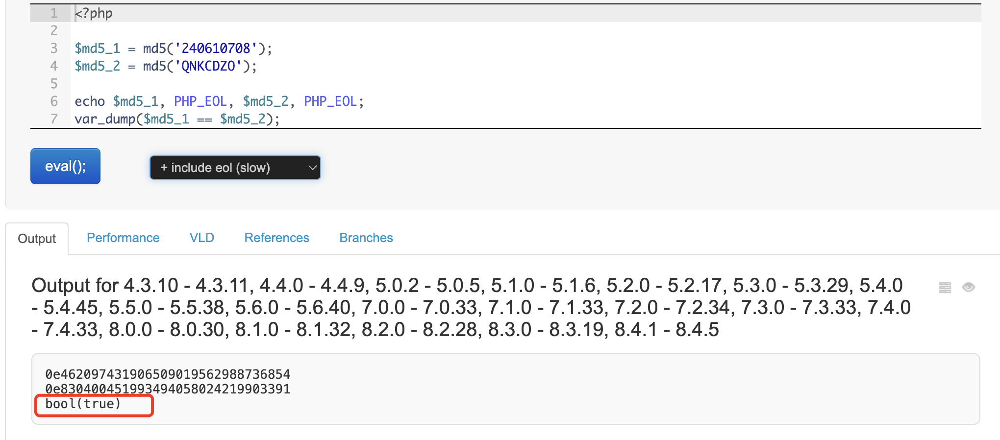
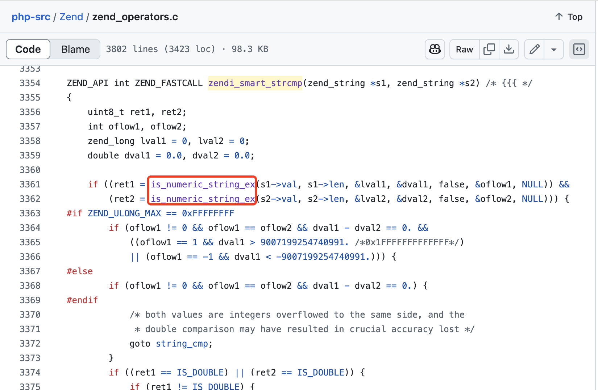
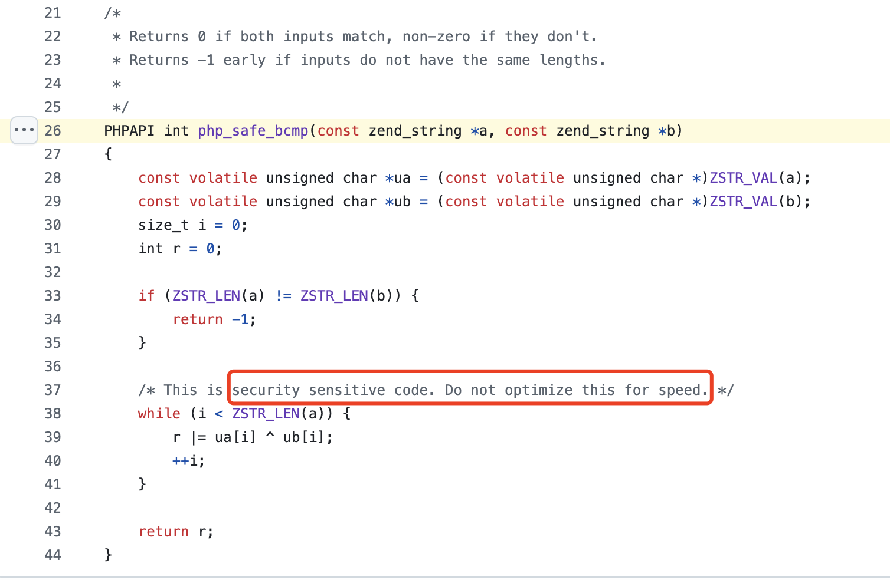

# PHP又出Bug了？md5('240610708')竟然等于 md5('QNKCDZO')！

如下图所示，`'240610708'` 和 `'QNKCDZO'` 是两个完全不同的字符串，它们的 MD5 哈希值自然也不相同。可为什么明明不同，PHP 还会认为这两个哈希值相等呢？更离谱的是，从 2004 年底的 PHP 4.3.10 版本开始，这个“问题”至今一直存在，所有后续版本都会认为它们是**相等的**！

难道是 PHP 又出 bug 了？还是这背后另有隐情？让我们一探究竟！



这看起来的确像是 PHP 的一个 bug。但实际上，这只是 `==` **弱类型比较运算符带来的副作用**。这个副作用的危害在于，只要还在用 `==` 进行哈希值比较，就无疑会埋下安全隐患！

我们先来看看这两个本不相同的 MD5 哈希值有什么特点，

```php
0e462097431906509019562988736854
0e830400451993494058024219903391
```

不难发现，这两个哈希值都**以 `0e` 开头，并且 `0e` 之后全是数字**。

在 PHP 中，对于形如 `'0e[0-9]+'` 的字符串，PHP 会尝试将它解析为**用科学计数法表示的数字**，即：

```php
0e462097431906509019562988736854
  => 0 × 10的462097431906509019562988736854次方 = 0
  
0e830400451993494058024219903391
  => 0 × 10的830400451993494058024219903391次方 = 0
```

由于 0 乘以任何数都等于 0，所以实际比较的是 `0 == 0` 吗？结果当然是 `true`，这才导致了这个看似 bug 的现象。

---

再从 PHP 源代码的角度来看，如果弱类型比较运算符  `==` 两边的值都是字符串，那么会执行 `zendi_smart_strcmp()` 这个函数。而这个函数最初要做的，就是试图通过 `is_numeric_str_function()` 将字符串转换成对应的数字，成功转换成数字后，再对数字进行比较。

对于形如 `'0e[0-9]+'` 的科学计数法字符串，无论 `e` 之后是什么，都会被转换成浮点数 0，0 自然等于 0 喽，所以 `==` 比较的结果为 `true`。



---

了解了不同的 MD5 哈希值会被 PHP 中的 `==` 判定为相同的原理后，就再来看看这个问题带来的危害吧。

显然，这个问题可能导致严重的安全漏洞：如果某个系统使用 `md5($password . $salt) == $stored_hash` 来验证用户身份，那么攻击者就可能找到另一个字符串，即使不是正确的密码，但加盐后的 MD5 哈希值满足 `'0e[0-9]+'` 的条件，而刚好来自数据库中的 `$stored_hash` 也是 `0e` 开头之后全是数字，这样的话攻击者就可以绕过密码验证了。

那如何堵住这个安全漏洞呢？

既然漏洞是由弱类型比较运算符 `==` 引起的，那最简单的办法就是改用 `===` 进行严格比较。而更好的方法是，使用 PHP 5.6+ 提供的专门用于 **哈希值比较** 的安全函数 `hash_equals()`。该函数还能通过牺牲性能来防止时序攻击。其源代码的注释中写道：*这是安全性敏感的代码，千万别为了追求速度去优化啊！*

> 时序攻击（timing attack）是一种通过**测量代码执行时间的微小差异**来推测机密信息的攻击方式，比如对于普通的 `===` 比较，其执行时间会因不一致的字符的出现位置的不同而不同。例如，相较于两个字符串的第一个字符就不相同，前面的字符全部一致，只有最后一个字符不同，后者的运算时间应该更长。



而更安全的做法是改用 PHP 5.5+ 提供的 `password_hash()` 函数来生成哈希值，并搭配 `password_verify()` 函数进行校验，而不要使用 MD5 进行安全相关的哈希计算。

总之，MD5 早已不再安全，PHP 的弱类型比较 `==` 又让这个问题雪上加霜。在实际开发中，我们应该避免使用 MD5 进行身份验证。
