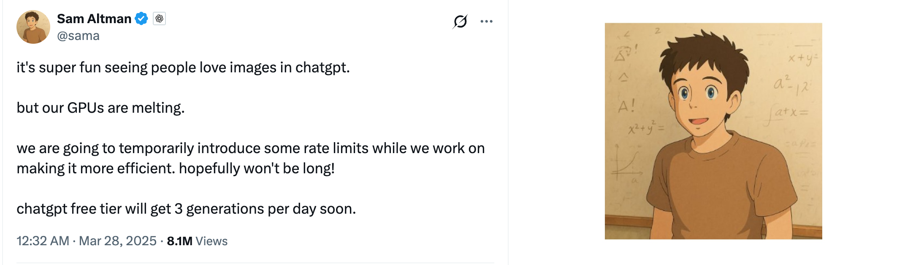
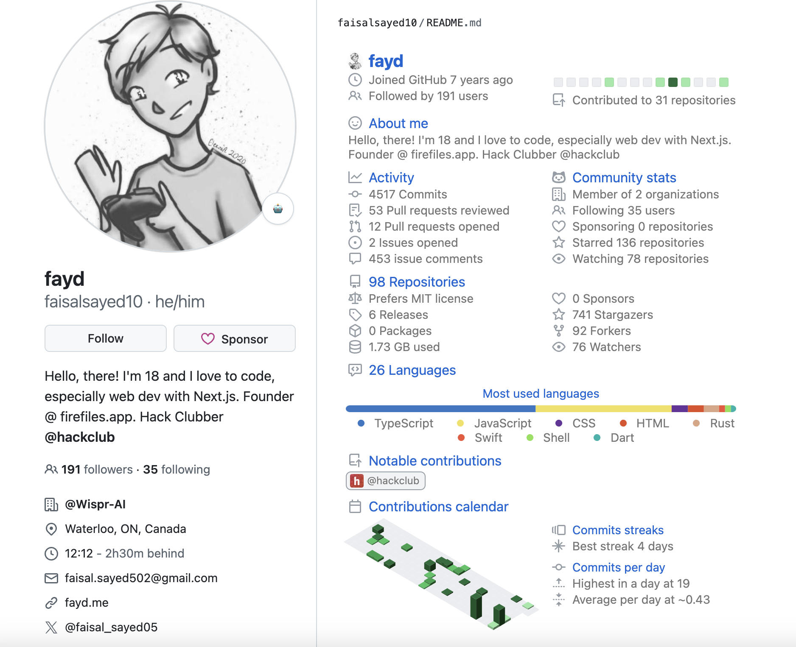
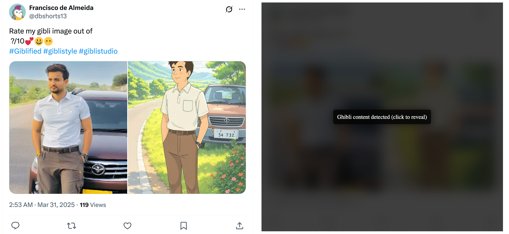
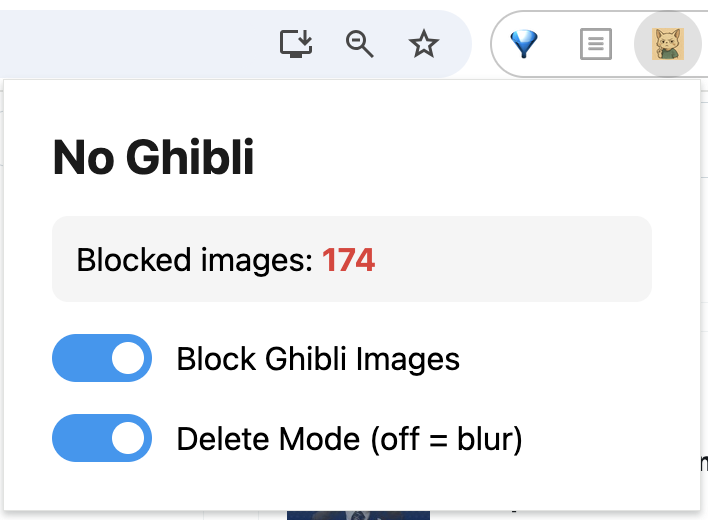
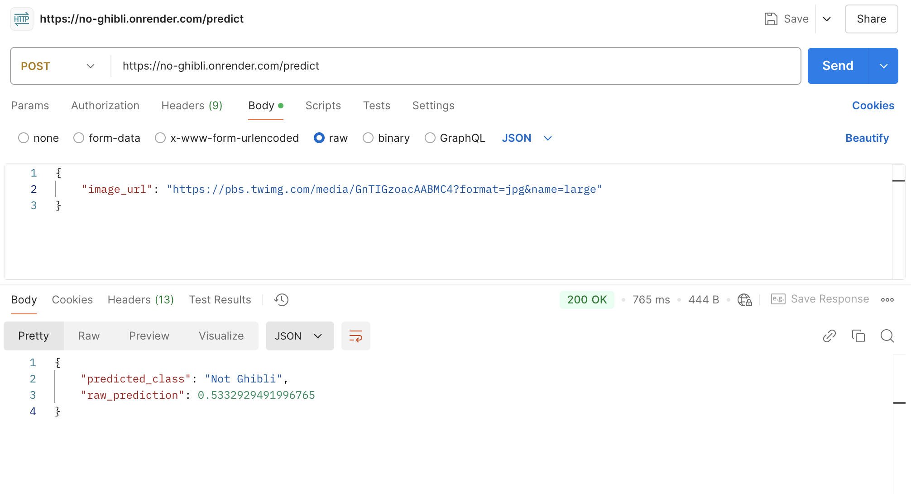
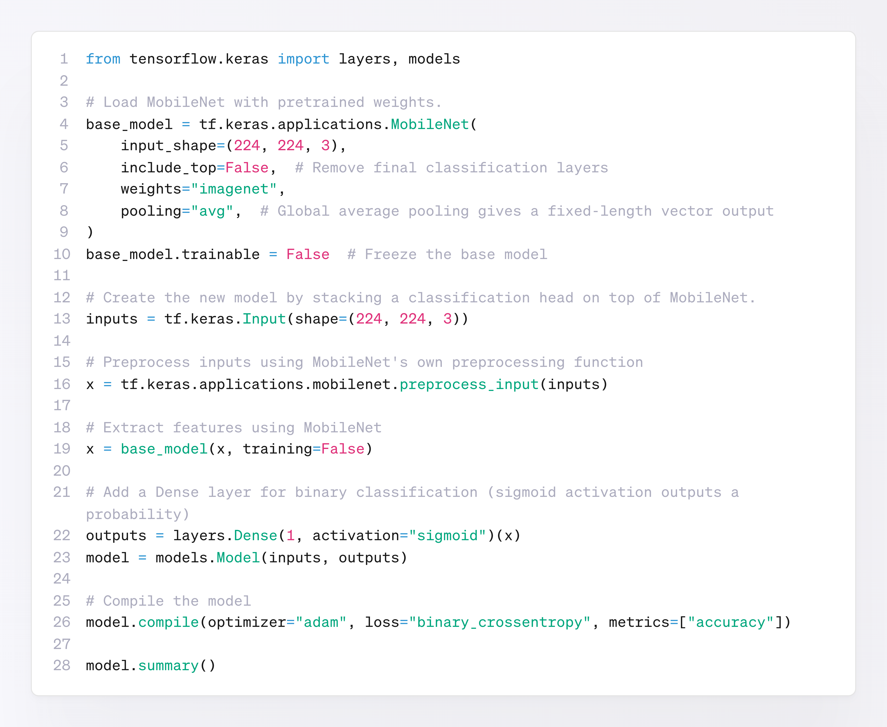

# AI画疯了，扛着AI反AI的也来了！开发Chrome插件专门屏蔽吉卜力风格的图片

近日，ChatGPT 解锁了全新的 AI 图片生成功能，现在只需一句话，就能把照片变成“吉卜力风格”。没过几个小时，网络就已经被各种吉卜力风格的图片和梗图攻占。

网友们兴奋得不得了，纷纷拿生活照、宠物照，甚至各种知名梗图来进行“吉卜力化”（Ghiblification）。只需输入类似“将照片转换为吉卜力风格”的“指令”，分分钟就能让自己或他人看起来就像刚从《千与千寻》或《龙猫》里跑出来。连 OpenAI 的大老板阿特曼都忍不住，把自己的头像也换成了吉卜力风格。



面对这股 AI 风潮，不少文章已经聊过宫崎骏老爷子对 AI 生成动画的强烈反感和不适，也讨论了 AI 画风在法律上的侵权问题。咱们今天就不掺和这些话题了，改聊点有趣的——一位网名叫 **faisalsayed10** 的 18 岁程序员看不下去了，干脆整了个 **Chrome 插件 No Ghibli**，利用 AI 图像分类技术来专门屏蔽社交媒体上的 AI 生成吉卜力风格图片。可谓是有人用 AI 绘图，就有人用 AI 让这些图片消失，扛着 AI 反 AI。

🔗 https://github.com/faisalsayed10/no-ghibli/tree/main




我们先来看看这个插件的效果：




启动插件后（右图），一切 AI 生成的吉卜力风格图片（左图）都会被无情封杀——不仅图片本身，就连用户信息和推文内容也一起被盖上深灰色的“毛玻璃”。

这还不够，**faisalsayed10** 甚至“贴心地”提供了**删除模式**，



一旦开启，刚刚刷新出的推文还没来得及看清，“欻”地一下，就会瞬间被捏成一道缝，随后消失不见，连一丝像素残渣都不留。可见 faisalsayed10 对这股跟风的嫌弃。

---

No Ghibli Chrome 插件背后的原理其实并不复杂。核心是一套后端服务，由**经过训练的分类模型**和 **HTTP 服务器**两部分构成。模型用于进行高效的图像分类，判别哪些图片带着“吉卜力基因”，哪些没有；HTTP 服务器则用于充当模型的“代言人”，对外部提供判别结果。如下图所示，将图片的 URL 作为参数，请求 **HTTP 服务器**的 `/predict` 接口，即可得到图片的分类以及属于该分类的概率，即模型有多确信自己没看走眼。


这里使用的模型也很简单，是一个基于 MobileNet 模型的二元分类模型。MobileNet 是 Google 提出的轻量级卷积神经网络（CNN），专为移动和嵌入式设备设计。相比于传统的深度学习模型，其参数量更少，计算更高效，适用于移动端、边缘设备和实时计算场景。

所有输入的图片都会先被调整为 224 × 224 像素的 RGB 格式，然后使用 MobileNet 模型的预处理函数 `preprocess_input()` 进行预处理。而经过 MobileNet 模型提取出的图片特征最终会经过全连接层（Dense 层）和 `sigmoid` 激活函数输出一个属于吉卜力风格的概率。



```python
from tensorflow.keras import layers, models

# Load MobileNet with pretrained weights.
base_model = tf.keras.applications.MobileNet(
    input_shape=(224, 224, 3),
    include_top=False,  # Remove final classification layers
    weights="imagenet",
    pooling="avg",  # Global average pooling gives a fixed-length vector output
)
base_model.trainable = False  # Freeze the base model

# Create the new model by stacking a classification head on top of MobileNet.
inputs = tf.keras.Input(shape=(224, 224, 3))

# Preprocess inputs using MobileNet's own preprocessing function
x = tf.keras.applications.mobilenet.preprocess_input(inputs)

# Extract features using MobileNet
x = base_model(x, training=False)

# Add a Dense layer for binary classification (sigmoid activation outputs a probability)
outputs = layers.Dense(1, activation="sigmoid")(x)
model = models.Model(inputs, outputs)

# Compile the model
model.compile(optimizer="adam", loss="binary_crossentropy", metrics=["accuracy"])

model.summary()
```

---

无论是 AI 绘图还是 AI 反 AI，都只是技术发展带来的有趣现象。有人沉浸在吉卜力风格的滤镜中，有人则迫不及待想把它们统统屏蔽掉。无论你是站在 AI 创造力的一边，还是更喜欢一个没有 AI 画风“轰炸”的世界，技术的多样性总能满足不同的需求。

也许再过不久，我们会看到更多类似的“AI 反 AI”工具，甚至 AI 之间会展开更加激烈的攻防战。

🔚

----

## 来源

https://github.com/faisalsayed10/no-ghibli/tree/main

https://habr.com/ru/news/895642/
