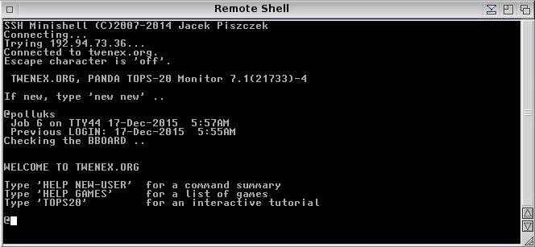

# 操作系统有个代号不稀奇，但轮番换了多个就离谱了

操作系统厂商通常会为旗下的操作系统赋予有别于正式名称的**代号**。比如，微软曾用 Chicago、Memphis、Whistler 分别作为 Windows 95、Windows 98、Windows XP 的代号；苹果则一开始是大猫系列的代号，Cheetah、Panther、Tiger……，后来改走国家地理风，什么 Yosemite、Mojave、Big Sur……。这些代号往往只是开发团队用来区分版本或内部沟通的，外人、特别是非程序员的最终用户一般不太关心它们。

但如果一个操作系统**打一枪换一个地方，轮番换了三四个代号**，那就很有趣了。这就好比一名演员，有一个艺名不稀奇，但三番五次地换艺名，特别是在不同片商用不同名字，就很值得尊敬了。

DEC（数字设备公司） 公司的 **TOPS-20** 操作系统代号的更迭正是这样一个有点奇葩的案例。

> DECSYSTEM-20 KL-10 (1974) at the Living Computer Museum

---

**TOPS-20 是 DEC 公司从 1969 年开始，基于 TENEX 为 PDP-10 大型机开发的操作系统**。而 **TENEX** 是 BBN 科技公司在 **1969 年**，基于 DEC 的 **TOPS-10** 开发的操作系统，在当时的 ARPANET（阿帕网，互联网的鼻祖）上几乎一统江湖。DEC 觉得这个系统不错，就买下了 TENEX 的版权，打算打磨成自己的新一代主力系统。可在取名字这件事上，DEC 的做法就有点像闹剧了。

起初，这个新系统被 DEC 命名为 **VIROS**，意思是**虚拟内存操作系统**，**Vir**tual Memory **O**perating **S**ystem）。这个名字还算合理，毕竟虚拟内存可是 TENEX 的一大亮点。但可能是这个名字听起来略像“病毒”（Virus），又或者 DEC 不想让人觉得自己缺乏创新，是在沾 TENEX 的光，于是当客户咨询“你们是不是在搞一个叫 VIROS 的系统”时，DEC 突然搪塞到“不存在，根本不存在”，并偷偷把代号从 **VIROS** 改成了 **SNARK**。

**SNARK** 这个词来源于英国作家路易斯·卡罗（《爱丽丝梦游仙境》的作者）的荒诞诗《猎鲨记》（The Hunting of the **Snark**），本身就带点恶搞意味。Snark 是作者编造出的一种难以追捕的动物，可能 DEC 也希望新一代操作系统在亮相前先潜伏起来。

然而，SNARK 这个名字还是不胫而走了（鲨鱼还真没腿）。不知出于什么考虑，DEC 似乎又想继续“掩人耳目”，这一次干脆把 SNARK 反过来写，变成了 **KRANS**。这一看就是程序员的小聪明，但不巧，又有人指出“krans”在瑞典语中是“葬礼花圈”的意思（一些瑞典人后来否认，说这个词只是“花环”的意思）。于是 DEC 又决定这个名字也还是别用了。

一通折腾后， **1976 年**这款操作系统终于被正式命名为 **TOPS-20**，作为前一代 **TOPS-10** 的后续版本，名字听起来颇为朴素直白。然而，黑客圈子一看便知它是从 TENEX 改进而来，立马给它起了个更“贴切”的外号：**TWENEX**。

这其实是个文字游戏。TENEX 是 TEN-EXtended 的缩写，即 **10-EXtended**（扩展），指的是对于 DEC **TOPS-10** 的扩展。

既然这次 DEC 升级到了 TOPS-20，又是套壳的 TENEX（事实并非如此，原始 TENEX 代码在 TOPS-20 中仅剩下很少一部分），那就叫 **TWENEX**，即 Twenty -EXtended，**20-EXtended**（扩展），岂不是刚刚好？这个绰号一传十、十传百，甚至还演化出了简写形式 **20x**。

DEC 的市场部门对此颇感头疼——明明正名是 TOPS-20，也没有照搬抄袭 TENEX，却挡不住黑客文化中充满调侃的自由命名风潮。

TOPS-20 曾风光一时，堪比 Unix 与 ITS 的影响力。然而随着 DEC 押注 VAX 架构和 VMS 系统，TOPS-20 被打入冷宫。DEC 曾努力劝说用户转投 VMS，却收效甚微。到 1980 年代末，TOPS-20 的用户基本都转向了 Unix。

TOPS-20 的命名过程充满了喜感：从病毒感满满的 VIROS，到诗意荒谬的 SNARK，再到悲伤的 KRANS，最后虽然落脚于平淡的 TOPS-20，用户却坚持叫它 TWENEX。

🔚

---

http://catb.org/~esr/jargon/html/T/TWENEX.html

https://www.amazon.com.au/machine-revival-TOPS-20-Legendary-emulator-ebook/dp/B0B137CCNB

%% 
TWENEX: /twe�neks/, n.
-----

The TOPS-20 operating system by DEC — the second proprietary OS for the PDP-10 — preferred by most PDP-10 hackers over TOPS-10 (that is, by those who were not ITS or WAITS partisans). TOPS-20 began in 1969 as Bolt, Beranek & Newman's TENEX operating system using special paging hardware. By the early 1970s, almost all of the systems on the ARPANET ran TENEX. DEC purchased the rights to TENEX from BBN and began work to make it their own. The first in-house code name for the operating system was VIROS (VIRtual memory Operating System); when customers started asking questions, the name was changed to SNARK so DEC could truthfully deny that there was any project called VIROS. When the name SNARK became known, the name was briefly reversed to become KRANS; this was quickly abandoned when someone objected that krans meant ‘funeral wreath’ in Swedish (though some Swedish speakers have since said it means simply ‘wreath’; this part of the story may be apocryphal). Ultimately DEC picked TOPS-20 as the name of the operating system, and it was as TOPS-20 that it was marketed. The hacker community, mindful of its origins, quickly dubbed it TWENEX (a contraction of ‘twenty TENEX’), even though by this point very little of the original TENEX code remained (analogously to the differences between AT&T V6 Unix and BSD). DEC people cringed when they heard “TWENEX”, but the term caught on nevertheless (the written abbreviation ‘20x’ was also used). TWENEX was successful and very popular; in fact, there was a period in the early 1980s when it commanded as fervent a culture of partisans as Unix or ITS — but DEC's decision to scrap all the internal rivals to the VAX architecture and its relatively stodgy VMS OS killed the DEC-20 and put a sad end to TWENEX's brief day in the sun. DEC attempted to convince TOPS-20 users to convert to VMS, but instead, by the late 1980s, most of the TOPS-20 hackers had migrated to Unix. There is a TOPS-20 home page. %%

%% 
THE T IN TCSH
------

In 1964, DEC produced the PDP-6. The PDP-10 was a later re-implementation. It was re-christened the DECsystem-10 in 1970 or so when DEC brought out the second model, the KI10.
TENEX was created at Bolt, Beranek & Newman (a Cambridge, Massachusetts think tank) in 1972 as an experiment in demand-paged virtual memory operating systems. They built a new pager for the DEC PDP-10 and created the OS to go with it. It was extremely successful in academia.

In 1975, DEC brought out a new model of the PDP-10, the KL10; they intended to have only a version of TENEX, which they had licensed from BBN, for the new box. They called their version TOPS-20 (their capitalization is trademarked). A lot of TOPS-10 users (`The OPerating System for PDP-10') objected; thus DEC found themselves supporting two incompatible systems on the same hardware--but then there were 6 on the PDP-11!

TENEX, and TOPS-20 to version 3, had command completion via a user-code-level subroutine library called ULTCMD. With version 3, DEC moved all that capability and more into the monitor (`kernel' for you Unix types), accessed by the COMND% JSYS (`Jump to SYStem' instruction, the supervisor call mechanism [are my IBM roots also showing?]).

The creator of tcsh was impressed by this feature and several others of TENEX and TOPS-20, and created a version of csh which mimicked them. %%