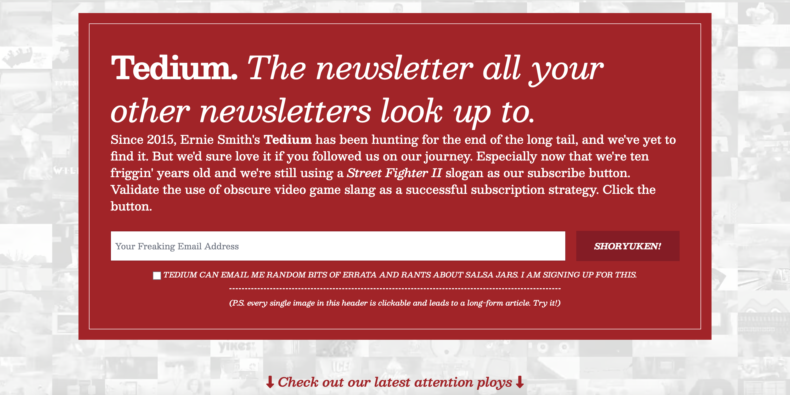
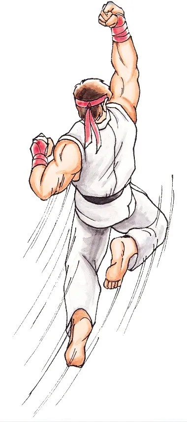

# 订阅按钮上的文字可以有多古怪？Tedium 把“SUBSCRIBE”写成了“SHORYUKEN!”

在浏览器的地址栏中输入 **tedium.co**，映入眼帘的便是一个极具辨识度的首页：醒目到晃眼的红白配色，大字号的文本，巨大的文本框……

环绕在红色方框周围的是一排排紧凑排列、循环播放的灰白色动画，短促且重复。与其说是动画，不如说是有规律的连续抽动，给人一种奇妙的感觉。

> https://tedium.co 的首页

这时，目光很容易被那个大大的文本框吸引过去。文本框里灰色的提示文字“**Your Freaking Email Address**”告诉我们这是个订阅栏。填上邮箱，点一下旁边的按钮，网站就会定期往你的邮箱投喂内容。

可问题来了——按钮上写的不是常见的“Subscribe”，而是大写的“**SHORYUKEN!**”！这是什么？拼错了的“Subscribe”？那也错得太离谱了，几乎没一个字母对得上！或者就是个冷僻的英文单词？

不过，如果你能读日语的罗马字，或者在街机厅挥洒过青春，那多半已经会心一笑了：**“SHORYUKEN”**，不就是**街霸**里那一记腾空而起的——升！龙！拳！

对了，前面文本框里的那个 “**Freaking**” 看着也挺眼生的吧？不妨查一下词典，保证你会再笑一次，坏笑一次。

为什么要在订阅按钮上写下这样一个（对大众而言）古怪的词呢？因为 Tedium 的创始人 Ernie Smith 坚信，曾经的互联网既古怪又迷人。他希望通过对晦涩、冷门、边缘事物的持续挖掘，把那种**不那么算法、却格外有趣**的网络体验带回来。Tedium 多年来一直致力于追寻“长尾的尽头”，那些可能被遗忘在时间缝隙中没人关心、但其实暗藏精彩的小故事，就是他们的主战场。

---

我感觉“SHORYUKEN!”其实是**一种对冷门同好的试剂**——能看懂、愿意点它的人，正是他们想要召唤的同类。

之所以有这个感觉和我小学的一位老师有关。那位老师姓**郝**，名字叫**有根**（具体是哪两个字已经记不清了）。在那个街机语音方面性能有限、我们小孩听力也不太靠谱的年代，升龙拳的“SHORYUKEN”在我们耳朵里听起来是“**薅优根**”。于是，每当提起这位老师，我和几个小伙伴就会笑成一团，而班上的女生、老师和我们的家长根本不知道我们在笑什么。

那种“只有你懂的梗”的快乐，就是我看到 Tedium 把订阅按钮写成“SHORYUKEN!”时心里涌起的熟悉感觉。

在今天这个什么都讲求转化率、A/B 测试、按钮颜色要“心理学”指导的世界里，Tedium 把街霸里的招式写在订阅按钮上，简直像是在说：**“我们只想吸引真正懂我们的人。”**

**薅优根**，不只是招式，还是暗号。

🔚

