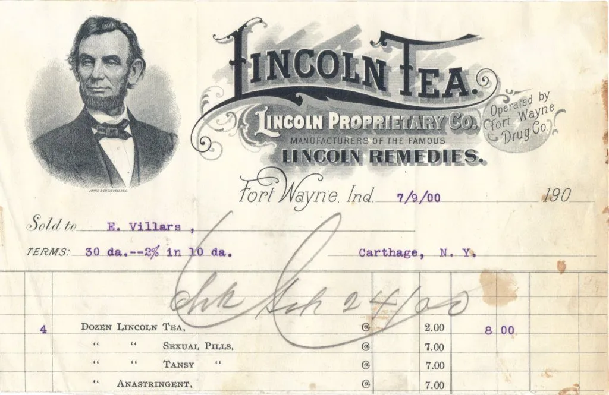
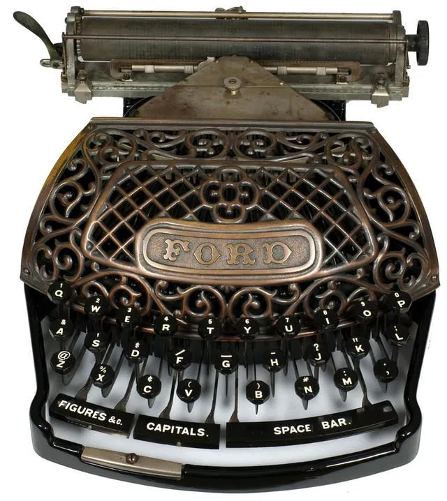

# 跨越数百年的巧合：Python 选中 @ 符号表示矩阵乘法

Python 从 3.5 开始，引入了 @ 符号表示矩阵乘法，这是通过 PEP 465 号提案正式确立的。

该提案以解决当前代码中的问题为主，没有任何“考古”元素，并没有参考 @ 在人类历史上的其他用法。于是，**从提案落地实施的那一刻起，一个跨越数百年的巧合悄然发生了**。

## Python 为什么要引入 @

在坐上时光机去探究 @ 的历史之前，我们先来聊聊 Python 为什么要特意新引入一个运算符 @ 来做矩阵乘法呢？

首先，`A @ B`**更贴近数学表达**。在数学上，矩阵乘法通常写作 A⋅B（乘号⋅通常省略），而不是写成 `dot(A, B)` 或 `A.matmul(B)` 这种函数调用形式。若写作 `A @ B`，代码就跟数学算式几乎一模一样了，写起来更顺手，看起来也更直观，有助于提升代码的**可读性和可维护性**。

其次，使用 `@` 可以**避免歧义**。在数值计算里，以矩阵为对象的乘法不止一种，比如按元素乘（也叫阿达玛乘积）和普通的矩阵乘法。如果全都用 `*` 来表示，容易搞混。特别是在 NumPy 里，不同类型的对象，如 `numpy.ndarray` 和 `numpy.matrix`，对 `*` 的解释还不一样，很容易出错。

```python
# 按元素乘（也叫阿达玛乘积）
[[1, 2],     [[11, 12],     [[1*11, 2*12],
 [3, 4]]  x   [13, 14]]  =   [3*13, 4*14]]

# 普通的矩阵乘法
[[1, 2],     [[11, 12],     [[1*11 + 2*13, 1*12 + 2*14],
 [3, 4]]  x   [13, 14]]  =   [3*11 + 4*13, 3*12 + 4*14]]
```

PEP 465 号提案中还提到了选择 @ 而不用其他符号表示矩阵乘法的一些理由：

* 各种键盘布局中都有 @ 符号，可以轻松输入
*  @ 看起来像个小漩涡，能使人联想到矩阵乘法中行与列交错扫描的运算过程
*  @ 符号的不对称暗示了矩阵乘法不满足交换律
* ……

还有一个小彩蛋（助记法）： @ 读作 at，而 **at** 一词刚好在矩阵 m**at**rix 这个词中。

在陈述完这些理由后，提案的作者还不忘顺带讽刺一下“竞争对手”——为什么不用 `$` 符号来作乘号呢，因为我们不想背上 PHP 的“技术债”。

提案里虽然考虑了今天代码编写的多种因素，却忽略了 @ 这个符号在历史上的一种用法。而从“考古”的角度看， @ 甚至比编程常用的 `*` **更有资格扮演乘号的角色**。

## 追溯 @ 的历史

故事还得从一张古老的账单说起——一张印着林肯肖像、以他的名字做品牌宣传的药品账单。



这张账单由位于美国印第安纳州韦恩堡的专利药品公司 **Lincoln Proprietary Co.** 于 **1900 年 7 月 9 日**开具。该公司曾推出多种以“Lincoln”为品牌的草本药品，借助林肯总统的形象和声誉，广泛宣传产品的疗效。

现在请把目光移到账单下方的那张表格上，注意看，每一行的中间都有一个 @ 。 @ 在这里是什么意思呢？显然不可能是发邮件或者 @ 某人出来说话吧。

其实，这里的 **@ 是单价**的意思。比如第一行的 **Dozen Lincoln Tea**，单价是 2.00（表格第 5 列），购买了 4 件（第 2 列的紫色数字），所以总价就是 2.00 × 4 = 8.00（第 6～7 列的紫色数字）。这不就是最**朴素的乘法**吗？

说个题外话，Lincoln Tea 据说是一种可以调理肝肾、净化血液的天然草本茶。林肯总统本人有没有喝过无从考证，但再看账单的下一行——一款打着总统名号的“男性活力”增强药……这宣传就有点太离谱了吧。

回到 @ 符号上。既然它表示“单价”，那这种用法是不是就**暗含了乘法运算**？单价 @ 数量 = 单价 × 数量 = 总价。换句话说，**早在 100 多年前， @ 就已经和“乘法”挂上钩了**。

还有个细节：这张账单并不是手写的，而是用打字机打印出来的。这意味着什么？说明 @ 当时就已经出现在打字机键盘上了。而 @ 会被安排进键盘布局，又进一步说明，在打字机发明之前，它就已经有了广泛的应用，至少对于当时需要使用打字机的人群而言， @ 比 × 要常用。


> 带有 @ 键（左下角）的打字机之一，发明于 1895 年的福特（与福特汽车公司无关）打字机

如果我们继续追溯 @ 的历史，会发现它的故事比我们想象的还要古老。据说早在 15 世纪到 16 世纪， @ 就已经在商业活动中登场，常用于表示重量或体积单位，比如“一个标准的瓶子能装的酒的量”这种标准化的度量方式。这也正是为什么， @ 在 Unicode 编码中的正式名称是 **commercial at**——“商业用的 at”。

不论是表示单价、单位体积还是单位重量， @ 的核心作用始终如一：在已知明确的数量后，通过**乘法**快速计算出总量。它像是“每个多少”的速记方式，也体现了在账目和度量背后的“乘法思维”。

当然，矩阵乘法与作为加法快捷方式的标量乘法差异巨大，背后涉及的是更复杂的行列计算，是线性空间的投影与变换。但归根结底，它依然是一种乘法，它仍然在生成一个叫作“积”（product）的结果。

有趣的是，英文里的 **product** 常用的意思是商品、产品。这也许就是乘法的本质：它是一种**生成新产品的方法**。这个新产品可能是一个数，也可能是一个矩阵。

----

当 Python 选中了 @ 来表示矩阵乘法时，仿佛**冥冥之中与几个世纪前的人们完成了一次符号用法的传承**。一边是用 @ 算出总价的商人，一边是用 @ 训练神经网络的程序员；他们之间隔着几个世纪，却不约而同地，把 @ 和乘法联系在了一起。

跨越数百年的巧合，有时候就藏在一行代码里。

🔚