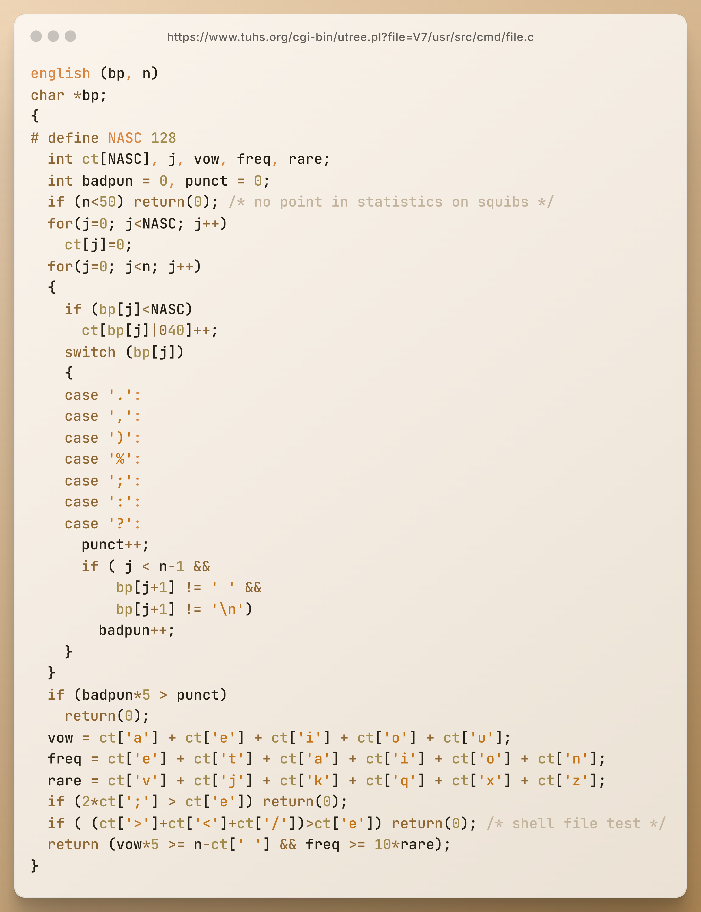
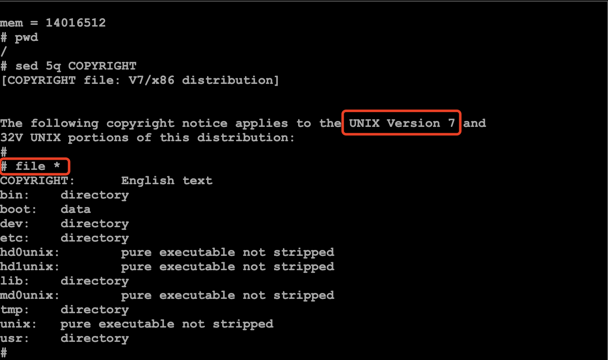
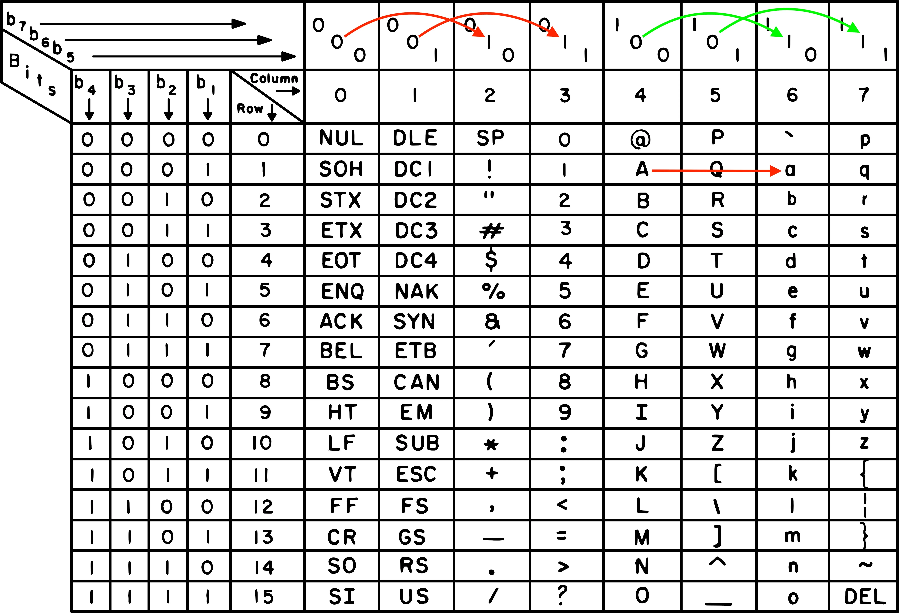

# C语言的”代码化石“出土：1979年的英文文本判别器



各位参观者请看，图中是一段出土自 Unix V7 系统“遗迹”的 C 语言代码，这段代码可追溯至距今 40 余年的 1979 年左右，作者是 Ian Darwin。它是早期 `file` 命令源代码的一部分。

`file` 命令用于在不依赖文件扩展名的情况下判断文件类型——当“打开方式不对”时，`file` 命令能告诉你文件中实际包含的内容。直到今天，大多数类 Unix 操作系统里还能见到 `file` 命令的身影。

现在看到的这个名为 `english(bp, n)` 的函数能够对文本的特征进行分析，并以此来判断一段文本是否由英文写成。换句话说，这是一个早期的“文本语言识别器”。



> 运行在 Unix V7 模拟器上的 `file` 命令。这里输出了根目录下所有文件的类型。可见，文件“`COPYRIGHT`”是一个英文文档

接下来，我们就来一同看看这件“数字文物”是如何构思和实现的，它的写法与我们今天的编码风格有何不同？在算法设计上是否还有可借鉴之处？

---
## K&R 风格的函数声明

先来看前两行函数声明的部分，这无疑是整段程序中与现代 C 语言差异最明显的地方了吧。

```c
english (bp, n)
char *bp;
```

若按照今天的 C 语言语法，这个函数的签名大致会写作：

```c
int english(char *bp, int n)
```

回到 1979 年，C 语言刚刚走过了它的第 7 个年头。那时还没有标准化的 ANSI C，主流仍是所谓的 **K&R 风格语法**——函数参数的类型不写在参数列表里，而是紧接函数名后；而参数或返回值如果是 `int` 类型，通常也可以省略。这种写法在今天看来或许有些古怪，但却在当年普遍使用。

这个函数体可以大致分为三部分：**初始化**、**统计**和**规则检查**。

## 初始化

先来看看初始化部分。和现代 C 语言相比，局部变量的定义倒是没有太大变化。为了方便大家理解，先来简单介绍下几个关键标识符的含义：

```c
english (bp, n)
char *bp;
{
# define NASC 128
	int ct[NASC], j, vow, freq, rare;
	int badpun = 0, punct = 0;
	if (n<50) return(0); /* no point in statistics on squibs */
	for(j=0; j<NASC; j++)
		ct[j]=0;
... ...
```

- **`bp`**：指向待判断的文本的指针，即指向待分析的字符串的首个字符
- **`n`**：文本长度
- **`NASC`**：定义了统计数组 `ct` 的大小，128 是 ASCII 字符的数量
- **`ct`**：用来统计文本中每种字符出现的次数
- **`j`**：`i` 已用作全局变量，所以这里用 `j` 作为循环变量
- **`vow`**：记录文本中出现的元音字母（**vow**el）的数量
- **`freq`**：记录高频英文字母（e、t、a、i、o、n）的出现次数
- **`rare`**：记录罕见英文字母（v、j、k、q、x、z）的数量
- **`badpun`**：记录不符合英文书写规范（即其后没有空格或换行）的标点符号的出现次数
- **`punct`**：记录所有标点符号（**punct**uation）的总数

## 统计

接下来，我们进入统计部分。简单来说，这里会统计文本中每种字符出现的次数。

```c
	for(j=0; j<n; j++)
	{
		if (bp[j]<NASC)
			ct[bp[j]|040]++;
		switch (bp[j])
		{
		case '.': 
		case ',': 
		case ')': 
		case '%':
		case ';': 
		case ':': 
		case '?':
			punct++;
			if ( j < n-1 &&
			    bp[j+1] != ' ' &&
			    bp[j+1] != '\n')
				badpun++;
		}
	}
```

这里就有个小技巧——使用了 `| 040` 这个位运算来**实现英文字母大小写的转换**。在 ASCII 码表中，英文字母的大写和小写只差一个固定的位，这个位就是第 6 位，即 `0010 0000`，十进制的 `32`，也就是八进制的 `040`）。

举个例子吧，把英文字母 `A` 的 ASCII 码（`65`）与 `040` 做按位“或”操作，就能把它转换成小写字母 `a`。这样，不管是大写还是小写字母，都会被统一为小写，方便统计和比较。



不过，从更严谨的角度看，这相当于把 ASCII 码表中第 1、2 列的字符分别映射到了第 3、4 列上，把第 5、6 列的字符分别映射到了第 7、8 列上（所以 “`)`” 和“`*`”的数量可能虚高）。

## 规则检查

好了，现在我们来到了整段代码的“压轴环节”——规则检查部分。

```c
	if (badpun*5 > punct)
		return(0);
	vow = ct['a'] + ct['e'] + ct['i'] + ct['o'] + ct['u'];
	freq = ct['e'] + ct['t'] + ct['a'] + ct['i'] + ct['o'] + ct['n'];
	rare = ct['v'] + ct['j'] + ct['k'] + ct['q'] + ct['x'] + ct['z'];
	if (2*ct[';'] > ct['e']) return(0);
	if ( (ct['>']+ct['<']+ct['/'])>ct['e']) return(0); /* shell file test */
	return (vow*5 >= n-ct[' '] && freq >= 10*rare);
```

这里使用了一些简单的规则，基于以下几个语言统计特征来判断文本是否为英语：

* 不符合书写规范的标点符号是否过多（> 20%）
* 元音字母 `vow` 的比例
* 高频英文字母 `freq`（e、t、a、i、o、n）出现的频率
* 罕见英文字母 `rare`（v、j、k、q、x、z）的比例
* 特殊（非自然语言）符号的比例，例如 <、> 等 Shell 脚本中常用的符号
* ……

总之，虽然这些规则未必来自正式的语言统计方面的论文，但它们的确描述了英文的基本结构特征：一段“像”英语的文本应该足够长、标点用得得当、元音字母够多、常用的英文字母占优势，而且不能像代码那样满是奇怪的符号。

---

## 尾声：古老代码中的现代回响

今天，判断一段文本属于哪种语言，早已有了更复杂、更强大的工具。例如基于**朴素贝叶斯分类**的算法，或利用大量语料库对各类语言进行概率建模，特别是眼下热门的**大语言模型（LLMs）**，甚至已经能够对语言风格、上下文、甚至作者习惯做出精准判断。

相比之下，1979 年的这段 `english()` 函数虽然原始，却展现了早期计算的美学：**在资源有限的条件下，用最简单的方法尽可能准确地解决实际的问题**。

回望这段尘封多年的 C 语言代码，我们依然能感受到它的**精巧**。就像在展柜中看到一件锈迹斑斑的工具，让人不禁感叹：“原来当年，已经有人想得这么远了啊。”

🔚

🏛️ 遗迹地址

* https://www.tuhs.org/cgi-bin/utree.pl?file=V7/usr/src/cmd/file.c Unix V7 上的 `file` 命令的源代码
* https://copy.sh/v86/?profile=unix-v7 Unix V7 模拟器

---
