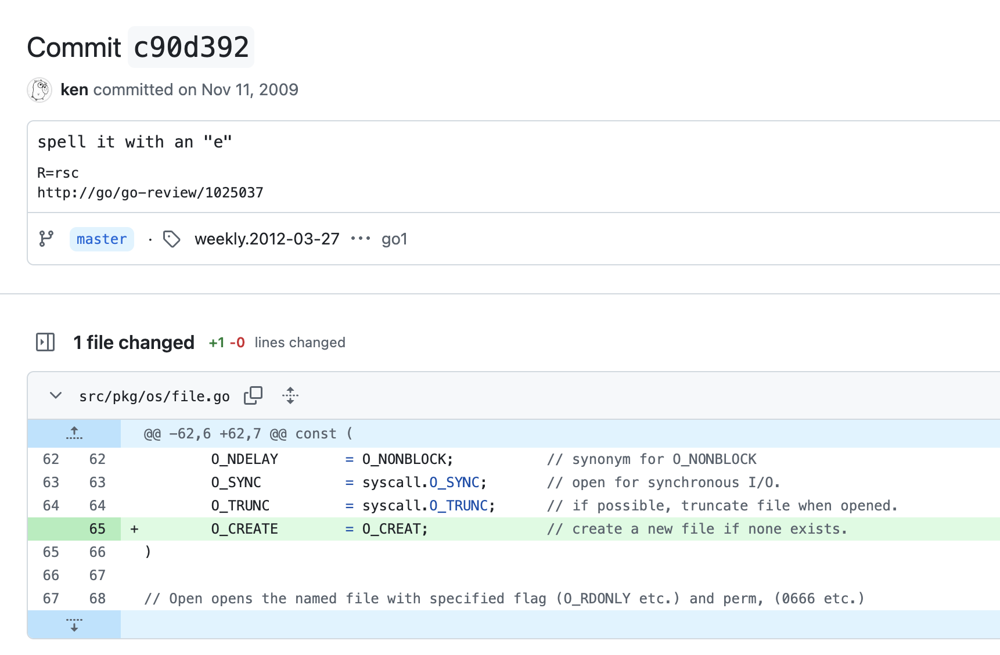

#Unix #creat #ken
## create vs creat

https://unix.stackexchange.com/questions/128708/why-wasnt-creat-called-create

https://unix.stackexchange.com/questions/10893/what-did-ken-thompson-mean-when-he-said-id-spell-creat-with-an-e

http://en.wikiquote.org/wiki/Kenneth_Thompson

https://stackoverflow.com/questions/682719/what-does-the-9th-commandment-mean

https://github.com/golang/go/commit/c90d392ce3d3203e0c32b3f98d1e68c4c2b4c49b

> it's not a spelling error. It's a deliberate (albeit non-standard) abbreviation. It fits with the heavy use of abbreviations like `fcntl`, `ls`, `mv`, etc, in general.

> Teletype keys are hard to press. It was beneficial to save a few letters. First ones that could be eliminated were vowels and redundant consonants.

> Back in the time of [`pdp-11`](http://en.wikipedia.org/wiki/PDP-11), there was an encoding called [`radix50`](http://en.wikipedia.org/wiki/DEC_Radix-50) ...
