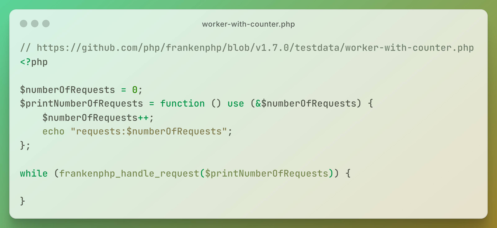
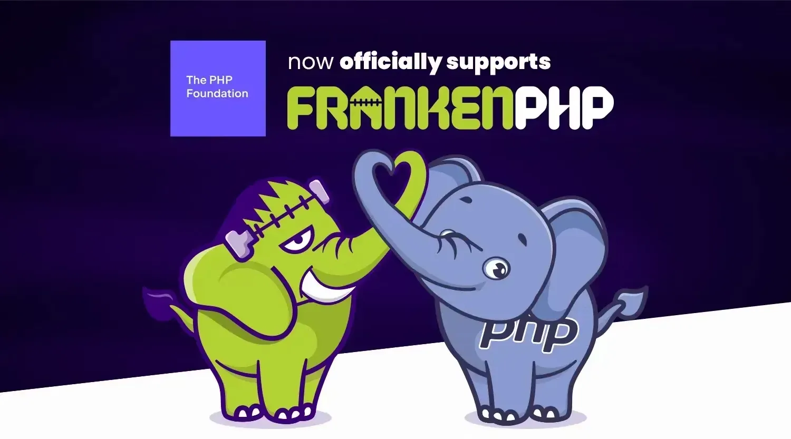

# Nginx和Apache要退休了？PHP有了新搭档：缝合怪FrankenPHP！

在开发 PHP 应用时，你是否也曾为环境搭建而头疼？先安装 Nginx 或 Apache，再配置 PHP-FPM 或 mod_php，把 Web 服务器与 PHP 解释器（SAPI）连接起来，这样才能让 PHP 应用顺利运行。虽然这些步骤并不复杂，但过程繁琐，配置细节多，常常让人感到烦躁，偶尔还会踩到坑里。

现在，这种“老派组合拳”可能要迎来对手了。

我们今天要聊的主角 **FrankenPHP** 不仅是一个 PHP 的运行环境，还内置了 Web 服务器功能。换句话说，只要安装好 FrankenPHP，只要一行命令：

```bash
$ frankenphp php-server
```

PHP Web 服务就跑起来了！

## 什么是 FrankenPHP

FrankenPHP 由 Symfony 项目核心开发者之一 Kévin Dunglas 打造，是一个基于 **Go 开发的高性能应用服务器**，通过与**下一代 Web 服务器 Caddy** 的紧密集成，在提升运行效率的同时，也简化了部署、运维流程。


> FrankenPHP 的作者 Kévin Dunglas

FrankenPHP 是将 PHP 解释器（准确来说是 embed SAPI）作为模块直接集成进了 Caddy。除此之外，开发者甚至可以使用 Go 语言来编写扩展供 PHP 调用，也可以反过来在 Go 中直接调用 PHP，灵活性非常高。

这个项目为什么叫“FrankenPHP”呢？“Franken”这个词源自玛丽·雪莱的科幻小说《弗兰肯斯坦》（_Frankenstein_）。故事中的弗兰肯斯坦博士将不同尸体的器官拼装起来，赋予其生命，造出了个“怪物”。FrankenPHP 的构成方式与之如出一辙——PHP、Go 和 Caddy 各取所长，组合成一个全新形态的运行时。正因如此，它的 Logo 是一头脑门上缝着手术线的僵尸大象。


FrankenPHP 最具代表性的功能之一无疑是 **worker 模式**了。



```php
// https://github.com/php/frankenphp/blob/v1.7.0/testdata/worker-with-counter.php
<?php

$numberOfRequests = 0;
$printNumberOfRequests = function () use (&$numberOfRequests) {
    $numberOfRequests++;
    echo "requests:$numberOfRequests";
};

while (frankenphp_handle_request($printNumberOfRequests)) {

}
```

传统 PHP 应用的模式是“请求来一个，就初始化一次”。每当有 HTTP 请求到来，PHP 应用都不得不从零开始，加载——执行——释放，重复做很多原本可以复用的工作。而在 FrankenPHP 的 worker 模式下，**PHP 应用可以常驻内存，请求之间共享状态**，避免重复启动，从而大幅节省资源、提升性能。

对于像 Symfony、Laravel 这样结构复杂、依赖众多的现代框架，这种优化效果尤其明显。更重要的是，开发者并不需要为了切换到 worker 模式去大动干戈。像 Laravel、Symfony、Yii 等主流框架已原生支持 worker 模式，几乎不需要改动代码，就能直接启用，轻松提升性能。

根据专注于中大型企业电商解决方案的 Sylius 公司的测试数据，在启用 worker 模式后，**系统响应时间下降了 80%，而维持相同服务能力所需的服务器数量也减少了近六成**。

## 生态现状与未来发展

目前，FrankenPHP 在 GitHub 上已经收获了超过 8000 颗星，吸引了不少开发者。更值得一提的是，FrankenPHP 已经被多个主流云平台纳入官方支持范围，包括 Upsun、Laravel Cloud、Clever Cloud 等。这意味着，FrankenPHP 已经从一个工程师的兴趣试验，成长为一个可以稳定跑在线上、可信任的正式产品。



更大的转折点就发生在不久前：FrankenPHP 正式成为 PHP Foundation 支持的官方项目。这不仅是官方对 FrankenPHP 技术路线的肯定，也释放出一个明确信号——官方正在加速推动 PHP 生态现代化的进程。

接下来，FrankenPHP 的部分文档将会直接整合进 PHP 官网，安装方式也有望变得更加简单，比如实现“一行命令部署”的体验。同时，FrankenPHP 也将作为 PHP 官方推荐的高性能运行时之一，得到大力推广。当然这并不意味着传统的 PHP-FPM 模式会被取代，只是开发者在选择部署方式时，会多一个更轻便、更强劲的新选项。

## PHP 的下一个加速器？

FrankenPHP 并不是凭空造出来的“怪物”，其核心构建在现代 Web 服务器 Caddy 之上。但对开发者来说，这种技术组合被巧妙地打包和封装，使用门槛并不高，几乎可以无痛上手。

只需要把传统的 Nginx 或 Apache 换成 FrankenPHP，不动一行业务代码，性能就能立竿见影地提升。可以说，还没开始“优化”项目，应用本身就已经悄悄提速了。

虽然 FrankenPHP 目前仍处于早期阶段，但它展现出的潜力令人期待。如果持续被社区接受并广泛应用，“PHP 慢”这顶帽子，恐怕要被摘掉了。

未来，也许在越来越多的 PHP 项目中，将看到 Nginx/Apache 逐渐让位于 FrankenPHP。这个“缝合怪”或许正是 PHP 下一阶段性能革命的开端。

🔚


## Ref

>【FrankenPHP】今後はPHP Foundationが公式でFrankenPHPをサポートするよ
>
> https://qiita.com/rana_kualu/items/b381b593b899515df7ab
> https://qiita.com/rana_kualu/items/b381b593b899515df7ab