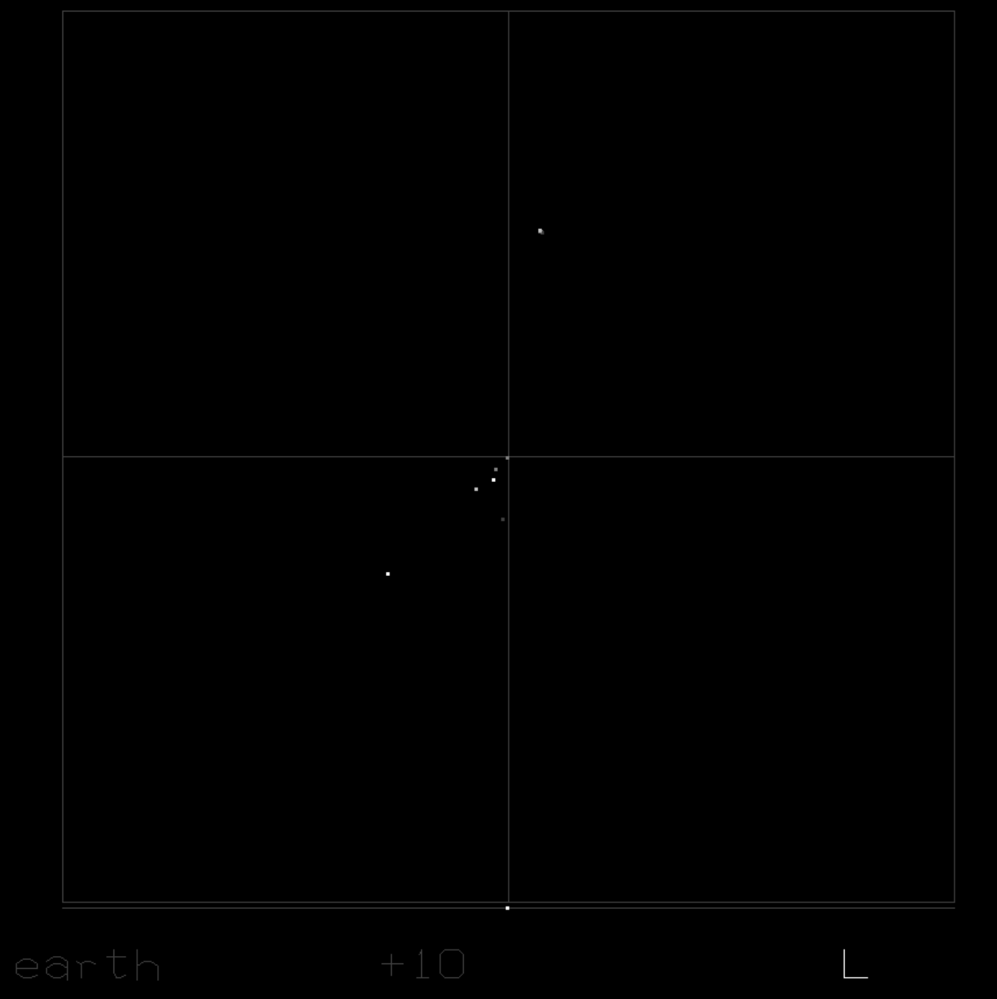
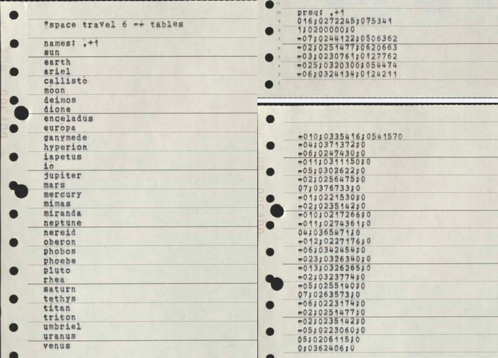
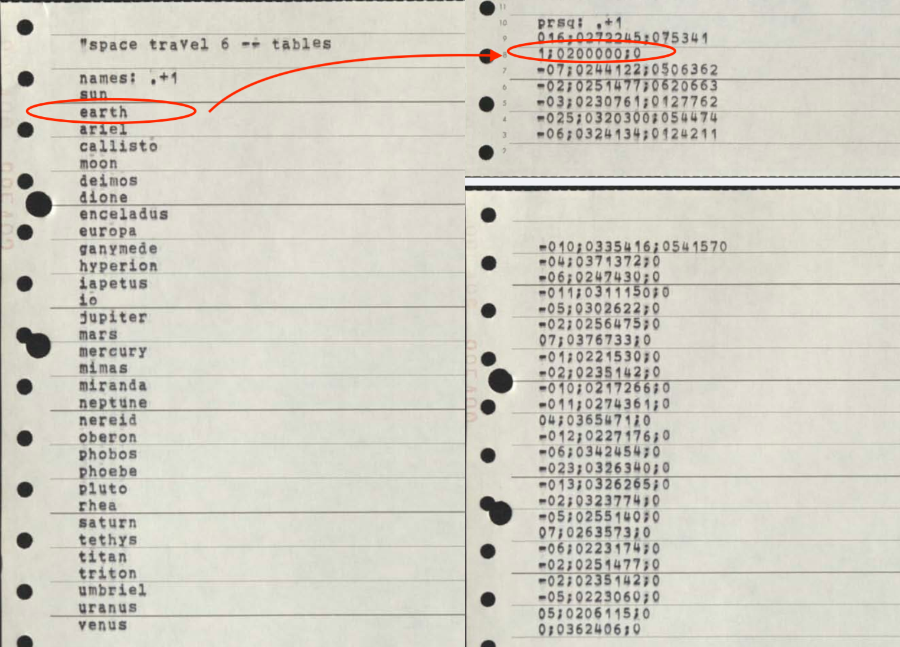
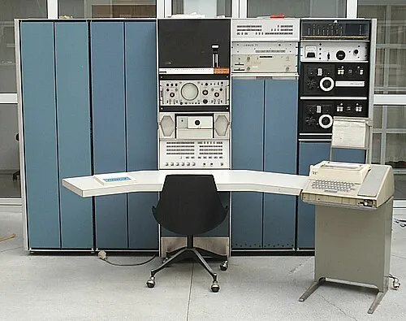
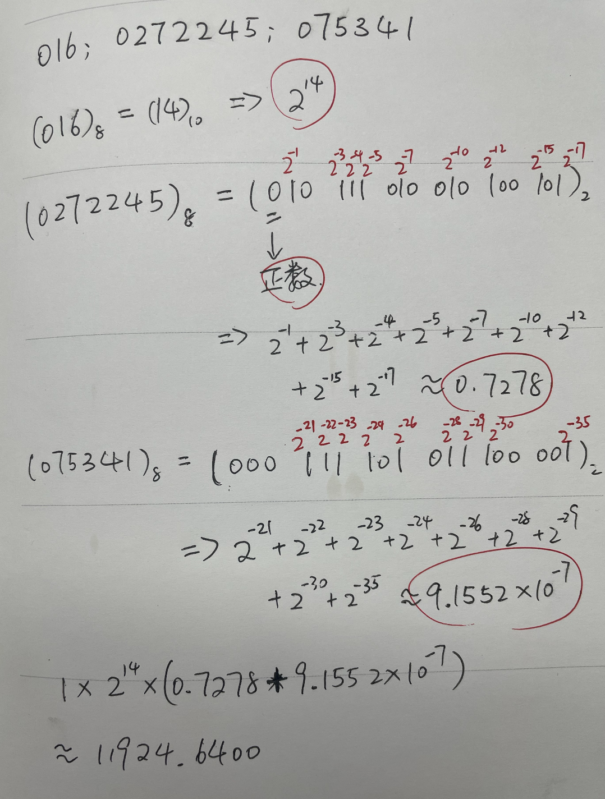
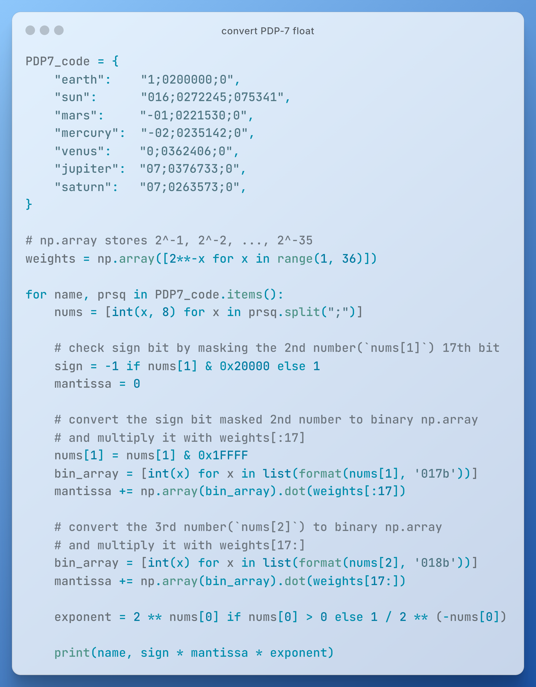

# Unix的催化剂·游戏《太空旅行》代码片段赏析：1.0要写作“1;0200000;0”

1968 年，Ken Thompson 投入大量心血的项目被管理层终止，部门开始重组，开发环境一夜之间从“高速公路”变成了“泥泞小道”。想申请一台新机器继续研发，被领导一口拒绝。可 Ken 并没有因此停下手里的活，还时刻惦记着那个亲手编写出来的**宇宙飞行模拟游戏：太空旅行（_Space Travel_）**。



后来的故事，很多读者或许已经听过不止一次了。

Ken 注意到实验室角落里还躺着一台旧机器——PDP-7，于是他决定把《太空旅行》移植到这台 PDP-7 上，以便能随时玩上一把。移植过程相当繁琐，PDP-7 没有像样的开发工具，许多工作都得从零开始。但也正是在这个过程中，Ken 和他的同事们开始动手搭建自己的工具链，一点点在这台老机器上建立起全新的系统。这个新系统正是原始版本的 Unix。

这段经历大家可能读过不少次了。可 **PDP-7 版《太空旅行》的代码究竟长什么样**，可能没多少人看过。今天，我们就一起来鉴赏其中的一个小片段。



## 星球的属性“prsq”

图中这两段代码，算是整个程序里最容易猜出用途的一部分了。左边这段列出了太阳、地球、火星等 32 个星球的名字。右边的代码也是 32 行数据，每行 3 个数字，用分号分开。行数和名字列表的行数一致，所以很容易猜出这些数字是在描述星球的某种属性，而前面的标签 `prsq:` 也暗示了，这种属性叫做“prsq”。

什么是“prsq”呢？它其实是“**P**lanet **R**adius **S**quared”的缩写，也就是“星球半径的平方”。不过这里存的其实不是半径的平方本身，而是各星球半径的平方与地球半径的平方之比值，即地球半径的平方是基准单位。既然是单位，那值自然就是 1.0 了。

在左边的 `name` 列表中，地球排第 2 位，那我们来看右边 `prsq` 列表的第 2 项是什么？



`1;0200000;0`——第 1 个数字倒是 `1`，可为什么后面还有个 `2` 呢？不过无论如何，这一行数据是整个列表里最整齐的，其他行的数据看起来就像乱码。

下面，我们就试着来解密这组数字背后的秘密。

## 解密“1;0200000;0”

要破解这组古老的数据，首先得了解 PDP-7 是台怎样的机器，以及它是怎么表示小数的。

PDP-7 是 1960 年代的小型计算机，和今天的电脑在很多地方都不一样。虽说是小型机，但看看照片吧，一台机器占了多少地方。



PDP-7 的特性之一是 **18 比特的内存存储单元**，即一个存储单元的大小不是熟悉的 1 字节 8 比特，而是 18 比特。

你可能也注意到了， `prsq` 列表中的数字都是 0 开头的八进制数。我们知道，1 个八进制数对应 3 个二进制数（比特），而 18 能整除 3，商是 6——也就是说，18 个二进制数，即 18 比特，刚好可以写成 6 个八进制数。而如果用现在常见的十六进制数表示呢？1 个十六进制数对应 4 个比特，18 除以 4 得 4.5，这样就不得不区别对待最左侧和余下的十六进制数了，既麻烦又容易出错。

这组数据每行中 3 个其间用分号分隔的八进制数字的含义如下：

第 1 个八进制数最直接，表示**指数**，即 2 的多少次方（可正可负）。

第 2 个八进制数（共 6 位，对应 18 个比特）稍微复杂一点。转换成二进制数后，最左边的 1 位用来表示**尾数**的**正负号**，为 1 时是负数，为 0 时是正数。剩下的 17 位则是**尾数的前半部分**。从左到右，每 1 位都对应着一个逐渐变小的权重：2⁻¹、2⁻²、2⁻³……，最后一位对应权重 2⁻¹⁷。

第 3 个八进制数也对应 18 个比特（不足 18 位时在左侧补 0），是**尾数的后半部分**。从左到右对应着权重，2⁻¹⁸ 、2⁻¹⁹……、一直到 2⁻³⁵。

要把这 3 个八进制数还原成小数，需要先把尾数中的每一位都乘上对应的权重，然后全部加起来，接着乘上 `1` 或 `-1` 以带上正负号，最后再乘上指数（2 的几次方）。

我们先按照这个规则算一下地球与自身的半径平方之比，口算就行：

`1;0200000;0: +1 × 2¹ × 2⁻¹ = 2 × 0.5 = 1`

还真是 1。接下来再计算一下太阳与地球的半径平方之比：



最终计算出来的结果约等于 `11924.6400`，和直接用太阳的半径 `696000 km` 和地球的半径 `6371 km` 算出来的结果 `696000² ÷ 6371² = 11934.4736` 相比，有一些小误差。

我们还可以把这个规则转换成代码，计算一下其他星球的 prsq（参考代码在文末）。

有关 prsq 的代码只是整个游戏程序中非常小的一部分，而且还是相对“好读”的部分。即便如此，乍看起来依然晦涩难懂。可见当年的程序员真的要“贴着硬件”去思考问题，技巧和耐心都不可或缺。

顺带一提，哪怕到了今天，现代汇编语言已经支持按日常书写习惯写小数了，可一旦落到内存里，哪怕是个简单的 `1.0`，也不再是一眼就能看懂的东西了。`000001c0: 00 00 80 3f`，能一眼看出内存地址 `0x000001c0` 上存了个 4 字节的 `float 1.0` 吗？

---

Ken 看似“不务正业”的这段插曲，最终却成了 Unix 诞生的催化剂。而《太空旅行》的真正遗产，或许不只是它的代码，而是一个道理：**伟大的创新可能诞生于看似没有价值的探索中**。

🔚



相关文章


```python
PDP7_code = {
    "earth":    "1;0200000;0",
    "sun":      "016;0272245;075341",
    "mars":     "-01;0221530;0",
    "mercury":  "-02;0235142;0",
    "venus":    "0;0362406;0",
    "jupiter":  "07;0376733;0",
    "saturn":   "07;0263573;0",
}

# np.array stores 2^-1, 2^-2, ..., 2^-35
weights = np.array([2**-x for x in range(1, 36)])

for name, prsq in PDP7_code.items():
    nums = [int(x, 8) for x in prsq.split(";")]

    # check sign bit by masking the 2nd number(`nums[1]`) 17th bit
    sign = -1 if nums[1] & 0x20000 else 1
    mantissa = 0

    # convert the sign bit masked 2nd number to binary np.array
    # and multiply it with weights[:17]
    nums[1] = nums[1] & 0x1FFFF
    bin_array = [int(x) for x in list(format(nums[1], '017b'))]
    mantissa += np.array(bin_array).dot(weights[:17])

    # convert the 3rd number(`nums[2]`) to binary np.array
    # and multiply it with weights[17:]
    bin_array = [int(x) for x in list(format(nums[2], '018b'))]
    mantissa += np.array(bin_array).dot(weights[17:])

    exponent = 2 ** nums[0] if nums[0] > 0 else 1 / 2 ** (-nums[0])

    print(name, sign * mantissa * exponent)
```


## Ref

> 以下是一篇技术博文的片段，润色一下，语言通俗，像讲故事，适合稍微有些编程基础，对计算机历史感兴趣的读者，发布在微信公众号上，避免夸张的说法，让人感到是水文
