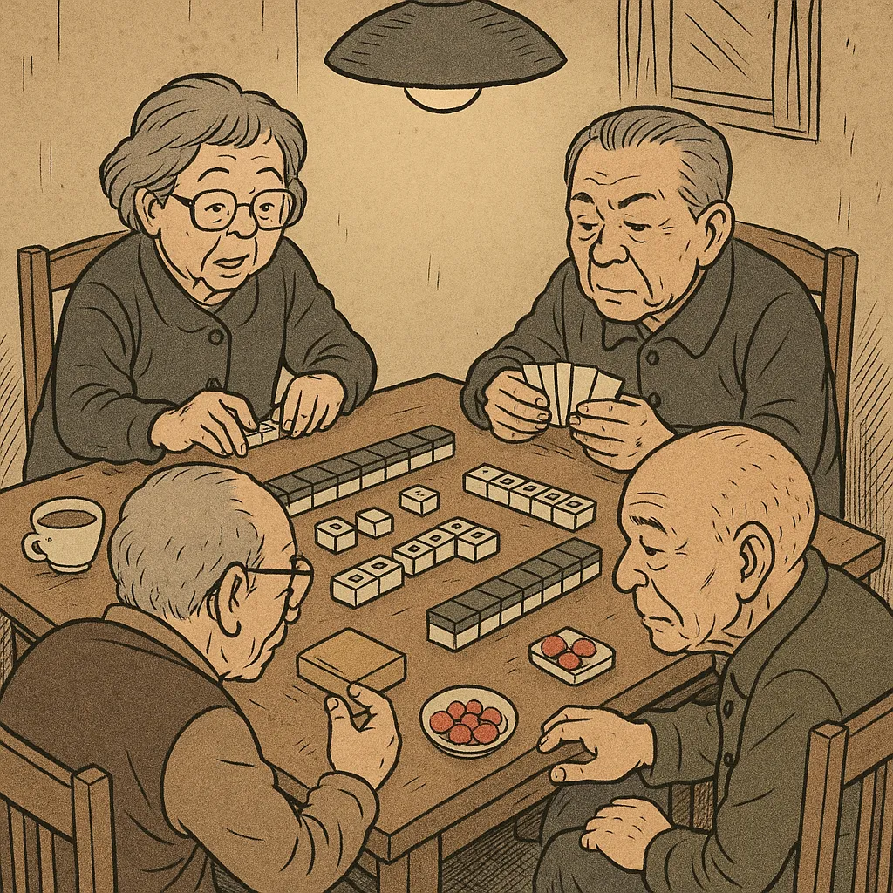
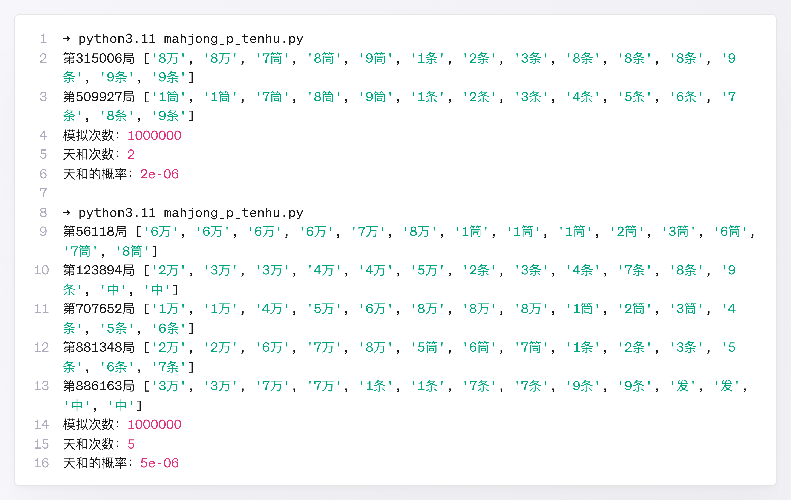
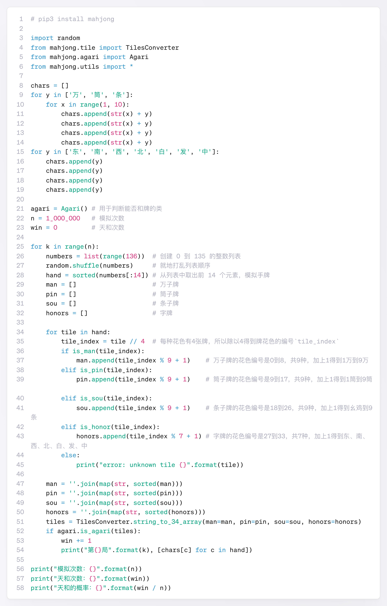

# 回忆姥姥家四平米麻坛+蒙特卡洛法与泊松分布估算天和概率

我小时候，搓麻是姥姥家经常开展的一项文体活动。参与者包括姥姥姥爷、姥姥的姐妹、姥爷的兄弟、怹们老公母俩的子女、怹们老公母俩各自手足的子女，乃至怹们老公母俩的亲家怹们老公母俩。参与者众多，活动场所却是不足四平米的客厅，所以需要择日、分男女、自愿组合到场交流。

四平米不到的客厅位于姥姥家的核心地带，北邻小厨房，南壤卧室，西靠户门墙，东临夹着卫生间的一大一小两间屋子。众宾齐聚，吉时当前，便在客厅中央设一麻坛，四人或端茶杯或抓瓜子，或叼着烟卷或含着糖块，按青龙白虎朱雀玄武之位各自入座。四方城墙一立，通往厨厕卧室之枢纽，遂告瘫废。大有四员大将镇守四维，夷狄蛮戎守分安常、内附款服；中原海晏河清、礼乐交融之势。

麻坛上方，有吊灯一盏，由弹簧状的线缆与屋顶相连，可升可降。夜幕低垂，麻坛新秀，困意难耐，相继睡去。老将们次第登场，拉下吊灯，发扬起年轻时满负荷工作法的精神，聚精会神搞建设，一心一意谋发展，看着上家，盯住下家，弄垮对门。

在耳濡目染的熏陶下，我也算学会了打麻将，还知道了“天和”（胡）这种运气爆表的和法。可惜在“门清自摸”都算大牌的四平米麻坛上，从未见过如此神迹。也不知道我姥姥当年靠“屁和”所谓的“赢钱”之后，还要贴多少退休金，带我和表弟去吃高档西餐 KFC。



## 用电脑来算算，天和到底有多稀罕

好在现在能写点 Python 代码了，我就想着，不如用电脑来算算，天和到底有多稀罕。顺带算算在麻坛上夙夜匪懈、兢兢业业一辈子，撞大运打出天和的可能性是多少。

这种用电脑反复进行“掷骰子”一样的随机模拟，来估算一个现象出现可能性的方法，就是所谓的**蒙特卡洛法**。手工计算相当枯燥麻烦的事，用善于机械运算的电脑往往能轻松搞定。写上几行代码，用不了 1 分钟，就能模拟百万次抓牌。只需要记住其中有几次“刚抓完 14 张牌就能和牌”，即天和的次数，再除以总的模拟次数，就差不多能估出天和的概率了。

从 136 张麻将牌中随机抓牌，本质上与从 1～136 个数中随机选 14 个数（无放回地选）没有区别，判断能否和牌也有现成的代码库。这两部分稍加组合，即可写出一个模拟程序（参考代码见文末），运行结果如下：



可以看到**天和的概率大概是百万分之几**（这里没有考虑带“会儿”的情况，实际概率应该更大）。运气好时甚至还有可能是七小对的天和。

那这辈子能打出天和的可能性怎么算呢？其实知道了天和的概率后，再有一个参数就能估计出来，即还需要知道一辈子打了多少局牌。具体的数值当然无法确定，但只需要大概估计一下即可，比如 1 万局、5 万局、10 万局……

下面列出了打过多少局牌和相应能打出天和的概率：

```
局数：10,000，打出天和的概率：0.03921(3.921%)
局数：30,000，打出天和的概率：0.1131(11.31%)
局数：50,000，打出天和的概率：0.1813(18.13%)
局数：80,000，打出天和的概率：0.2739(27.39%)
局数：100,000，打出天和的概率：0.3297(32.97%)
局数：500,000，打出天和的概率：0.8647(86.47%)   <- 努力的目标
局数：1,000,000，打出天和的概率：0.9817(98.17%)
```

可见，要想打出天和，得奔着 50 万局努力了。这里利用了概率学上二项分布的知识。网上随便找个二项分布计算器就可以算出类似的结果，但要记得用 1 减一下成功 0 次的概率。

其实还有一种更简单的计算方法能衡量摸牌的运气。因为天和的概率非常小，而局数又很多，所以可以利用一种叫作**泊松分布**的规律，将天和的概率和局数相乘，得到一个称作拉姆达（记作 `λ`）的结果，这个拉姆达就是麻将生涯中最有可能打出天和的次数。

```
局数：10,000，λ = 0.04，打出天和的概率：0.03921(3.921%)
局数：30,000，λ = 0.12，打出天和的概率：0.1131(11.31%)
局数：50,000，λ = 0.2，打出天和的概率：0.1813(18.13%)
局数：80,000，λ = 0.32，打出天和的概率：0.2739(27.39%)
局数：100,000，λ = 0.4，打出天和的概率：0.3297(32.97%)
局数：500,000，λ = 2.0，打出天和的概率：0.8647(86.47%)
局数：1,000,000，λ = 4.0，打出天和的概率：0.9817(98.17%)
```

或者可以这样理解拉姆达：假设存在平行宇宙，你在很多个宇宙里都打了 `N` 局麻将，这些宇宙里的你，有的天和了，有的连屁和都没有，如果能把这些宇宙中天和的次数都加起来，再计算平均值，结果就是这个拉姆达。

----

几年前，姥姥家拆掉了客厅与厨房间的隔断墙，空间变得宽敞了些，但开坛搓麻的次数却慢慢变少了。

叼着烟喝着茶，磕着瓜子含着糖，盯着上家看住下家，这几样就够四位运动员忙活的了，应该也没什么精力去算什么拉姆达了吧。或许怹们打麻将，从来不是为了和大牌，只是为了能坐在一起待会儿。

姥姥在稳中求进的总基调下虽免不了“点炮”，时而导致业绩不佳，却从未减少我和表弟的 KFC 时光。

🔚

