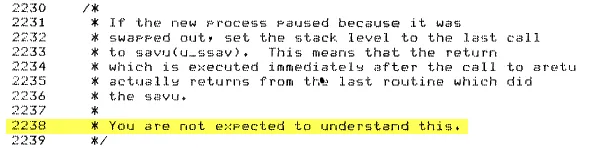
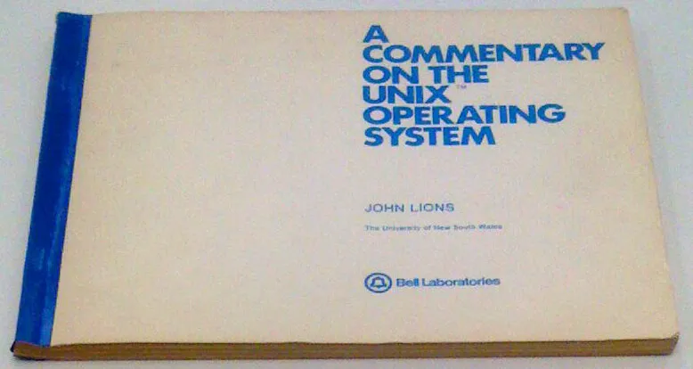
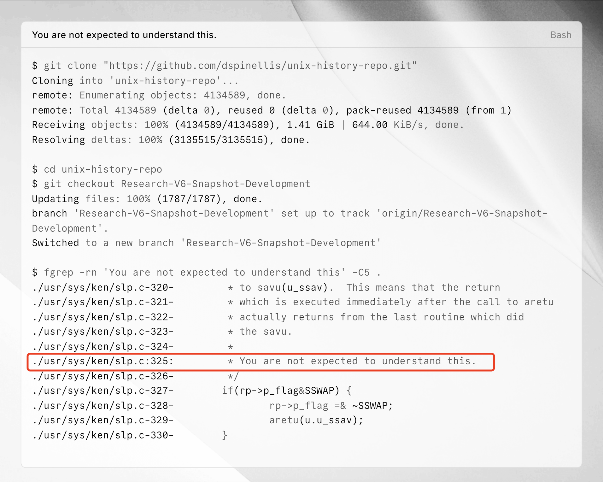
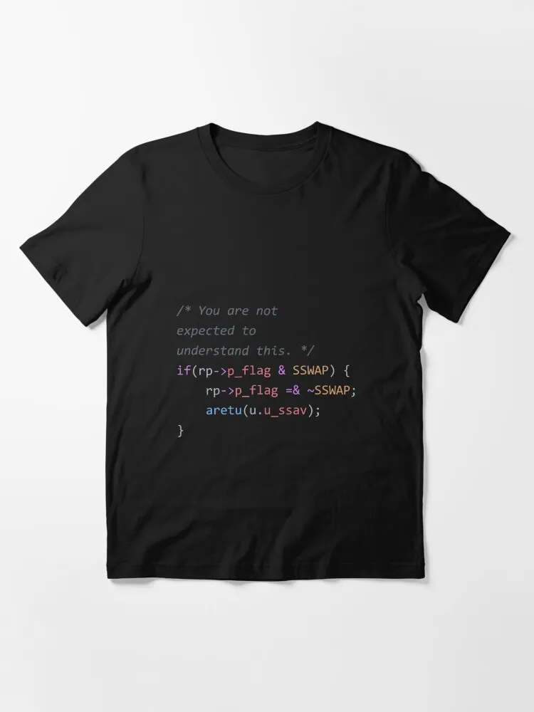
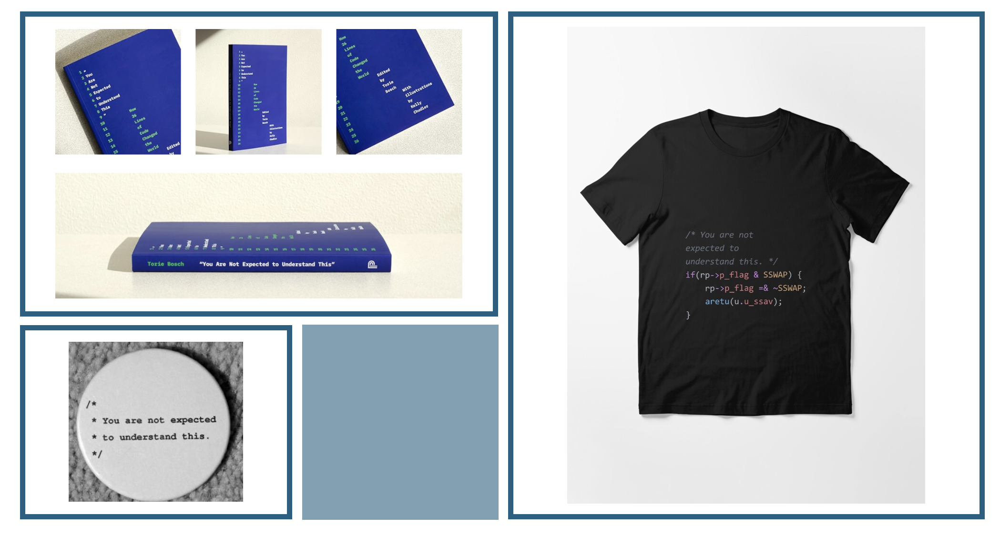

# 在Unix V6的源代码中还有一句“挑衅式”的注释，是无礼的挑战，还是……

“**You are not expected to understand this.** ”

这行有些“挑衅”意味的注释就藏在 Unix 第 6 版的源代码中，具体位置在源文件 `/usr/sys/ken/slp.c` 中的 `swtch()` 函数的底部，这部分代码是进程调度机制的核心。

早年间，能见到这行注释的人不是手边有第 6 版的 Unix（1975 年的产物），就是读过 John Lions 写的《A Commentary on the UNIX Operating System》（UNIX 操作系统评述，1976 年出版），而大多数人应该只是听别人提起过这句话而已。

但现在不一样了，得益于各种 IT 考古方向的开源项目，只要输入几个命令，人人都能亲眼见证这行注释，比如：

这行注释常被用来“质疑”Unix 注释的质量。看上去就像是贝尔实验室的大佬们写完代码后，扔下一句“你们爱明白不明白，看不懂也正常”，就潇洒离场了。久而久之，甚至有人把它当成一种“**无礼的挑战**”。

Unix 的创造者之一 Dennis Ritchie 就曾回忆道，甚至有人寄给过他印有这句话的衣服。大概是有人想用这种方式，表达对那种“你不配懂”的不满。

**可这句话真的是这个意思吗？**

面对不断出现的不满（还有神秘的快递包裹），Ritchie 站出来解释道：这句话的本意是“**This won't be on the exam.**” ——字面意思是“这不会出现在考试中”——是想安慰大家“你真的不需要理解这个”。就像老师在黑板上推导了半天复杂的公式，突然转过头说了一句：“这个考试不考啊。”

Ritchie 曾坦言道：“甚至我们也都没搞明白这里“。当年他与同事在将内核迁移到新机器时也在这里卡了近一周的时间。这样看来，注释背后藏着的非但不是高高在上的炫技，反倒还含有一丝自嘲的意味。

---

时至今日，这段代码早已进入操作系统史的陈列柜，但这句”**You are not expected to understand this.**“的余温还在，俨然成为了 geek 圈的文化符号。你可以看到以这句话为题的图书，印着这句话的 T 恤，印着这句话的徽章……

🔚

推荐阅读
