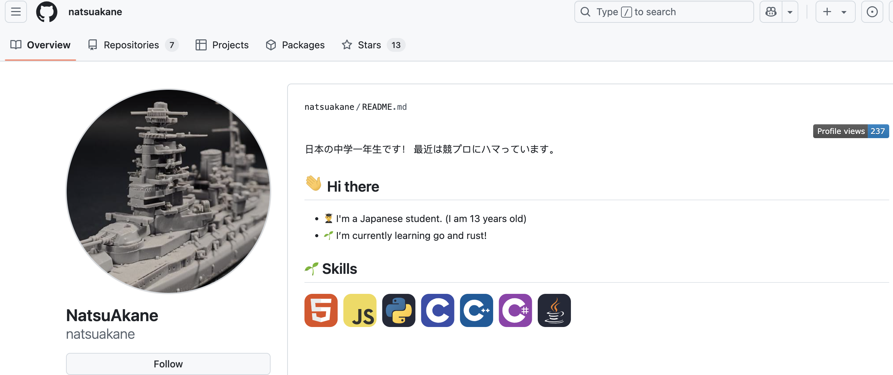
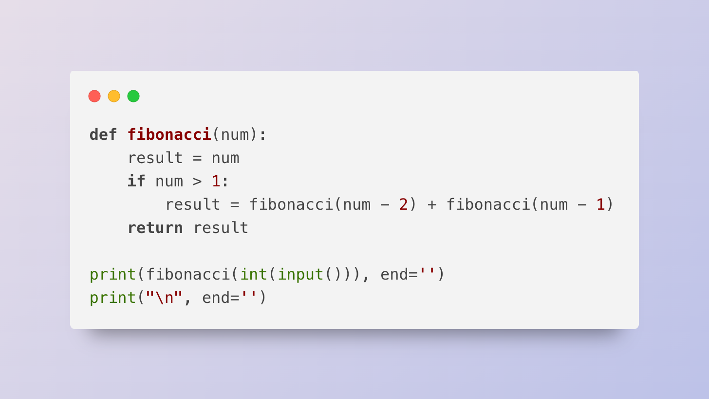
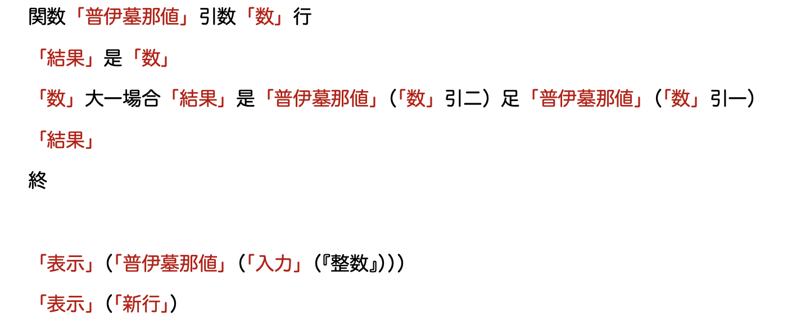
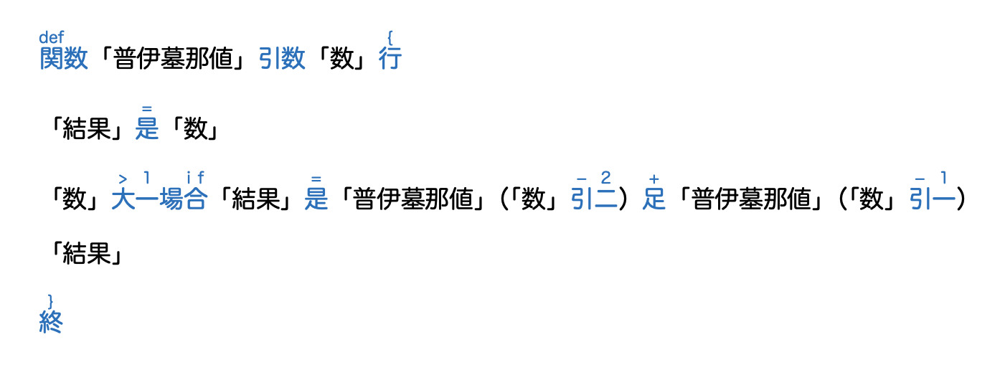
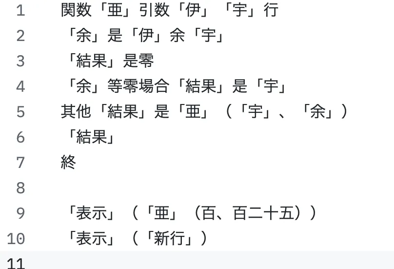

https://zenn.dev/natsuakane/articles/c7ad7c7bb5bf1b

# 日本中学生创造了一门“类似中文”的编程语言

natsuakane 是一名日本的中学生（13 岁），他创造了一门类似中文的编程语言 Wei-lang（https://github.com/natsuakane/Wei-lang）。用他自己的日式汉语来介绍就是“我制作偽中国語之機械言語”。



Wei 是“伪”的拼音，lang 是 language 的缩写。下面我们就通过一段计算斐波那契数列第 n 项的代码，来看看 Wei-lang 的特点。

```
関数「普伊墓那値」引数「数」行
「結果」是「数」
「数」大一場合「結果」是「普伊墓那値」（「数」引二）足「普伊墓那値」（「数」引一）
「結果」
終

「表示」（「普伊墓那値」（「入力」（『整数』）））
「表示」（「新行」）
```

将这段代码存储到文件 fibonacci.wei 中，然后用 weilang 命令解析这个文件，并输入 10，
```
$ ./weilang fibonacci.wei
10
55
```

这段代码输出了 55，这正是斐波那契数列的第 10 项。

Wei-lang 与主流编程语言最大的不同点就是**代码中充满了汉字**，所有标点符号也都是全角符号（使用半角空格作缩进反而会出错）。

若将这段代码翻译成 Python 代码，大概是这样，

```python
def fibonacci(num):
    result = num
    if num > 1:
        result = fibonacci(num - 2) + fibonacci(num - 1)
    return result

print(fibonacci(int(input())), end='')
print("\n", end='')
```



我们注意到，在 Wei-lang 的代码中，有些汉字括在了「」之中。这些汉字构成了函数、参数和变量的名字。

例如 `「数」` 相当于 Python 代码中名为 `num` 的参数；`「結果」` 相当于名为 `result` 的局部变量。`「表示」` 和 `「入力」` 后面都带有 `（）`，应该不难猜出它们是函数名。“表示”和“入力”这两个日文单词的含义分别是“显示”和“输入”，所以对应 `print()` 和 `input()` 函数。



在主流编程语言中，函数名和变量名等标识符要么是英文和数字的组合（如 C、Java、Go 等），要么是以特殊的符号开头，比如 PHP 中的 `$var`，MySQL 中的 `@var`。像 `「数」` 这种前后都需要特殊符号的写法从未出现过。不过，用一对括号将参数括起来也有好处，这样在函数的参数列表中，就可以省略 `,` 分隔符了，例如 `（「甲」「乙」）`，中间就不需要再加逗号了。

`「普伊墓那値」` 这个函数名中的每个汉字我们都认识，但合在一起就完全不知道什么意思了。这其实是日语中的借用字（当て字），即不考虑汉字原本的含义，仅使用汉字来表示外来语读音的现象。类似咱们小时候刚学英语时，用汉字标注单词读音的做法。

Wei-lang 在函数返回值方面还有点 Rust 的风格，最后一个表达式，即 `「結果」` 的值就是函数的返回值。



代码中还有些汉字没有括在「」之中，除了表示数字的零一二三四五六七八九，剩下的那些汉字相当于运算符和关键字。如 ` 関数 ` 相当于 Python 中的 `def`，表示开始定义函数。` 是 ` 相当于赋值的 `=`；` 大 ` 相当于比较运算符 `>`；` 引 ` 和 ` 足 ` 来自日语的引く和足す，分别表示减法和加法；` 場合 ` 一词多出现在日语中表示”如果……就……“的句子中，正好对应 `if` 语句。

` 行 ` 和 ` 終 ` 从出现位置上可以判断出分别对应 C、Java 等语言中的 `{` 和 `}`。从含义上看，用 ` 終 ` 作为表示结束的 `}` 还挺合适的，不过 ` 行 ` 和表示开始的 `{` 有什么关联暂时没有想到。

另外，“行”字可以拆开成“彳”“亍”（chì chù）两个字，其实这两个字本身就有左右的含义。彳表示左步；亍表示右步， 彳亍合在一起指缓步慢行。这两个字曾用于翻译量子力学中也有左右之分的狄拉克符号。

---
虽然作者 natsuakane 自称 Wei-lang 是类似中文的编程语言，但很多汉字的用法并不符合汉语习惯，所以更准确的说法可能是"Wei-lang 是一门汉字编程语言”。

Wei-lang 是用 C++实现的，源代码只有不到 1800 行。尽管代码量不大，Wei-lang 依然具备了基本的编程语言功能，而且采用了编译原理中的 LL(1) 自顶向下分析法，并利用了多态、组合设计模式等编程技巧，很难相信这些代码竟出自一位中学生之手。

natsuakane 曾表示，思考如何才能写出像中文一样的代码很有意思。

🔚


---

