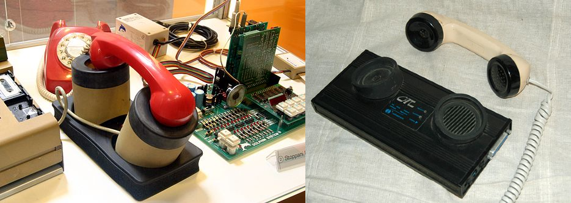
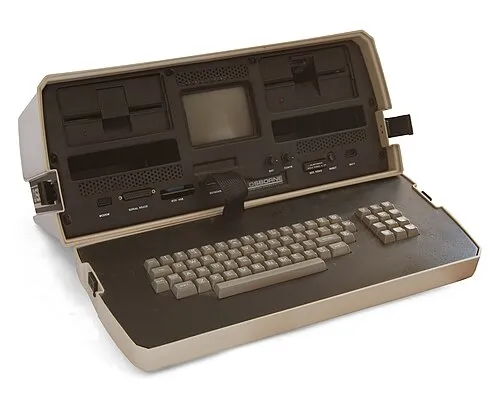
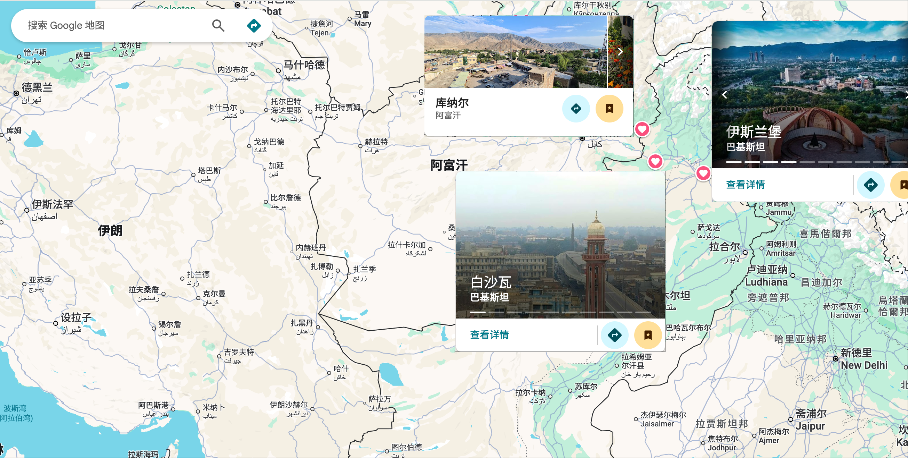
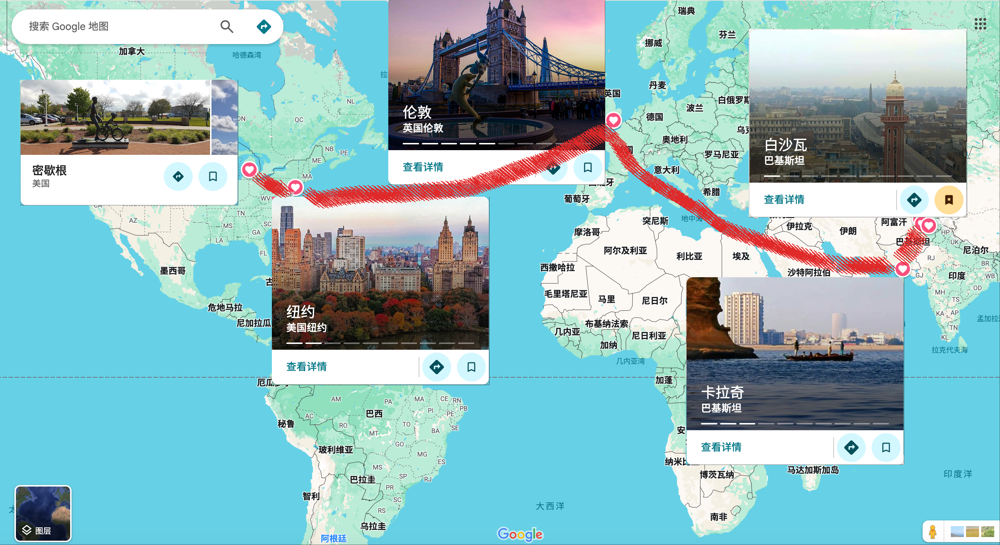
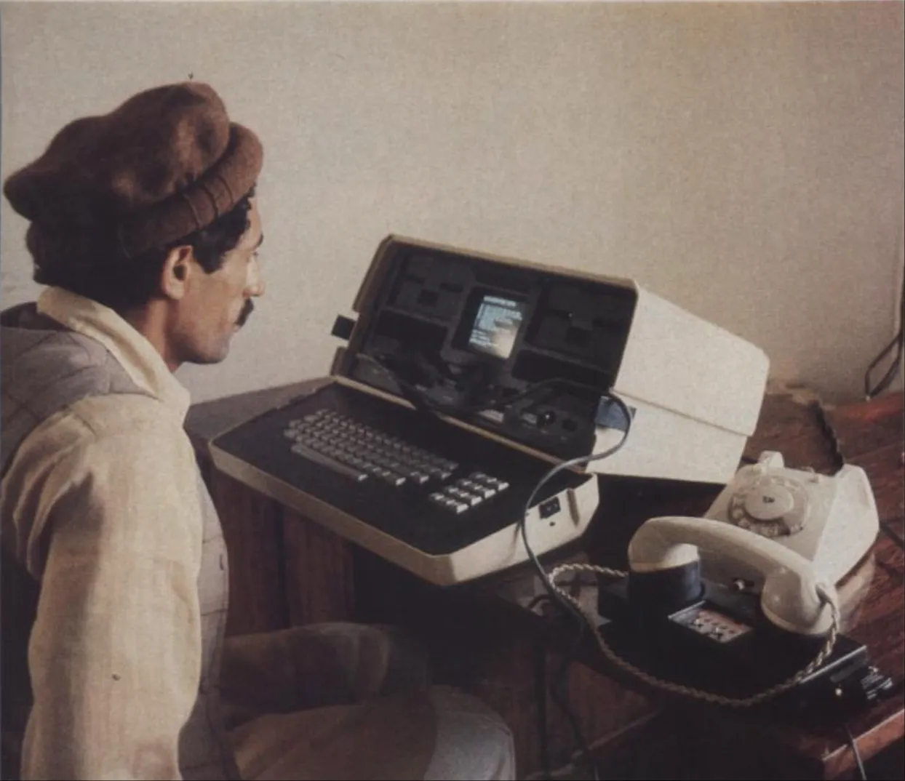

# 1982 年：Osborne电脑的战地新闻竞速之旅

1982 年，阿富汗，库纳尔省。

夜色笼罩山谷，空气被迫击炮的轰鸣撕裂，尖锐的呼啸声划破夜空，炮弹落在山坡上，炸起火光与碎石。游击队员们伏在乱石之间，对山脊上的敌方阵地拼命还击。子弹击中岩石，叮当作响。

而我只能死死趴在地上。此刻我突然觉得，就算这趟任务的报酬再高，也不值当拿命去换。但别无退路，只能深吸一口气，强迫自己像个记者那样——从怀里摸出笔记本，在炮火声中匆匆记下只言片语。

## Osborne 1——走进战区的便携式电脑

我是 **David Kline**，一名自由记者。

1981 年底，《芝加哥太阳时报》再次派我深入阿富汗前线，这是我三年内第四次踏上那片战火纷飞的土地。就在接到任务的那一刻，我突然有了个疯狂的想法：能不能**带着我的 Osborne 1 电脑进入战区**，用它来写稿，然后在当地把新闻直接传回美国？

比起手写或用咔哒作响的打字机，使用文字处理软件撰写文章显然更加便捷。更重要的是，如果我可以使用电话和声学耦合器（acoustic coupler）将稿件发回报社，就可以避开巴基斯坦昂贵且不可靠的公共电传办公室（telex offices）。

> 声学耦合器是一种早期的调制解调器，通过把电话听筒放进橡胶杯内，用声音信号来传输数据；而后来的调制解调器则直接与电话线连接，速度更快、更稳定。
> 

像我这样没有配备电传打字机的驻外自由记者，不得不去公共电传办公室，将稿件副本交给一名当地的操作员。那些成日无所事事的官僚老爷们要么不能及时发送稿件，要么不按书面形式发送，甚至会对稿件进行审核，拒绝发送他们认为不合适的内容。

对我来说，**使用 Osborne 1 便携式电脑进行现场报道是否可行**，这项试验本身的价值远远超出了报道阿富汗战争这一实际任务的意义。如果能成功使用电脑撰写并发送来自阿富汗战区的新闻，就意味着，整个新闻业的从业者日后都有了一个更为先进、更加及时发布新闻的手段。

> Osborne 1 是 1981 年推出的全球首款真正意义上的便携式电脑，重约 11 公斤，配有 5 英寸屏幕和双软驱，被视为“移动计算”的开端。
> 

都说万事开头难，在动身前往阿富汗之前，有数十个问题亟待解决：Osborne 是否足够皮实，经不经受得住一万两千英里的飞机、汽车、马车，甚至是骆驼的考验？能否在炎热、多尘的环境中工作？如何改造才能适配中南亚国家的电压电流？声学耦合器和其他外围设备还需要进行哪些改装？美国商务部是否允许私自将微处理器带出国？巴基斯坦政府是否允许通过电话线传输数据……还有，如何向巴基斯坦机场的安检人员解释个人商用电脑的概念，以至于他们不会将拎着 Osborne 的我视为情报人员加以特别关照。

幸运的是，经过向近百名计算机和通信领域专家的咨询，以及当地售卖 Osborne 电脑的 Computerland 商店全体员工的协助，这些问题被一个个解决。我还准备了大量杂志广告来展示 Osborne 电脑在日常消费者中的使用情况，以避免在巴基斯坦的监狱里呆上几个星期。

但对这次试验来说，最重要的一环是居住在密歇根州的 **Marty Cawthorn 先生**。他致力于计算机通信及定制软件的开发。Marty 花了数十个小时解答我的疑问，并自愿充当我与报社之间的中转站。到了阿富汗以后，先由 Marty 通过一款叫作 **MODEM7** 的通信程序接收我的文章，然后他再将这些文章短距离传输到报社。

1982 年 3 月 21 日，我背着 Osborne 电脑、声学耦合器和各种工具，踏上了一万两千英里的旅途——飞机、火车、人力车、骆驼，直到看到阿富汗边境的群山。

## 巴基斯坦边境小城白沙瓦的雨夜

在山区与游击队员一同生活了两个星期后，我已经积累了足够的素材，是时候动笔写作了。于是，我背起行囊，从前线撤下，翻山越岭，徒步回到了巴基斯坦边境那座尘土飞扬的小城——白沙瓦。

抵达白沙瓦后，我投宿在记者们常聚的迪恩旅馆，打开了 Osborne 电脑。我的计划是先整理出一份大纲，把所见所闻分门别类归纳出来，然后传给《芝加哥太阳时报》的编辑，等收到他们的审阅意见，再决定先写哪一篇。

当然前提是声学耦合器能正常工作，而此前从未有人尝试过这样的操作。最大的难关是那条超过一万两千英里的数据传输链路是否稳定：从白沙瓦到卡拉奇的约一千英里要靠微波信号传送；接着从卡拉奇出发，数据要跨越六千英里通过卫星传送至伦敦；再经由五千英里的海底电缆抵达纽约；最后一段则是从纽约到密歇根。

此外，巴基斯坦的电话接线员也充满不确定性。如果他们在监听时，听到的不是人声，而是刺耳的“嘟嘟”声，很可能会立刻切断线路。为了降低风险，我决定先拨通电话联系 Marty，再让他回拨过来，这样一来，线路便会从美国接入，风险小一些。

4 月 16 日傍晚，我先拨打电话给 Marty，让他回拨。可就在等待时，意外发生了。旅馆的电话手柄比标准尺寸长了足有一英寸，根本卡不进声学耦合器的橡胶杯内。真是太大意了，我居然没事先确认房间的电话能否使用。无奈之下，我们只好约定一小时后换另一部电话再试。我立刻把电脑、声学耦合器、电源滤波器全都塞进包里，跳上一辆人力车，冒雨赶往一位当地朋友家里——他家的电话应该可以用。

晚上八点，Marty 准时打来电话。我把声学耦合器设为发送模式，听到对方的应答音后，把电话听筒插进橡胶杯里，输入发送文件的代码。屏幕随即出现提示：“File Open, Size 68 Sectors, Awaiting Initial NAK.”（文件已打开，大小 68 扇区，等待初始 NAK 信号）

一秒过去了，又一秒过去了……Osborne 依旧没有反应。我们尝试调整了各种设置，连续折腾了十几分钟，结果仍然毫无反应。也许是当晚的雷雨影响了数据传输，总之文件发送失败了。

第二天清晨，天空万里无云。我们再次尝试，这次居然成功了。终于听到了 Osborne 磁盘驱动器运转时发出的嗡鸣声，既刺耳又悦耳。两台电脑隔着一万两千英里的山川、沙漠和大洋，终于开始交换数据了。先是 1 号扇区，然后 2 号扇区，每个扇区的传输都让人捏了把汗。虽然少数扇区需要重传，但 68 个扇区的文件最终全部成功传完。Marty 随即将稿件转交给《芝加哥太阳时报》，一切尽在掌控之中。当晚，我就收到了编辑的电传。

我靠在椅背上，心中涌起一阵轻松与满足。整个过程看似疯狂，却在现实中奇迹般地成功了。

## 与法新社的暗战

三天后，我的 Osborne 迎来了一次真正的“实战”。在一次例行拜访消息渠道时，我得知了一条令人震惊的消息：一名极为重要的战俘似乎已经被处决。

我很快意识到，这是条分量极重的新闻，但必须确认消息的可靠性。于是我联系了我的朋友 Alain Faudeaux，一位法国新闻社（AFP）常驻巴基斯坦的记者。当时他在伊斯兰堡，而我在白沙瓦。我们约定，他也可以抢发稿件，但作为回报，他要来到白沙瓦，帮我牵线搭桥，找到可靠的消息源。

到 4 月 19 日下午两点半，我们已经收集到了足够的材料，可以动笔写稿了。Alain 就住在我隔壁的房间，他拼命地在一台古老的手动打字机上敲击。一场你追我赶的新闻竞赛就此展开。

但我拥有的优势极不公平，Osborne 电脑和声学耦合器。下午四点半，我就完成了排版整齐的英文稿件。而此刻，Alain 还在修改第二稿，而且不得不用英语写。要是在伊斯兰堡，他可以在办公室的电传机上直接用法语写作发往巴黎，但这里是白沙瓦，所以一会他还得前往公共电传室，而英文是电传操作员唯一认可的语言。

我收拾好电脑，向 Alain 道别，他嘴里嘟囔着几句难懂的法语。我坐上人力车，赶往朋友家，拨通了电话，再次请 Marty 回拨。线路接通的瞬间，我把整篇报道传了过去。Marty 则立刻转发给《芝加哥太阳时报》，编辑部在当地时间上午 9 点半就收到了稿件。当天，我的新闻就刊登在了第二版，**比法新社提前了整整五个小时**见报！

---

这篇文章改编自《Osborne -- Behind Guerrilla Lines》（Osborne——游击队前线背后的故事），发表于 1982 年 7 月的《Microcomputing》（《微型计算机》）杂志第 42 至 50 页，作者就是本文的“我”，David Kline。

回顾“我”在阿富汗前线使用 Osborne 1 的经历，我们可以看到，便携式电脑不仅是技术创新，还为新闻报道方式带来了一次根本性变革。虽然当年的电脑笨重、脆弱，通信线路不稳定、成本高昂，但它让记者能够随时撰稿并将新闻快速传回编辑部，为战地报道带来了前所未有的速度和灵活性。

今天，情况已经发生了巨大变化。笔记本电脑、平板、智能手机、高速互联网和卫星通信几乎让任何地方都能成为新闻中心，不仅是记者，几乎所有人都可以实时采集、编辑、传输信息，报道的时效性远超以往。

🔚

