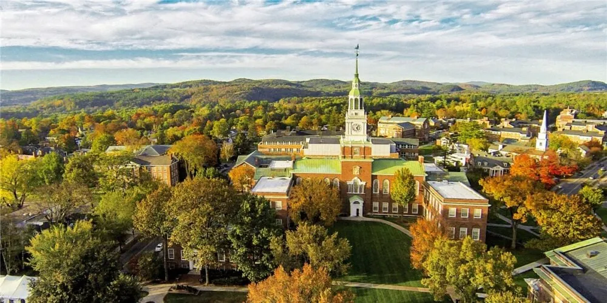
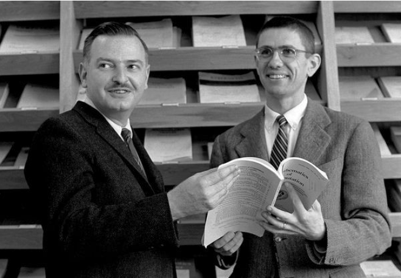
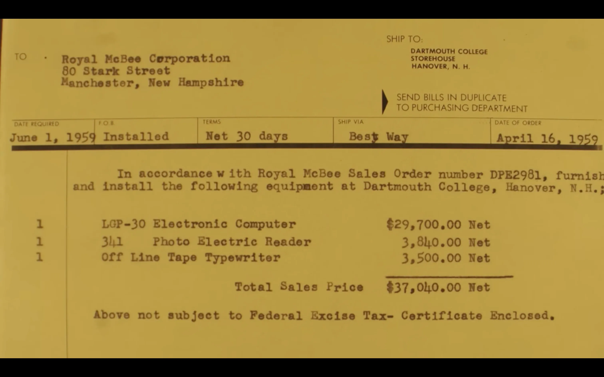
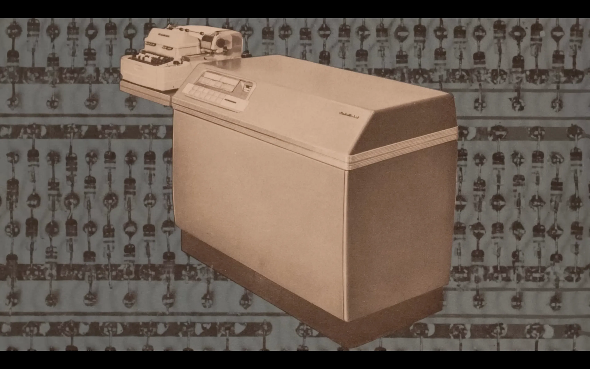

# 达特茅斯学院曾“打着添置家具的幌子”，偷偷购买了台计算机

今天的达特茅斯学院，已然是计算机史上不可忽视的一座地标。**BASIC 语言**和**时间共享系统**（**DTSS**，Dartmouth Time-Sharing System）的诞生，使这里成为普及计算机教育的先驱。如今，该校是美国顶尖的文理学院之一，拥有齐备的高性能计算资源和先进的研究设施。

可谁能想到，1950 年代，达特茅斯学院一台计算机也没有，不得不“巧立名目”，以添置家具的名义，好不容易偷偷购买了一台。

当时，BASIC 的共同创造者之一 **Thomas Kurtz** 还只是一名“搬运工”——数据的搬运工。那时的计算机只能使用**打孔卡**操作，他的任务就是把打孔卡放进箱子里，每两周一次，坐 6:20 的火车，前往 200 公里以外的 MIT。然后把打孔卡投入 MIT 计算机中心的输入槽，再**闲逛上 2、3 个小时**，直到打印机输出结果，才能带着结果回到达特茅斯。

据 **Kurtz** 估算，当时两所高校间的数据传输速率**仅有 1.67 bit/s**。是的，你没听错，每秒传输的数据量不到 2 个二进制数。

直到 1958 年，这种低效的“沟通”才终于迎来了转机。

BASIC 语言的另一位创造者 **John Kemeny** 觉得是时候改变了。Kemeny 于 1954 年来到达特茅斯学院，受命重建数学系。他的目标并不只是培养传统的数学人才，而是要**让全院的学生都能接触到计算机**。他相信，计算机应该像黑板和粉笔一样，成为通用的学习工具。

当时，达特茅斯正在建设数学大楼，Kemeny 想借此机会添置一台计算机。可预算里根本没有“计算机”这一栏。怎么办呢？Kemeny 灵机一动：既然新大楼有“家具和装潢”的预算，那就把计算机算作家具吧。对，计算机也是一种“家具”。

于是，就有了这张 1959 年 4 月 16 日的发票。收件方是新罕布什尔州曼彻斯特的 Royal McBee 公司，送货地址是达特茅斯学院的仓库。单子上清清楚楚写着：一台 **LGP-30** 电子计算机，29,700 美元；一台光电读卡机，3,840 美元；再加上一台离线磁带打字机，3,500 美元。三样加起来，总价 37,040 美元。付款条件是 30 天内结清，交货日期定在 1959 年 6 月 1 日。

别说，LGP-30 看着是挺像家具的，大冰柜。

从今天的眼光来看，这不过是一张普通的采购单。但对达特茅斯学院来说，这是一个转折点：计算机第一次真正走近了、也走进了校园。正是这台被当作“家具”买进来的 LGP-30，为 Kemeny 和 Kurtz 改造数学系、推动跨学科计算机教育奠定了基础，也成为 BASIC 语言诞生的摇篮。

🔚

