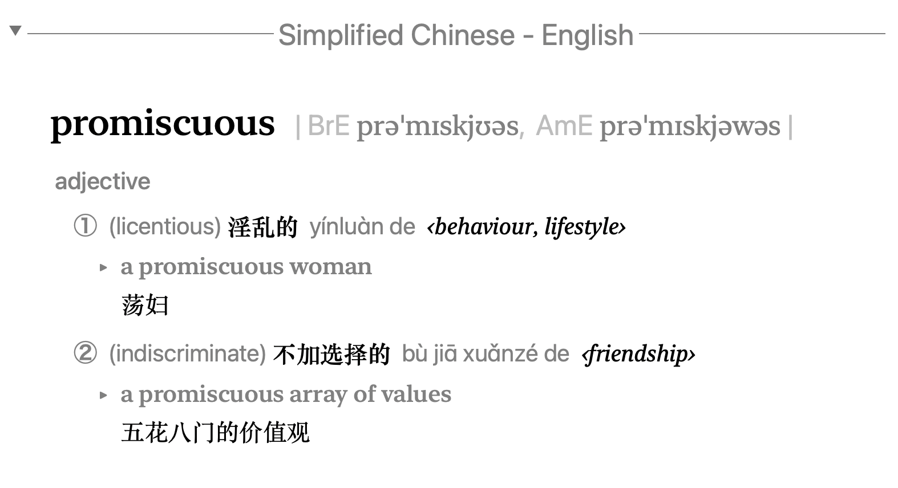
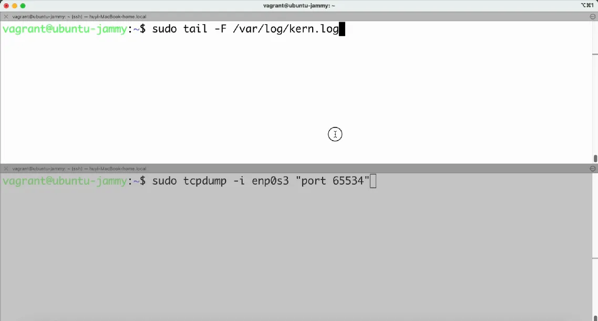

# IT术语中的低俗词语①：promiscuous

IT技术圈的术语（黑话）自有其传承。早期黑客文化中，讽刺与反叛几乎是一种身份象征，不正经，才够格。调侃、低俗乃至粗口风格的俚语成为黑客社群的通用术语，其中一些词语还沉淀到了官方文档和源代码中。

今天要和大家分享的低俗术语是“**promiscuous**”，出自 Linux 的系统内核日志。

如下图所示，为了捕获出入网卡的数据包，运行 `tcpdump` 命令后，网卡就会进入“**promiscuous mode**”，即混杂模式（不翻译成“×乱模式”哈）。

什么是 **promiscuous mode** 呢？在早期以太网等**共享传输介质**的网络中，所有数据包都在同一条物理线路上传输，每个连接到网络中的主机理论上都**能“听到”所有的数据包**。

正常情况下，网卡会**过滤掉那些不是发送给自己的数据包**。但进入 promiscuous mode 后：网卡会接收线路上的所有数据包，无论其中的目标 MAC 地址是不是自己的。所谓来的都是客，多少接待一下。

恶意用户只要在网路中的一台机器上开启了混杂模式，就可以窃听网络中其他主机的通信数据了，这也是早期以太网不安全的重要原因之一。那为什么还要允许混杂模式呢？

因为在以下场景，混杂模式还是非常实用的。例如，需要使用 tcpdump 或 Wireshark 抓取并分析网络通信内容、在入侵检测系统（IDS）中监控是否存在异常行为，或者在调试和开发网络协议栈时进行底层数据包的捕获和分析，这些都要求网卡能接收目标地址不是本机的数据包。

混杂模式虽“×荡不羁”，但用得好，就是排查网络问题的瑞士军刀；用得歪，那就是骇客溜门撬锁的工具了。

🔚

