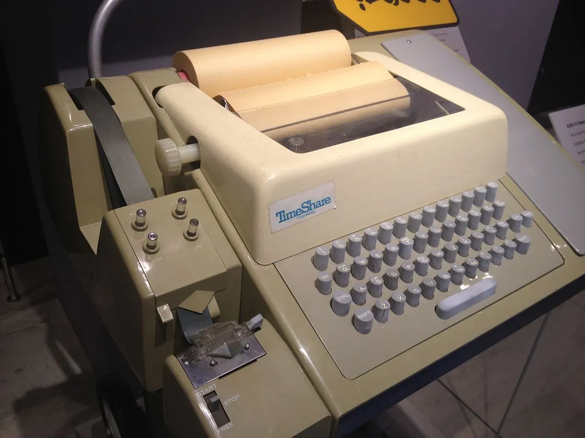
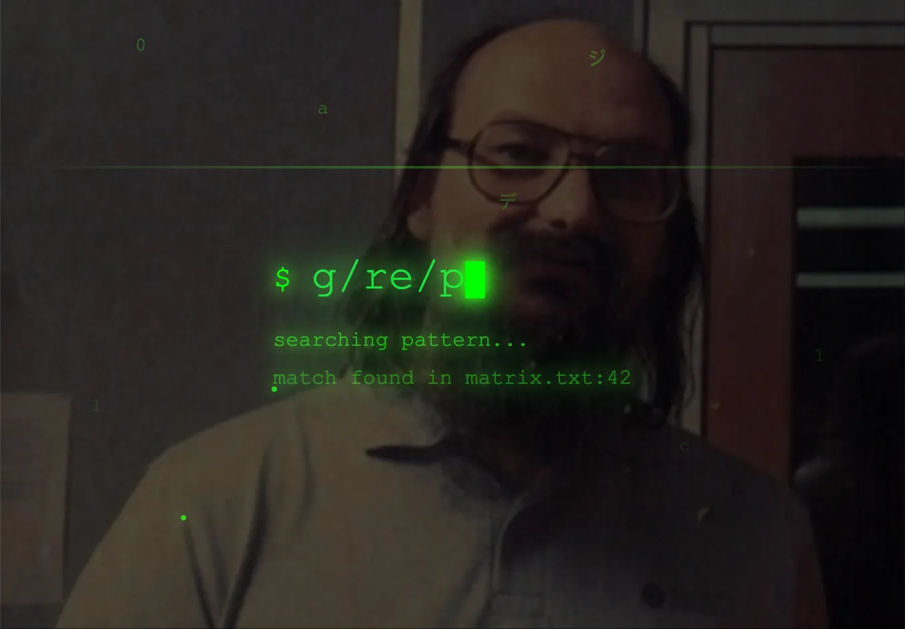

# grep命令真的是一夜间就写好了？grep为什么叫grep？

大家好，今天聊一个程序员都绕不开的命令：**`grep`**。

> 只用过 `findstr` 或 `Select-String` 的 Windows 宝子们可以下车喽，拜拜～

说起 `grep`，大多数程序员脑海里浮现的应该是终端上的一行命令，或单独使用，或接入管道（`|`），或多次“自身接龙”（`... | grep ... | grep ...`），然后一堆结果就“唰”地跳出来。既可用于日志分析，又能用来搜索代码，`grep` 已经成了 Unix 世界里最具代表性的工具之一。

但你知道吗？关于 `grep` 的起源，有个“**一夜而就**”的传说。

故事要追溯到 **1970 年代初**，Unix 还是萌芽期的时代。

那时， Unix 上的标准文本编辑器是 Unix 的缔造者之一 **Ken Thompson** 写的 **ed**。虽然 `ed` 是最早一批支持正则表达式的**行编辑器**之一，但它有个致命问题：**只有把整个文件读进内存后才能操作**。因此，在当年那点可怜的内存面前，几十 KB 的文本就已经让 `ed` 吃不消，更别说去分析成百上千页的文稿了。

在**屏幕式编辑器**（如 vi、nano）出现之前，用户只能使用**行编辑器（line editor）**。在 1960–70 年代，操作计算机的工具是**电传打字机** —— 一种带键盘的低速打印机 —— 没有显示屏，也无法在文本中自由移动光标。于是，行编辑器的操作就**以“行”为单位**，每条命令作用于一行或多行文本。

Ken 的同事 **Lee McMahon** 是个语言学家，他当时在研究一件大事：通过文本分析，判断美国《联邦党人文集》（_The Federalist Papers_）的确切作者。这些文集共有 85 篇，署名是“_Publius_”，究竟哪篇是谁写的，一直是学界争论的焦点。

McMahon 想用计算机分析这些文档中的模式，看看能不能找出一些语言学上的规律。问题是：这 85 篇文档加起来**超过了 1 MB** —— 以今天的标准来看几乎微不足道 —— 但当时的计算机内存根本放不下。

于是他找到 Ken Thompson，提了个需求：  

“嗨，我只想在这些文章里找出那些包含某个词的行，别的啥都不要。能不能搞个工具？”

Ken 点点头，“行，我回头搞一个”。

一夜过去。

**没想到第二天**，Ken 就已经把写好的程序交给 McMahon 了。这个小工具能在一个或多个文件里，顺序扫描所有内容，把匹配正则表达式的行找出来。这个小工具的名字正是 **`grep`**。

于是就有了 `grep` 是 Ken 一夜之间写出来的传说。

其实，Ken 并不是“熬了一夜爆肝”从零开始写 `grep` 的。他早就写过个叫 **`s`** 的私人工具，用来做与 `grep` 类似的事情。McMahon 来提需求时，Ken 只是花些时间，把代码修修补补一番，以便跑得更稳健，然后就交了出去。

所以“`grep` 是一夜之间写出来的”这个传说，严格来说有点夸张。更真实的情况是：Ken 手头已经有了现成的**代码积木**，他只是用这些积木**迅速重新拼凑出另一个程序**，并换了个更有趣的名字。

那 `grep` 这个名字又是怎么来的呢？为什么不直接用 search、find 这种明显表示“查找、搜索”的词呢？

还是要回到 `ed` 编辑器里去找答案。原来在 `ed` 编辑器里有个命令：

`g/<re>/p`

意思是：全局搜索（**g**lobally）匹配正则表达式（`<re>`）的行，并把这些行都打印（**p**rint）出来。

Ken 把这串命令缩成一个词：**grep**。而 `grep` 也由此成了 Unix 世界中从文本中搜索关键词最自然的表达。

---

McMahon 拿到工具后，顺利地开展了文本分析。而 `grep` 本身，则被收录进了 Unix 第四版，逐渐成为“Unix 哲学”的象征：  

**写一个小而精的工具，做好一件事**。

📖 推荐阅读

🔚 看个程序员短剧呗👀～

------

## REF

提纲

> 今天人们对 grep 的认识
> 当时的 ed 编辑器
> 同事研究的内容，需要处理大量文本，不能用 ed 编辑器，委托 ken 开发工具
> ken 第二天就把写好的程序交给了
> 为什么 ken 开发得这么快

I thought today maybe we would talk about 'grep', a well-known command in the UNIX world. Something that's been around since the early 1970s.

What 'grep' lets you do is to search for patterns of text — arbitrary patterns of text — in one or more files. And there could be an unbounded number of files of input.

Or the input could be coming from some other program, for example as it is if you're using Unix pipelines. So you take some program and you pipe it into 'grep', and that way, no matter what the amount of input is, 'grep' can filter out, or show you, the things that you're interested in.

And that's stuff that you can't do with a text editor very conveniently — if at all.

One of the issues with 'grep' has always been: Where does that weird name come from?
And so I thought, perhaps, I could tell that story, if it would be of any interest. And we'll see where we go from there.

## Wikipedia

> Before it was named, grep was a private utility written by [Ken Thompson](https://en.wikipedia.org/wiki/Ken_Thompson "Ken Thompson") to search files for certain patterns. [Doug McIlroy](https://en.wikipedia.org/wiki/Doug_McIlroy "Doug McIlroy"), unaware of its existence, asked Thompson to write such a program. Responding that he would think about such a utility overnight, Thompson actually corrected bugs and made improvements for about an hour on his own program called `s` (short for "search"). The next day he presented the program to McIlroy, who said it was exactly what he wanted. Thompson's account may explain the belief that grep was written overnight.[[6]](https://en.wikipedia.org/wiki/Grep#cite_note-6)

> Thompson wrote the first version in [PDP-11](https://en.wikipedia.org/wiki/PDP-11 "PDP-11") [assembly language](https://en.wikipedia.org/wiki/Assembly_language "Assembly language") to help [Lee E. McMahon](https://en.wikipedia.org/wiki/Lee_E._McMahon "Lee E. McMahon") analyze the text of _[The Federalist Papers](https://en.wikipedia.org/wiki/The_Federalist_Papers "The Federalist Papers")_ to determine authorship of the individual papers.[[7]](https://en.wikipedia.org/wiki/Grep#cite_note-7) The [ed text editor](https://en.wikipedia.org/wiki/Ed_\(text_editor\) "Ed (text editor)") (also authored by Thompson) had [regular expression](https://en.wikipedia.org/wiki/Regular_expression "Regular expression") support but could not be used to search through such a large amount of text, as it loaded the entire file into memory to enable [random access](https://en.wikipedia.org/wiki/Random_access "Random access") editing, so Thompson excerpted that regexp code into a standalone tool which would instead process arbitrarily long files sequentially without buffering too much into memory.[[1]](https://en.wikipedia.org/wiki/Grep#cite_note-history102-1) He chose the name because in ed, the command `g/_re_/p`, where the _`re`_ is the **r**egular **e**xpression to match, would print all lines featuring a specified pattern match.[[8]](https://en.wikipedia.org/wiki/Grep#cite_note-8)[[9]](https://en.wikipedia.org/wiki/Grep#cite_note-9) grep was first included in [Version 4 Unix](https://en.wikipedia.org/wiki/Version_4_Unix "Version 4 Unix"). Stating that it is "generally cited as _the_ prototypical software tool", McIlroy credited grep with "irrevocably ingraining" Thompson's [tools philosophy](https://en.wikipedia.org/wiki/Tools_philosophy "Tools philosophy") in Unix.[[10]](https://en.wikipedia.org/wiki/Grep#cite_note-reader-10)

## Oral History of `grep`

We are a long way away from 'grep' at this point. So what's 'grep' all about?

Well, it turns out that at the time that this was going on, **'ed'** was the standard text editor.  
But, as I said, the machines you're working on are very very wimpy. Not much computing capacity in a lot of ways.

And in fact, one of the limitations was that you couldn't edit a very big file, because there wasn't enough memory and the **'ed'** worked entirely within memory and so you were stuck.

One of my colleagues at the time, **Lee McMahon**, was very interested in doing text analysis — the sort of thing that we would call today, perhaps, Natural Language Processing.

And so what Lee wanted to do ... he had been studying something that, at the time, was the very interesting question of who were the authors of some fundamental American documents called the _Federalist Papers_.

The _Federalist Papers_ were written by, variously, **James Madison** and **Alexander Hamilton** and **John Jay** in 1787 and 88, if I recall correctly.  

There were 85 of these documents, but they were published anonymously under the name _Publius_.  And so we had no idea, in theory, who wrote them.

And so there's been a lot of scholarship trying to figure out for sure.  It's well known who wrote some of them and others are still, I think, a little uncertain.  

And so Lee was interested in seeing whether you could actually, by textual analysis of his own devising, figure out who wrote these things.

So that's fine. But it turns out that these 85 documents was in total just over a megabyte — I mean down in the noise by today's standards — wouldn't fit.  

He couldn't edit them all in **'ed'**.

And so what do you do?  

So one day he said: _"I just want to go through and find all the occurrences of 'something' in the Federalist Papers so I can look at 'em!"_  

And he said this to **Ken Thompson** and then went home for dinner or something like that.

And he came back the next day and Ken had written the program — and the program was called **'grep'**.  

And what **'grep'** did was to go through a bunch of documents — one or more files — and simply find all of the places where a particular regular expression appeared in those things.

---

And so the way ... it turns out that one more of the commands in **'ed'** is a command called **'g'**.  

And this stood for _global_.  
And what it said was, on every line that matches a particular regular expression — so, for example, _'print'_ — I can then do an **'ed'** command.

So, I could say: _"On every line that contains the word 'print' I'll just print it"_.  
So I can see what my various print statements would look like.

Or I could, in some other way, say **'g'** — and some other regular expression in there — and delete them.  
So I could delete all of the comments in a program, or something like that.

So the general structure of that is:

`g/re/p`

And that's the genesis of where it came from.

---

OK, and so this is in some ways the genius of **Ken Thompson**.  
A beautiful program, written in no time at all, by taking some other program and just trimming it out and then giving it a name that stuck.

That's the story of where **'grep'** came from.