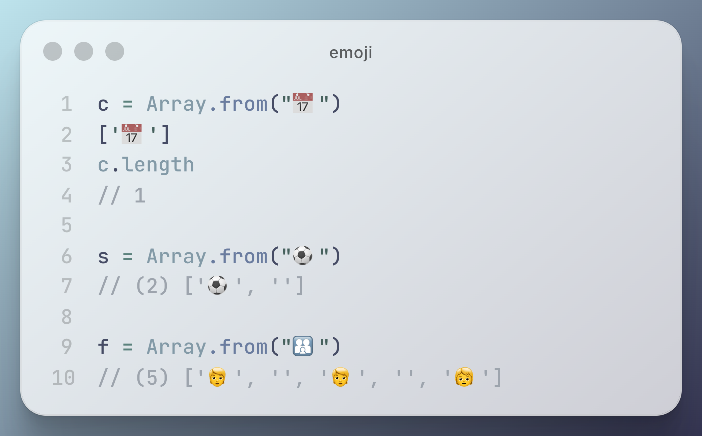
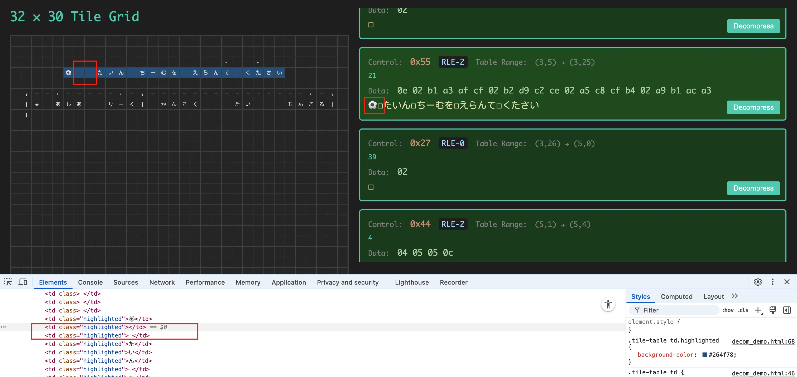
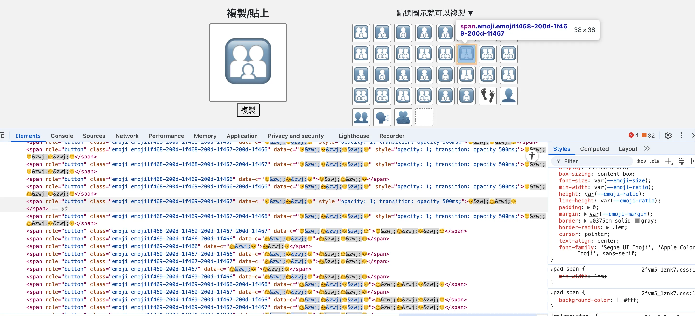

# 1个emoji符号竟然不算1个字符？！

为了修复一个 bug，我在浏览器的控制台里敲下了几行 JavaScript 代码，运行结果非常出乎意料：



表面上，每个 emoji 看起来都是 1 个字符，只不过是彩色的。但结果显示，有的 emoji 确实就是 1 个字符，有的则算作 2 个，甚至还有的多达 5 个字符。

顺便提一下我要解决的 bug。如下图所示，预期点击“Decompress”按钮后，文字就会填充到左侧的表格中，每个格子一个字符，就像小时候写作文那样。但图中这段文字（有谁知道这是哪个 FC 游戏的画面吗？）明明是足球 emoji 后面只跟了 1 个空格，但填充到表格里后，却莫名其妙又多了 1 个空格。



但没有 emoji 的字符串不会产生多余的空格，所以我猜测可能是计算 **emoji 字符的长度**时出现了问题。

这背后的原因还挺复杂的，简而言之就是：
* 日历 emoji（📅，逗号前的 emoji 能看到吗？）是一个独立的符号，Unicode 编号是 `U+1F4C5`，所以 `Array.from()` 得到的长度是 `1`
* 足球 emoji（⚽️）则由 2 个码点组成：`U+26BD` 和 `U+FE0F`，后者称为变体选择符（Variation Selector-16），用来指示系统以彩色的 emoji 形式显示，如果没有它，就只是普通的黑白符号
* 家庭 emoji（🧑‍🧑‍🧒）则更复杂，由 5 个码点组成，包括 3 个家庭成员，爸爸、妈妈和我的 emoji 以及 2 个零宽连字符（ZWJ，Zero Width Joiner），ZWJ 用于将多个符号组合成一个整体图标，这样系统就能渲染成一个“家庭”图标。ZWJ 相当于 emoji 世界的“胶水”



这些例子表明，emoji 实际上是 Unicode 码点的组合，很难简单地定义它是否是 1 个“字符”。虽然我们看到的是一个图标或一个表情，但在编码层面，它可能是多个符号和控制字符的结合。也就是说，所谓的“1 个字符”在存储上并不总是指 1 个码点或 1 个数组元素。

🔚 喝杯咖啡☕️吧

----

## Ref

https://tw.piliapp.com/emojis/family/

```js
c = Array.from("📅")
['📅']
c.length
// 1

s = Array.from("⚽️")
// (2) ['⚽', '️']

f = Array.from("🧑‍🧑‍🧒")
// (5) ['🧑', '‍', '🧑', '‍', '🧒']
```