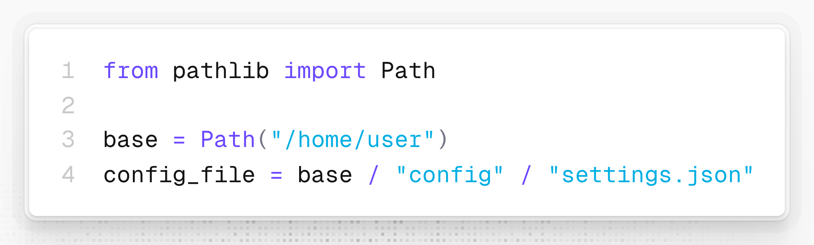
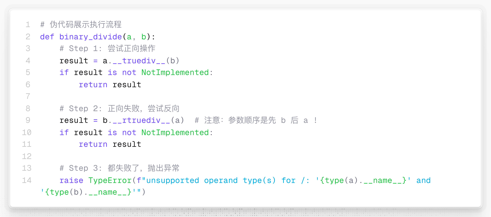
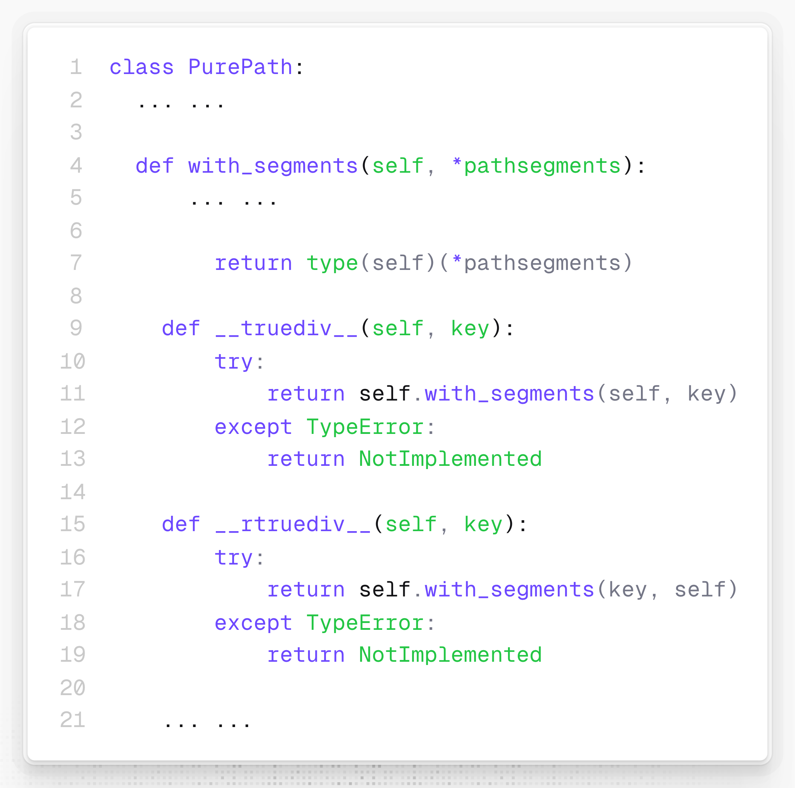
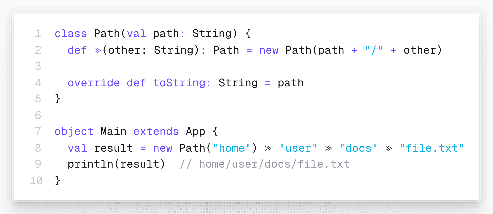

# 在Python中除号“/”竟能用来拼接文件系统的路径

看看这段 AI 写出的 Python 代码，会不会觉得 AI 又错了?



```python
from pathlib import Path

base = Path("/home/user")
config_file = base / "config" / "settings.json"
```

能用除法操作符 `/` 来连接变量和字符串，拼接路径吗？

`/` 怎么说也应该写到引号 `""` 里面吧？

这样写看起来倒是很直观，但不报错吗？

下面就让我们拨开迷雾，看看 Python 是如何让 `/` 变得如此“聪明”，除了知道 `1 / 2 = 0.5`，居然还能帮我们完成“路径拼接”了。

## 魔法揭秘：操作符重载

这个戏法的原理其实很简单，只不过是 Python 的一个独特设计：**操作符重载，而且每种二元操作符都有正向和镜像两个重载版本**。

所谓**操作符重载**，就是 Python 允许自定义类型也支持像 `+`、`/` 这样的操作符。

以加法为例，只要在自定义类型中定义了 `__add__()` 这个“正向”函数，当执行 `a + b` 时，实际调用的就是 `__add__(a, b)`。

这其实并不算稀奇，支持操作符重载的语言几乎内部都是这样处理的。

而 Python 的独特之处在于，当 `a + b`，即 `__add__(a, b)` 失败时，还留了一手！Python 转而会去调用 `__add__()` 的“倒影”—— `__radd__(b, a)` 这个“镜像”版本的函数，这里的前缀 `r` 就表示这是镜像操作的版本。

对于除法操作符 `/`，情况和加法类似，也有正向和镜像——`__truediv__()` 和 `__rtruediv__()` 两个“除法”函数：

如果写成伪代码，那么当 Python 执行 `a / b` 时，背后其实发生了这样的事情：



```python
# 伪代码展示执行流程
def binary_divide(a, b):
    # Step 1: 尝试正向操作
    result = a.__truediv__(b)
    if result is not NotImplemented:
        return result

    # Step 2: 正向失败，尝试反向
    result = b.__rtruediv__(a)  # 注意：参数顺序是先 b 后 a !
    if result is not NotImplemented:
        return result

    # Step 3: 都失败了，抛出异常
    raise TypeError(f"unsupported operand type(s) for /: '{type(a).__name__}' and '{type(b).__name__}'")
```

具体到 **pathlib** 这个库，除法操作符 `/` 是这样重载的：



```python
class PurePath:
	... ...
	
	def with_segments(self, *pathsegments):
	    ... ...
	        
        return type(self)(*pathsegments)
	
    def __truediv__(self, key):
        try:
            return self.with_segments(self, key)
        except TypeError:
            return NotImplemented

    def __rtruediv__(self, key):
        try:
            return self.with_segments(key, self)
        except TypeError:
            return NotImplemented
    
    ... ...
```

这里的 `with_segments()` 能接受任意数量的路径片段并返回由这些片段拼装而成的新 `Path` 对象。

例如，对于 `path = Path("/home/user") / "documents"`，执行流程为：

1. Python 调用 `(Path.)__truediv__(Path("/home/user"), "documents")`
2. 内部调用 `self.with_segments(self, "documents")`。**注意**，此时的 `self` 是 `Path("/home/user")`
3. 成功返回新的 `Path("/home/user/documents")`

而对于“字符串拼接 `Path`”这一镜像操作，如 `path = "/home/user" / Path("music")`，执行流程就会稍微复杂一点：

1. Python 尝试 `(str.)__truediv__("/home/user", Path("music"))`
2. `str` 类型不知道该如何“除以” `Path` 对象，返回 `NotImplemented`
3. Python **自动尝试镜像操作**，即调用 `(Path).__rtruediv__(Path("music"), "/home/user")`
4. 内部调用 `self.with_segments("/home/user", self)` 。**注意参数顺序**！`"/home/user"` 变成了第 1 个参数，且此时的 `self` 是 `Path("music")`！
5. 成功返回 `Path("/home/user/music")`

这就是为什么 `str / Path` 也能工作的原因：**镜像操作符接管了控制权，并且巧妙地交换了参数顺序**。

既然 `Path / str` 已经能拼接路径了，为什么还要支持 `str / Path` 呢？也就是为什么还需要镜像操作呢？

最大的好处恐怕就是，用户不需要关心操作数的顺序了，两种写法都能正常工作。甚至可以混搭：`path3 = "a" / Path("b") / "c" / Path("d")`。

---

虽然 `/` 在数学上是除法，但在文件系统的路径中，`/` 又表示分隔符，比起

`path = base.join("config").join("settings.json")`

显然

`path = base / "config" / "settings.json"`

要更加直观自然。毕竟，**优雅的代码不是写给机器看的**，而是写给人读的。Python 在这方面一直做得很好。

再说个有趣的语法糖，如果你觉得 `>`、`≫` 等更适合作为路径中的分割符，不妨试试 Scala 中的**中缀形式方法调用**：



🔚

```
// 超简化版：只支持 Path > "string"
// 类似Python: Path("a") / "b" / "c"

class Path(val path: String) {
  // 唯一的操作符：Path > String
  def >(other: String): Path = new Path(path + "/" + other)

  override def toString: String = path
}

// 使用示例
object Main extends App {
  val result = new Path("home") > "user" > "docs" > "file.txt"
  println(result)  // home/user/docs/file.txt
}

// 运行:
// scala ScalaPathMinimal.scala
```