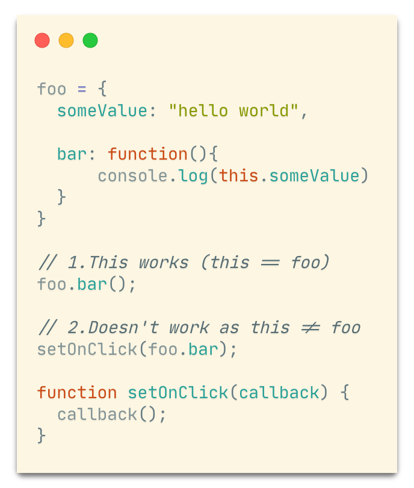

# 计算机术语“foo”来源于汉语？

就像古时候在私塾读过几天《百家姓》的小学生，只要你学过一阵编程，就应该见过 **foo** 和 **bar** 这两个“常见姓氏”。无论是哪种编程语言的教程，示例代码中总能看到这两个词的身影：

就像扑克牌里的大小王、麻将里的“混儿”，或者闲话家常里的“张三”“李四”，**foo** 和 **bar** 是代码里的“万能标识符”，遇到需要起名字的时候，无论是变量名、函数名，还是类名、包名，都能用它们来“凑合”。

其实，**foo** 这个词背后还有一段有趣的历史。

**foo** 最早可追溯到 1930 年代的无厘头漫画《Smokey Stover》：美国漫画家 Bill Holman 喜欢在画面里藏一些没有含义的词，其中就包括 **FOO**。

据作者本人说，他是在旧金山唐人街的玉雕底部看到“福”这个字的音译 _foo_，觉得好玩就用在漫画上了。

小小的 **foo** 提醒我们，编程世界里不只有算法与数据结构，偶尔也藏着些历史和文化。