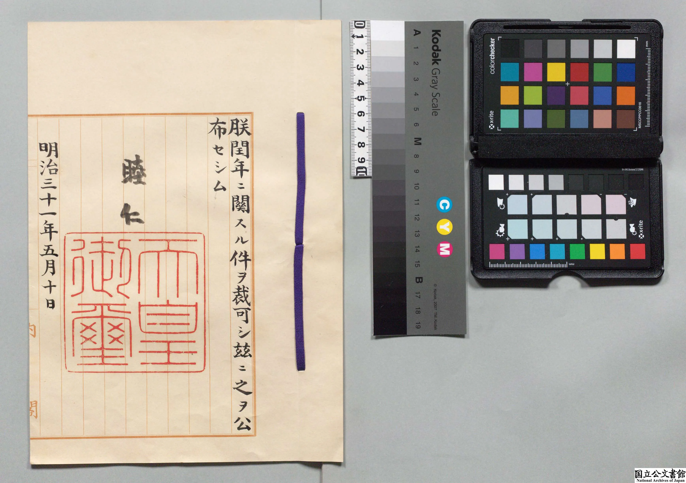
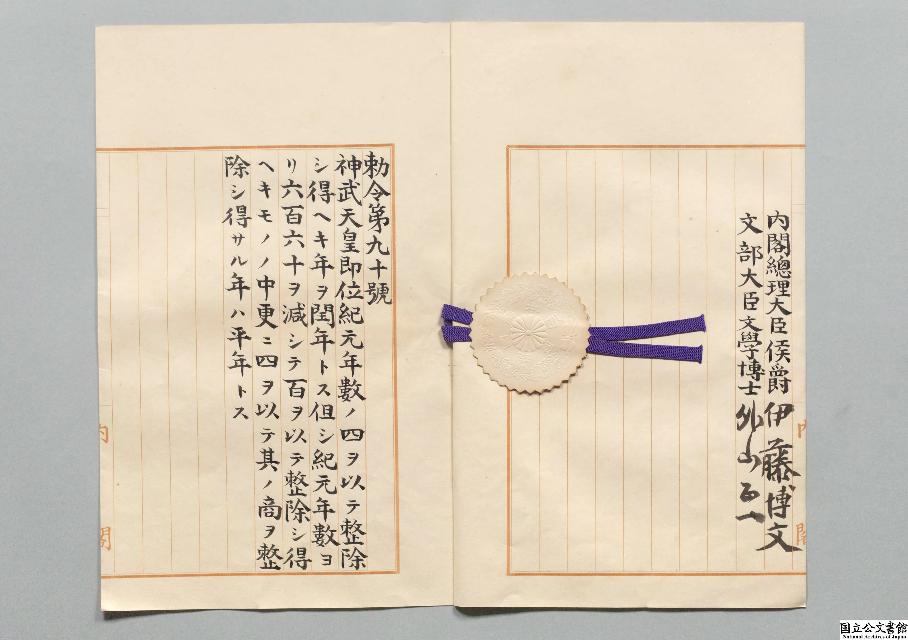

# 明治天皇手书敕令Fix Bug

明治五年（1872 年）冬，当时的日本政府正忙着推进一件影响全国的大事：废弃沿用了千年的阴阳历，从 **1873 年 1 月 1 日**起，全面改用西洋的太阳历，也就是格里高利历。

匆忙之中，竟遗漏了一条判断闰年的关键规则：“四年一闰”这条规则是记住了，但忘了第二条规则：“百年不闰，四百年再闰”。这意味着本是平年的 1900 年会被当成闰年。

二十多年后，眼看就要迈入 20 世纪了，才突然发现不对劲：1900 年不是闰年啊！

于是，于 1898 年（明治三十一年）火速“发布补丁”，并按当时的正式流程，由明治天皇署名并加盖印章，内阁总理大臣伊藤博文会同文部大臣外山正一副署，以勅令第九十号的形式“push 了 bug fix”。

> 以神武天皇即位纪元（皇纪年）为基准，能被 4 整除的年份为闰年。但如果将该年份减去 660 后，结果能被 100 整除，且用 100 除后的商不能被 4 整除，则该年为平年。

皇纪纪年是以**神武天皇即位为起点**的纪年，比西历早 **660 年**。因此要先减去 660，把皇纪年“校正”成西历年。另外，敕令的前半句还隐含了 `(n + 660) ≡ n (mod 4)` 这一同余关系。

这应该算是规格最高的 Fix Bug 之一了吧。

-----

https://www.digital.archives.go.jp/file/154407.html

閏年ニ関スル件・御署名原本・明治三十一年

https://www.digital.archives.go.jp/file/154407.html

日本天皇手书 Bug Fix —— 明治时代的“闰年大危机”

明治五年冬天，日本政府正忙着推行一件大事：把旧的阴阳历，换成西洋的太阳历。
改历布告匆匆在 1872 年 12 月 9 日贴出，宣布一个月后，从 1873 年 1 月 1 日 起全国都要用新历。

这种赶工程度，放在现在就是：

结果可想而知——他们忘了一个最关键的闰年规则。

☀️ 忘记闰年的明治政府：一个小数点级别的大事故

太阳历（格里高利历）最重要的闰年规则是：

4 的倍数 → 闰年

但 100 的倍数 → 其实是平年

只有 400 的倍数 → 重新变成闰年

明治政府在赶稿期间，把这条规则给漏掉了。

这意味着什么？
意味着他们差点把 1900 年 当成闰年。

但问题是：1900 年根本不是闰年！

如果真闰错了，日本的历法会在 20 世纪开始就偏一天——
相当于操作系统从元旦起每天慢 1 秒，没有人知道哪里出问题。

👀 危机发现：幸亏有人仔细看了文档

时间来到 1890 年代末。
有人认真算了一下，突然发现不对劲：

“喂……1900 年我们是不是会多放一天假？”
“不会吧？应该是闰年吧？”
“……你再看看规则？”
“啊？还有这个条件？！”

一阵沉默。

整个明治政府意识到：
我们快要在国民面前推送一个跨世纪大 bug 了。

✒️ Bug Fix：天皇御名入、伊藤博文背书的“补丁”

1898 年（明治三十一年），政府火速起草补丁补丁，并按当时的正式流程：

由 明治天皇亲笔署名（御名御璽）

由 首相伊藤博文 会同主要大臣副署

以 勅令第 90 号 的形式公布

标题叫：

閏年ニ関スル件（关于闰年的件）

正文大意就是：

“以后遇到 100 的倍数年，
如果不能被 400 整除，那年不是闰年。
千万别算错。”

这是历史上少见的：
由国家最高权力正式发布的历法 bug fix。

从此，1900 年没被错误当成闰年，日本顺利与世界保持一致。

🎉 小结：这是一个怎样的故事？

这是一个关于：

一场仓促上线的“国家级系统迁移”

一个被忘记的小小数学规则

一个差点让全国误用 100 年的 bug

以及一个由天皇签名修复的历史补丁

你可以把这件事概括成一句话：

“明治政府匆忙上线格里高利历，漏了闰年规则，
事后由天皇发布官方补丁修正——日本史上最尊贵的 bug fix。”