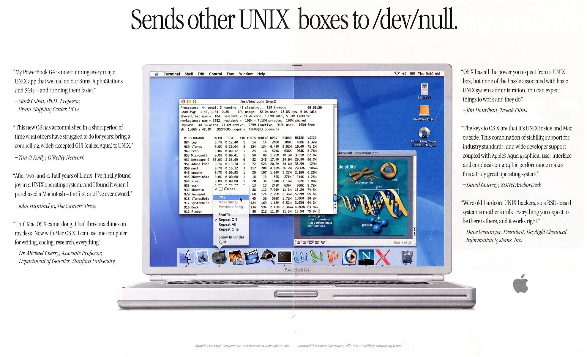
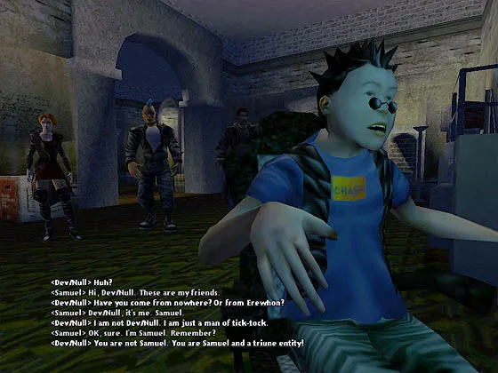
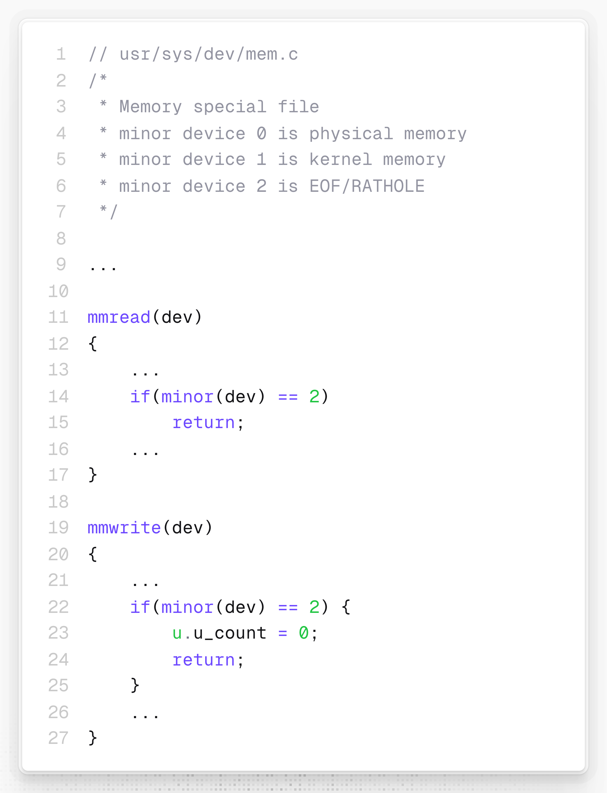

# 一对if-return语句创造出的计算机文化符号：dev/null

在 Unix 世界里，有一个如同“黑洞”的特殊文件（设备）——`/dev/null`。当你想让一个喋喋不休报错的程序“闭嘴”时，只需把错误输出重定向到这个文件：`command 2>/dev/null`。

经过几十年的演变，`/dev/null` 已经渐渐演化为一个计算机文化符号——带着些许玩笑、隐喻、反讽和一丝自嘲。

如果有人说“**Send complaints to /dev/null**”，那么他实际想表达的是“你抱怨也没用，我不管”；而“**My mail got archived in /dev/null**”则表示“邮件都被删除了”；“**Redirect to /dev/null**”更加直接，表示“从我眼前消失吧、别打扰我”。

2002 年，苹果 PowerBook G4 的广告语： “**Sends other UNIX boxes to /dev/null**” ，用 `/dev/null` 能够“吞噬一切”的形象，暗示该款笔记本的性能远胜其他 Unix 系统。iPhone Dev Team 也曾以玩笑话 “**Send donations to /dev/null**”，幽默地表示“我们不接受任何捐款”。



极客文化旺盛的生命力还将 `/dev/null` 带向了更广阔的世界。它被进一步拟人化，化身为办公室里人人熟知的虚构同事——**Dave Null** 或 **Devin Null**，永远负责接收所有投诉和垃圾信息。甚至在领英（LinkedIn）上，也能找到许多名为 **Dave Null** 的才华横溢的求职者。


一款以同名桌游为基础的 2000 年角色扮演游戏 _Vampire: The Masquerade – Redemption_ 里，有一个吸血鬼黑客就叫 **Dev/Null**。



而一位电子音乐人（本名 Pete Cassin）直接把艺名定为 **Dev/Null**，将极客气质融进自己的艺术形象。


但如果你翻开 1970 年代 Unix V7 的源代码，就会惊讶地发现，这样一个深具影响力的文化标志的背后，仅有一对单薄的 `if-return` 语句。


```c
// usr/sys/dev/mem.c
/*
 * Memory special file
 * minor device 0 is physical memory
 * minor device 1 is kernel memory
 * minor device 2 is EOF/RATHOLE
 */

...
 
mmread(dev)
{
    ...
    if(minor(dev) == 2)
        return;
    ...
}

mmwrite(dev)
{
    ...
    if(minor(dev) == 2) {
        u.u_count = 0;
        return;
    }
    ...
}
```

`if(minor(dev) == 2) return;` ——**直接返回**，假装文件读完了。

`if(minor(dev) == 2) { u.u_count = 0; return; }` ——清空计数器并**直接返回**，假装写进去了。

不到 100 个字符，就定义出了 `/dev/null` 这个“黑洞”设备（次设备号为 2）的独特行为，创造出了整个 Unix 世界里一种常用的模式。有趣的是，源文件开头的注释将 `/dev/null` 亲切地称作 **“RATHOLE”**——“老鼠洞”。

`/dev/null` 的全部意义就在于**什么都不做**。在纷繁复杂的系统里，有时候最强大的功能，恰恰就是“什么都不做”。

🔚