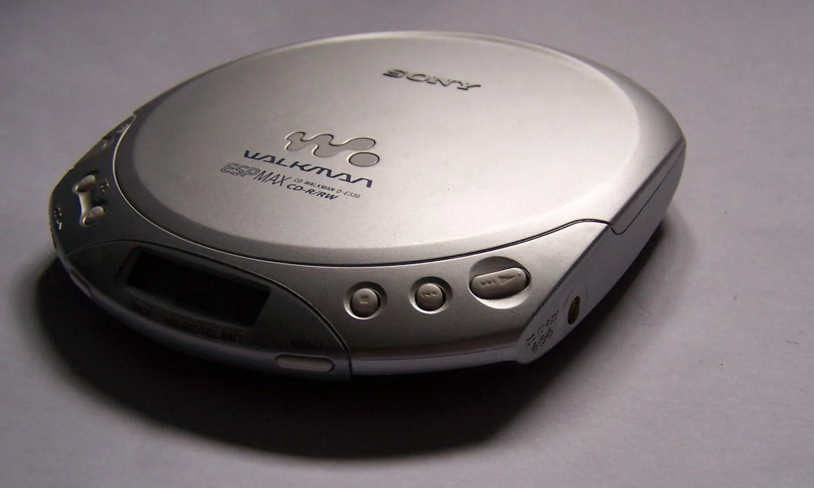
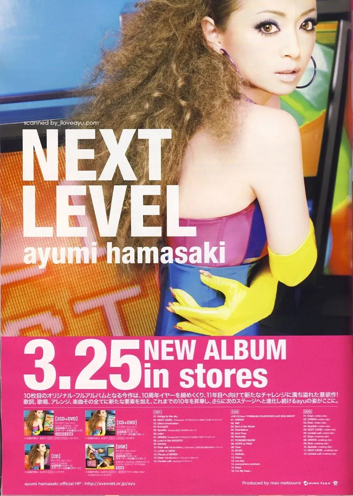
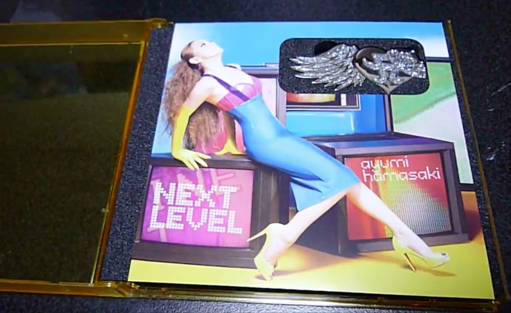

# USB专辑：连接CD与在线音乐的旋律线

曾几何时，中学生们一个个头戴耳机，听着 **CD 随身听**里的歌曲，骑着山地车穿梭在街道上，这几乎成了那个时代的标志之一。那时候，CD 刚刚进入生活，虽然价格略高，但凭借清晰的音质，很快成为新一代音乐爱好者的热门选择。

说到 CD，你可能也听过那个有趣的传闻：为什么一张 CD 的标准时长是 **74 分钟**？据说是索尼和飞利浦的工程师为了完整收录贝多芬的第九交响曲，经过仔细计算，才最终确定了这个长度。

随着数字化逐渐普及，音乐载体又出现了新的尝试。21 世纪初，实体 CD 淡出市场，在线音乐又尚未发展成熟，于是，二者的结合体——USB 专辑横空出世。歌手们开始把专辑装进 **USB 闪存盘**。

2009 年，**滨崎步**率先在日本乐坛尝试这一形式：她的第十张原创专辑《NEXT LEVEL》推出了 U 盘版本，这是她个人乃至日本歌手第一次用 U 盘发行专辑。

这枚银色 U 盘不仅收录了 **14 首 MP3 歌曲**，还附赠 MTV 和电子歌词画册（PDF），总容量 **2GB**，剩余空间则可以当作普通 U 盘使用。U 盘的外观被设计成她 10 周年纪念单曲“单翼之心”的形状，既具有收藏价值，又兼具实用性。

随着网络和流媒体的发展，**在线音乐**逐渐成为主流。从国外的 **Spotify**、**Google Play Music**，到国内的**网易云音乐、QQ 音乐、酷狗**等平台，数字音乐逐渐取代了物理载体。相比 CD 或 U 盘，在线音乐的播放和存储更为便利。U 盘专辑因此成为数字化过渡时期的特殊产物——既承载了收藏情怀，也见证了音乐走向完全数字化的过程。

对于那些曾经拿着银色 U 盘的歌迷来说，它不仅是一段回忆，也是一种身份象征：曾跨过那个连接 CD 与在线音乐时代的小桥梁。