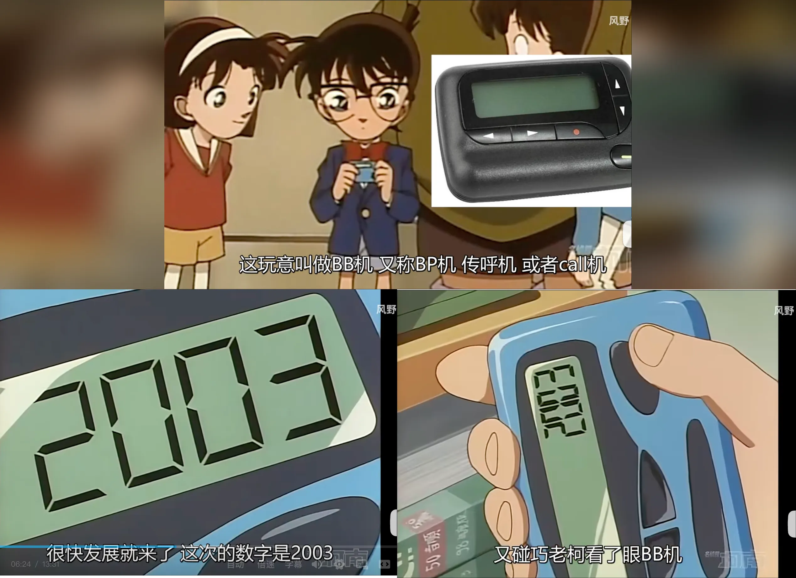
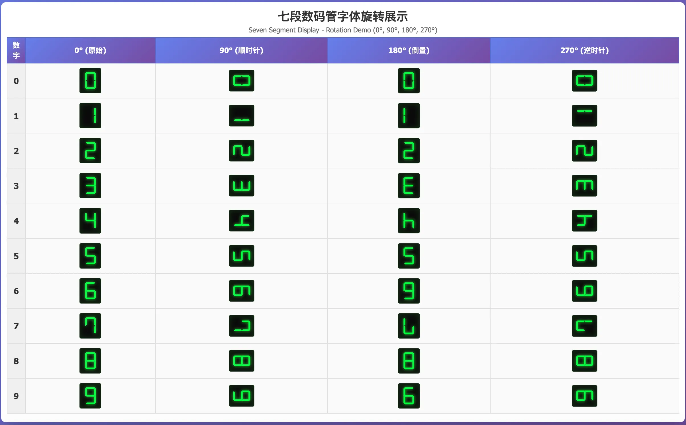
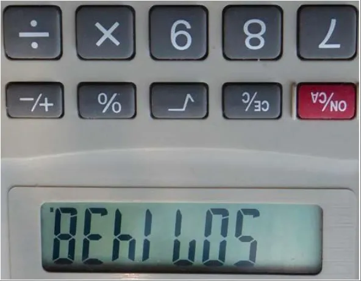

# 2003=MOON：数字变字母的趣事

在《名侦探柯南》第 123 集“天气预报小姐姐绑架事件”里，柯南的 BP 机上（毕竟是 1998 年播放的动画片了）突然收到一串奇怪的数字：9109、110、**2003**、00……这些其实是被绑架的小姐姐向外界发出的求救暗号。柯南无意中把 BP 机竖了过来，灵光一闪——**“2003”不是数字，而是代表 MOON**。

因为把这 4 个数字竖过来看时，**3 看起来像 M，0 像 O，而 2 则像变形后的 N**。小姐姐正试图告诉他：我被关在能看到月亮的地方！（都能打电话到寻呼台，为什么不直接报警呢？）

你可能还记得，早期计算器或电子表的屏幕，用的都是这种 **7 段数码管**。也就是说，0～9 的数字都是由横竖排列的 7 条小线段组合而成。现在电梯里的数字显示，大多仍是这种风格。

7 段数码管主要是为显示阿拉伯数字而设计的，但也能勉强表示如 H、L、P、U 等形状简易的字母。但如果把屏幕倒过来翻转 180 度看（或者你拿个大鼎），奇妙的事情就会发生——有些数字会变成字母： 

* 3 → E  
* 4 → h  
* 5 → S  
* 6 → g

动画里破案的关键——2003 转成 MOON——也是利用了这一现象，只不过翻转了 90 度而已。

我小时候看这集时，也被这种“数字变字母”的玩法迷住了，曾试着找出能组成英文单词的数字组合。但那时不会编程，对着词典一个个手工转换又很枯燥，所以很快就放弃了（可能都没转换到 abandon 就 abandon 了）。

有趣的是，Unix 早期核心成员**柯林翰**（Brian Kernighan）也遇到过几乎同样的”案件“。

大概是在 1972 年，他也像毛利小五郎一样，接到一个求助电话，是别的部门的研究员打来的：

“我发现把计算器倒过来看，某些数字会变成字母，比如 3 会变成 E，7 会变成 L。你们电脑里不是有本英文字典吗？帮我查查用这些数字都能拼出哪些单词吧？”

“那你倒着拿计算器时，都能看到哪些字母呢？”柯林翰问道。

对方回答：“B、E、H、I、L、O、S。”

马上就要”破案“了！

柯林翰放下电话，双手回到键盘上，没有写一行代码，只随手敲出了一条命令：

`grep '^[behilos]*$' /usr/dict/web2`

`/usr/dict/web2` 是韦氏国际词典第 2 版，共收录 23 万多个英文单词。这条命令的意思是：**只筛选由 b、e、h、i、l、o、s 这几个字母组成的单词**。

系统瞬间就给出了答案，“**真相只有 263 个**”单词，只是其中绝大多数连英语母语者都不认识。柯林翰把它们打印出来，寄给了求助人。

那位研究员再也没有回电，大概已经忙着用计算器玩单词拼写去了。

🔚

相关故事还有