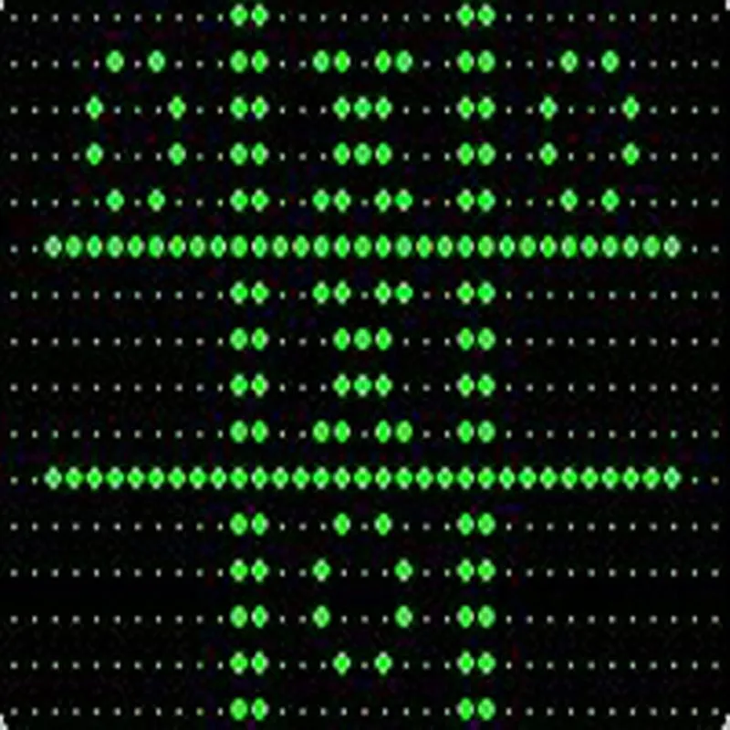
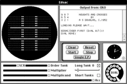
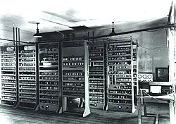

Alexander Douglas writes OXO for EDSAC
Graphics & Games
Alexander Douglas was a Cambridge University PhD candidate when he designed one of the earliest computer games, a version of Tic-Tac-Toe (known in Britain as 'Naughts and Crosses’), called OXO. Played on Cambridge's EDSAC computer, OXO allowed a player to choose to start or to allow the machine to make the first move. Using a rotary telephone dial to enter their moves, the EDSAC would display the game board on a 35 x 15 dot cathode ray tube. Few outside of Cambridge ever played OXO.

# _OXO_ (video game)

|OXO|   |
|---|---|
|  _OXO_ played in an [EDSAC](https://en.wikipedia.org/wiki/EDSAC "EDSAC") simulator for the [Classic Mac OS](https://en.wikipedia.org/wiki/Classic_Mac_OS "Classic Mac OS")|   |
|[Designer](https://en.wikipedia.org/wiki/Video_game_designer "Video game designer")|[A S Douglas](https://en.wikipedia.org/wiki/A_S_Douglas "A S Douglas")|
|[Platform](https://en.wikipedia.org/wiki/Computing_platform "Computing platform")|[EDSAC](https://en.wikipedia.org/wiki/EDSAC "EDSAC")|
|Release|- [UK](https://en.wikipedia.org/wiki/United_Kingdom "United Kingdom"): 1952|
|[Genre](https://en.wikipedia.org/wiki/Video_game_genre "Video game genre")|[Puzzle](https://en.wikipedia.org/wiki/Puzzle_video_game "Puzzle video game")|
|Mode|[Single-player](https://en.wikipedia.org/wiki/Single-player_video_game "Single-player video game")|

_**OXO**_ is a [video game](https://en.wikipedia.org/wiki/Video_game "Video game") developed by [A S Douglas](https://en.wikipedia.org/wiki/A_S_Douglas "A S Douglas") in 1952 which simulates a game of [noughts and crosses](https://en.wikipedia.org/wiki/Noughts_and_crosses "Noughts and crosses") (tic-tac-toe). It was one of the first games developed in the [early history of video games](https://en.wikipedia.org/wiki/Early_history_of_video_games "Early history of video games"). Douglas programmed the game as part of a thesis on [human-computer interaction](https://en.wikipedia.org/wiki/Human-computer_interaction "Human-computer interaction") at the [University of Cambridge](https://en.wikipedia.org/wiki/University_of_Cambridge "University of Cambridge").

The program was written for the [Electronic Delay Storage Automatic Calculator](https://en.wikipedia.org/wiki/EDSAC "EDSAC") (EDSAC). EDSAC was one of the first [stored-program computers](https://en.wikipedia.org/wiki/Stored-program_computer "Stored-program computer"), with memory that could be [read from or written to](https://en.wikipedia.org/wiki/Random-access_memory "Random-access memory"), and had three small [cathode-ray tube](https://en.wikipedia.org/wiki/Cathode-ray_tube "Cathode-ray tube") screens to display the state of the memory; Douglas re-purposed one screen to demonstrate portraying other information to the user, such as the state of a noughts and crosses game. After the game served its purpose, it was discarded on the original hardware but later successfully reconstructed.

_OXO_, along with a [checkers](https://en.wikipedia.org/wiki/Checkers_\(1952_video_game\) "Checkers (1952 video game)") game by [Christopher Strachey](https://en.wikipedia.org/wiki/Christopher_Strachey "Christopher Strachey") completed around the same time, is one of the earliest known games to display [visuals](https://en.wikipedia.org/wiki/Video_game_graphics "Video game graphics") on an electronic screen. Under some definitions, it thus may qualify as the first video game, though other definitions exclude it due to its lack of moving or real-time updating graphics.

## History

.jpg)

The [Electronic Delay Storage Automatic Calculator](https://en.wikipedia.org/wiki/Electronic_Delay_Storage_Automatic_Calculator "Electronic Delay Storage Automatic Calculator") in 1948

The [Electronic Delay Storage Automatic Calculator](https://en.wikipedia.org/wiki/EDSAC "EDSAC") (EDSAC) mainframe computer was built in the [University of Cambridge](https://en.wikipedia.org/wiki/University_of_Cambridge "University of Cambridge")'s [Mathematical Laboratory](https://en.wikipedia.org/wiki/Computer_Laboratory,_University_of_Cambridge "Computer Laboratory, University of Cambridge") between 1946 and 6 May 1949, when it ran its first program,[[1]](https://en.wikipedia.org/wiki/OXO_%28video_game%29?utm_source=chatgpt.com#cite_note-AOTE-1)[[2]](https://en.wikipedia.org/wiki/OXO_%28video_game%29?utm_source=chatgpt.com#cite_note-PCTBR-2) and remained in use until 11 July 1958.[[3]](https://en.wikipedia.org/wiki/OXO_%28video_game%29?utm_source=chatgpt.com#cite_note-EDSAC99-3) The EDSAC was one of the first [stored-program computers](https://en.wikipedia.org/wiki/Stored-program_computer "Stored-program computer"), with memory that could be [read from or written to](https://en.wikipedia.org/wiki/Random-access_memory "Random-access memory"), and filled an entire room; it included three 35×16 dot matrix [cathode-ray tubes](https://en.wikipedia.org/wiki/Cathode-ray_tube "Cathode-ray tube") (CRTs) to graphically display the state of the computer's memory.[[4]](https://en.wikipedia.org/wiki/OXO_%28video_game%29?utm_source=chatgpt.com#cite_note-Replay50s-4)[[5]](https://en.wikipedia.org/wiki/OXO_%28video_game%29?utm_source=chatgpt.com#cite_note-OXO-5) As a part of a thesis on [human-computer interaction](https://en.wikipedia.org/wiki/Human-computer_interaction "Human-computer interaction"), [Sandy Douglas](https://en.wikipedia.org/wiki/Sandy_Douglas "Sandy Douglas"), a doctoral candidate in mathematics at the university, used one of these screens to portray other information to the user; he chose to do so via displaying the current state of a game.[[6]](https://en.wikipedia.org/wiki/OXO_%28video_game%29?utm_source=chatgpt.com#cite_note-HCIAS-6)[[7]](https://en.wikipedia.org/wiki/OXO_%28video_game%29?utm_source=chatgpt.com#cite_note-Priest-7)

Douglas used the EDSAC to simulate a game of [noughts and crosses](https://en.wikipedia.org/wiki/Noughts_and_crosses "Noughts and crosses"), and display the state of the game on the screen. Like other early video games, after serving Douglas's purpose, the game was discarded.[[4]](https://en.wikipedia.org/wiki/OXO_%28video_game%29?utm_source=chatgpt.com#cite_note-Replay50s-4) Douglas did not give the game a name beyond "noughts and crosses"; the name _OXO_ first appeared as the name of the simulation file created by computer historian [Martin Campbell-Kelly](https://en.wikipedia.org/wiki/Martin_Campbell-Kelly "Martin Campbell-Kelly") while creating a simulation of the EDSAC several decades later.[[8]](https://en.wikipedia.org/wiki/OXO_%28video_game%29?utm_source=chatgpt.com#cite_note-TCU-8) Around the same time that _OXO_ was completed, [Christopher Strachey](https://en.wikipedia.org/wiki/Christopher_Strachey "Christopher Strachey") expanded a [checkers](https://en.wikipedia.org/wiki/Checkers_\(1952_video_game\) "Checkers (1952 video game)") program he had originally written in 1951 and ported it to the [Ferranti Mark 1](https://en.wikipedia.org/wiki/Ferranti_Mark_1 "Ferranti Mark 1"), which showed the state of the game on a CRT display.[[9]](https://en.wikipedia.org/wiki/OXO_%28video_game%29?utm_source=chatgpt.com#cite_note-Draughts52-9) _OXO_ and Strachey's checkers program are the earliest known games to display [visuals](https://en.wikipedia.org/wiki/Video_game_graphics "Video game graphics") on an electronic screen, though it is unclear which of the two games was displayed first.[[7]](https://en.wikipedia.org/wiki/OXO_%28video_game%29?utm_source=chatgpt.com#cite_note-Priest-7) As it ran on a computing device and used a graphical display, _OXO_ is considered under some definitions to be a contender for the first video game,[[10]](https://en.wikipedia.org/wiki/OXO_%28video_game%29?utm_source=chatgpt.com#cite_note-EVG-10) though under others it does not due to its lack of moving graphics or graphics which update continuously.[[11]](https://en.wikipedia.org/wiki/OXO_%28video_game%29?utm_source=chatgpt.com#cite_note-TVGD-11)

## Interaction

Each game was played by one user against an [artificially intelligent](https://en.wikipedia.org/wiki/Artificial_intelligence_in_video_games "Artificial intelligence in video games") opponent, which could play a "perfect" game. The player entered their input using a [rotary telephone](https://en.wikipedia.org/wiki/Rotary_dial "Rotary dial") controller, selecting which of the nine squares on the board they wished to move next. Their move would appear on the screen, and then the computer's move would follow; the game display only updated when the game state changed. _OXO_ was not available to the general public and could only be played in the University of Cambridge's Mathematical Laboratory by special permission, as the EDSAC could not be moved, and both the computer and the game were only intended for academic research purposes.[[8]](https://en.wikipedia.org/wiki/OXO_%28video_game%29?utm_source=chatgpt.com#cite_note-TCU-8)