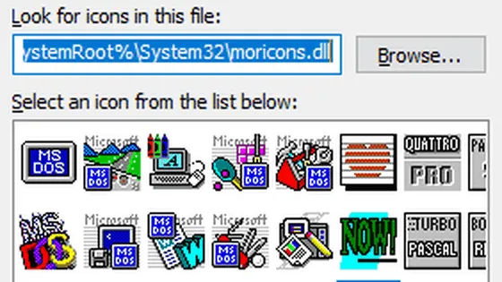
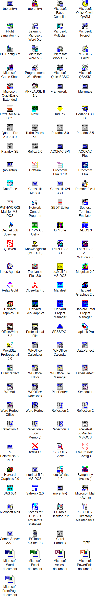

# moricons.dll：一扇通往Windows 3.0时代PC软件世界的窗口

在 Windows 的系统目录中，有一个名为 **moricons.dll** 的文件。自 **Windows 3.0** 诞生之时，它便在 Windows 中扎下根，并一路保存至今。即便在最新的 Windows 11 的 System32 文件夹中，依然能看到它的身影。

故事要从 **1990 年**说起。当时，微软希望 Windows 3.0 能够自动为已有的 DOS 程序生成图标，帮助用户在类似今天“开始菜单”的**程序管理器（Program Manager）** 中快速定位应用程序。为此，他们将一批图标打包进一个 DLL 文件。原本想命名为“moreicons.dll”，但受限于 DOS 8.3 文件名规则，只好去掉“e”，简写为 **moricons.dll**。

moricons.dll 中古老图标的秘密最终被工程师 **Stephen Kitt** 揭开。他发现，每一个图标在 Windows 3.0 的 **APPS.INF** 文件中都有对应说明。在他的提示下，一位匿名网友编写了 Python 脚本，将 DLL 中的图标全部提取出来，并对照 APPS.INF 制作成完整的图文对照表。

就这样，三十多年前的 PC 软件世界，随着 **moricons.dll** 的揭秘，逐渐重现眼前。

如今，这些低分辨率、略显模糊的图标对大多数现代用户几乎毫无意义。正如微软资深开发者 Raymond Chen 所言：“花 12 KB 的空间，让这只‘睡熟的老狗’安静地躺着，比冒兼容性问题的风险要划算得多。”微软也选择仅保留这个文件。

然而，对于计算机考古爱好者来说，**moricons.dll** 依旧是一扇通往过去的窗口。透过这些小小的图标，我们可以追溯那个 DOS 与 Windows 3.0 时代的软件生态，感受早期个人计算机的趣味与历史。