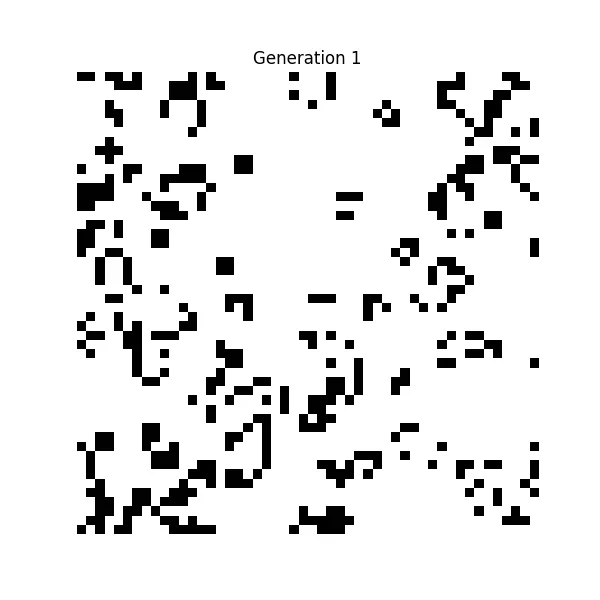

# 搜索Conway's Game of Life，观察生命的演化

我小时候，喜欢看雨后的纱窗。

一场雨过后，纵横排列着无数小方格的纱窗仿佛变成了“简易的动画屏幕”——有的小格子里填充着七彩的水膜，有的则空荡荡。只要盯着看，就会发现这些小格子的“状态”在不断变化：有的水膜突然消失，而新的水膜又悄然出现在其他方格中。水膜的消失与出现有时还带着节奏——几块亮起，另几块又熄灭。连在一起的一片片小水膜组成了一个个闪着七色光的不规则“生物”，在纱窗上慢慢“爬行”。

没想到，这段童年的记忆与英国数学家 John Conway 在 1970 年提出的数学模型颇为相似。这个模型叫作“生命游戏”（Game of Life），虽然名字里有“游戏”，但它并不是传统意义上的游戏——**没有玩家、没有目标、没有胜负**。Conway 的初衷设计，是研究简单规则如何产生丰富的行为。

“生命游戏”是一个无限的二维网格，每个格子只有“生”或“死”两种状态，其变化完全取决于一系列简单规则和周围 8 个邻居的状态。比如，一个已经死亡的格子如果正好挨着 3 个存活的邻居，下一轮就会复活；而存活格子的周围若少于 2 个邻居，则会因孤独而死亡……

出于好奇，我在搜索引擎中输入了“Conway's Game of Life”。没想到，结果页竟与众不同：

🎬

右侧突然多了 ▶️、⏸️ 等四个按钮，像播放器的控制面板。页面背景渐渐浮现出一片片淡蓝色的小方格，状态不断变化，看似随机，却又仿佛遵循某种规律——就像雨后的纱窗，也“活”了起来。一些淡蓝色的多边形“生物”开始变形、蠕动。右侧的小方格颜色似乎比左侧更深，应该不是错觉吧。

Google在用最直观的方式解释什么是“Conway's Game of Life”。

顺手打开浏览器调试窗口，发现页面 HTML 中多了一个 `<canvas>` 标签——所有“生命”的演化都绘制在这一块画布上。

凝视着页面，我仿佛回到了童年，看着小水膜在纱窗上自由闪动。而控制这一切的，仅仅是那几条简单的规则。看似偶然，却能与必然交织出“生命”。