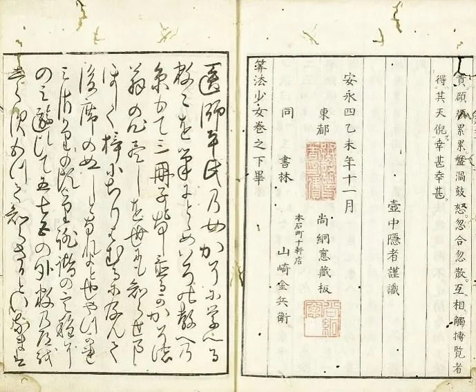
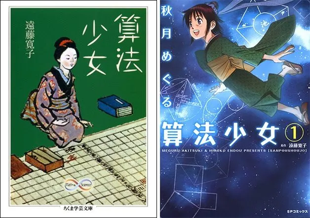

## Wiki

# 算法少女

ウィキメディアプロジェクトへの貢献者2-3 minutes 4/9/2007

---

出典: フリー百科事典『ウィキペディア（Wikipedia）』

|『算法少女』   （さんぽうしょうじょ）|   |
|---|---|
|著者|壺中隠者、平章子|
|発行日|[安永](https://ja.wikipedia.org/wiki/%E5%AE%89%E6%B0%B8 "安永")4年（1775年）、1935年、2009年|
|発行元|山崎金兵衛、古典数学書院、筑摩書房|
|[ジャンル](https://ja.wikipedia.org/wiki/Category:%E3%82%B8%E3%83%A3%E3%83%B3%E3%83%AB%E5%88%A5%E3%81%AE%E6%9B%B8%E7%89%A9 "Category:ジャンル別の書物")|数学、[和算](https://ja.wikipedia.org/wiki/%E5%92%8C%E7%AE%97 "和算")|
|言語|漢文、日本語|
|形態|和装|
|ページ数|58頁|
|公式サイト|[NDLJP](https://ja.wikipedia.org/wiki/%E5%9B%BD%E7%AB%8B%E5%9B%BD%E4%BC%9A%E5%9B%B3%E6%9B%B8%E9%A4%A8#%E9%9B%BB%E5%AD%90%E5%9B%B3%E6%9B%B8%E9%A4%A8%E4%BA%8B%E6%A5%AD "国立国会図書館"):[3508165](https://dl.ndl.go.jp/info:ndljp/pid/3508165)|
|コード|[ISBN 978-4-480-09255-7](https://ja.wikipedia.org/wiki/%E7%89%B9%E5%88%A5:%E6%96%87%E7%8C%AE%E8%B3%87%E6%96%99/9784480092557)|
||   |
|[ウィキポータル 数学](https://ja.wikipedia.org/wiki/Portal:%E6%95%B0%E5%AD%A6 "Portal:数学")|   |
|[ [ウィキデータ項目を編集](https://www.wikidata.org/wiki/Q11603229 "d:Q11603229") ]|   |
|[テンプレートを表示](https://ja.wikipedia.org/wiki/Template:%E5%9F%BA%E7%A4%8E%E6%83%85%E5%A0%B1_%E6%9B%B8%E7%B1%8D "Template:基礎情報 書籍")|   |

『**算法少女**』（さんぽうしょうじょ）は、[安永](https://ja.wikipedia.org/wiki/%E5%AE%89%E6%B0%B8 "安永")4年（[1775年](https://ja.wikipedia.org/wiki/1775%E5%B9%B4 "1775年")）に出版された[和算](https://ja.wikipedia.org/wiki/%E5%92%8C%E7%AE%97 "和算")書。当時の和算書で唯一、著者が女性名義になっている珍しい本であり、現在では[国立国会図書館](https://ja.wikipedia.org/wiki/%E5%9B%BD%E7%AB%8B%E5%9B%BD%E4%BC%9A%E5%9B%B3%E6%9B%B8%E9%A4%A8 "国立国会図書館")などでわずかに見ることの出来る稀覯本である。国会図書館に所蔵されている資料は[国立国会図書館デジタルコレクション](https://ja.wikipedia.org/wiki/%E5%9B%BD%E7%AB%8B%E5%9B%BD%E4%BC%9A%E5%9B%B3%E6%9B%B8%E9%A4%A8%E3%83%87%E3%82%B8%E3%82%BF%E3%83%AB%E3%82%B3%E3%83%AC%E3%82%AF%E3%82%B7%E3%83%A7%E3%83%B3 "国立国会図書館デジタルコレクション")で閲覧できる[[1]](chrome-extension://ecabifbgmdmgdllomnfinbmaellmclnh/data/reader/template.html#cite_note-1)。また、[1935年](https://ja.wikipedia.org/wiki/1935%E5%B9%B4 "1935年")（昭和10年）に謄写版が古典数学書院から復刻された[[2]](chrome-extension://ecabifbgmdmgdllomnfinbmaellmclnh/data/reader/template.html#cite_note-2)。

本書を題材に、[児童文学](https://ja.wikipedia.org/wiki/%E5%85%90%E7%AB%A5%E6%96%87%E5%AD%A6 "児童文学")作家の[遠藤寛子](https://ja.wikipedia.org/wiki/%E9%81%A0%E8%97%A4%E5%AF%9B%E5%AD%90_\(%E4%BD%9C%E5%AE%B6\) "遠藤寛子 (作家)")が小説『[算法少女](https://ja.wikipedia.org/wiki/%E7%AE%97%E6%B3%95%E5%B0%91%E5%A5%B3_\(%E5%B0%8F%E8%AA%AC\) "算法少女 (小説)")』を著していて[[3]](chrome-extension://ecabifbgmdmgdllomnfinbmaellmclnh/data/reader/template.html#cite_note-3)[[4]](chrome-extension://ecabifbgmdmgdllomnfinbmaellmclnh/data/reader/template.html#cite_note-4)、同作は後に漫画化・アニメ映画化された[[5]](chrome-extension://ecabifbgmdmgdllomnfinbmaellmclnh/data/reader/template.html#cite_note-5)。

[2009年](https://ja.wikipedia.org/wiki/2009%E5%B9%B4 "2009年")（平成21年）に本書の現代語訳と問題の解答を解説し、資料として[天理大学](https://ja.wikipedia.org/wiki/%E5%A4%A9%E7%90%86%E5%A4%A7%E5%AD%A6 "天理大学")附属[天理図書館](https://ja.wikipedia.org/wiki/%E5%A4%A9%E7%90%86%E5%9B%B3%E6%9B%B8%E9%A4%A8 "天理図書館")蔵『算法少女』の影印を収録した『和算書「算法少女」を読む』が[ちくま学芸文庫](https://ja.wikipedia.org/wiki/%E3%81%A1%E3%81%8F%E3%81%BE%E5%AD%A6%E8%8A%B8%E6%96%87%E5%BA%AB "ちくま学芸文庫")から出版された[[6]](chrome-extension://ecabifbgmdmgdllomnfinbmaellmclnh/data/reader/template.html#cite_note-6)。

『算法少女』序文によると、娘が父親の協力の下にこの本を著わしたとあるが、本名はない。父親は**壺中隠者**、娘は単に**平氏**とあり、同時に**章子**の印章がある[[7]](chrome-extension://ecabifbgmdmgdllomnfinbmaellmclnh/data/reader/template.html#cite_note-7)。当時は弟子の名前で師匠が自分の業績や研究を発表することが行われていたので、実際の著者は「壺中隠者」と見られる。しかしそれでも、この時代の和算書に女性が名前を連ねるのは他に例がなく、その意味でも日本の文化史上貴重な本といえる。跋文（あとがき）は[俳人](https://ja.wikipedia.org/wiki/%E4%BF%B3%E4%BA%BA "俳人")の[谷素外](https://ja.wikipedia.org/wiki/%E8%B0%B7%E7%B4%A0%E5%A4%96 "谷素外")（号は一陽井）が記している[[8]](chrome-extension://ecabifbgmdmgdllomnfinbmaellmclnh/data/reader/template.html#cite_note-8)。和算が学問であると同時に趣味的な分野として受け止められていたことが窺える。

著者「壺中隠者」の正体については長く不詳のままだったが、[数学史](https://ja.wikipedia.org/wiki/%E6%95%B0%E5%AD%A6%E5%8F%B2 "数学史")家・[三上義夫](https://ja.wikipedia.org/wiki/%E4%B8%89%E4%B8%8A%E7%BE%A9%E5%A4%AB "三上義夫")の研究によって医師・**千葉桃三**であることが明らかになった[[9]](chrome-extension://ecabifbgmdmgdllomnfinbmaellmclnh/data/reader/template.html#cite_note-9)。

時代背景としては、その6年前の[明和](https://ja.wikipedia.org/wiki/%E6%98%8E%E5%92%8C "明和")6年（[1769年](https://ja.wikipedia.org/wiki/1769%E5%B9%B4 "1769年")）、[田沼意次](https://ja.wikipedia.org/wiki/%E7%94%B0%E6%B2%BC%E6%84%8F%E6%AC%A1 "田沼意次")が[老中](https://ja.wikipedia.org/wiki/%E8%80%81%E4%B8%AD "老中")格に昇進し、[田沼時代](https://ja.wikipedia.org/wiki/%E7%94%B0%E6%B2%BC%E6%99%82%E4%BB%A3 "田沼時代")が本格化した。[鎖国令](https://ja.wikipedia.org/wiki/%E9%8E%96%E5%9B%BD%E4%BB%A4 "鎖国令")が緩和され、諸外国の進んだ文物が日本に入ってきた。[安永](https://ja.wikipedia.org/wiki/%E5%AE%89%E6%B0%B8 "安永")3年（[1774年](https://ja.wikipedia.org/wiki/1774%E5%B9%B4 "1774年")）、[杉田玄白](https://ja.wikipedia.org/wiki/%E6%9D%89%E7%94%B0%E7%8E%84%E7%99%BD "杉田玄白")、[前野良沢](https://ja.wikipedia.org/wiki/%E5%89%8D%E9%87%8E%E8%89%AF%E6%B2%A2 "前野良沢")らによる『[解体新書](https://ja.wikipedia.org/wiki/%E8%A7%A3%E4%BD%93%E6%96%B0%E6%9B%B8 "解体新書")』が著された。経済力を持った町人庶民が文化を発展させる一方、地方では[飢饉](https://ja.wikipedia.org/wiki/%E9%A3%A2%E9%A5%89 "飢饉")から[一揆](https://ja.wikipedia.org/wiki/%E4%B8%80%E6%8F%86 "一揆")が引き起こされた。その結果、困窮民が都市部に流入し、貧富の差が増大した。

##

## 《算法少女》，或由医生的女儿编撰

https://www.nippon.com/cn/japan-topics/c12802/

提到《算法少女》，你会想到什么？有些人可能读过小说或漫画，但它的原作是一部大约250年前，即1775年（安永四年）在江户出版的三卷本和算书。作者自称壶中隐者，在序文中写道：“我是来自大阪的医生，这本书是我口述的算术，由女儿平章子整理成书。所以，我想书名中使用‘少女’一词应该是恰如其分的吧。”

活跃在那个时代的和算家会田安明在某篇文章中提到过该书，据他说，他确认了该书作者的实名为千叶桃三，出身于大阪，是居住在江户的一名医生，也是关流（关孝和流派）秘诀皆传的和算爱好者。

  
《算法少女》下卷的版权页（图片：国立国会图书馆数字档案馆）

让我们看看该书的内容。东大寺学园的前中学数学教师和算研究家小寺裕在《和算书‹算法少女›解读》（筑摩学艺文库）一著中进行了详细介绍。

《算法少女》的开篇介绍了计算圆周率的方法。首先，通过内接正多边形来近似计算的方法，将多边形的边数由4、8、16、……不断增加，当达到正10万余（！）多边形时，便能得出圆周÷直径＝355/113=3.14159202……。然而，即便如此，也仍不够精确，所以在书末传授了用秘术的无穷级数的表示方法，有那么一点显摆的味道。

即使在今天圆周率仍被作为衡量超级计算机性能的标准之一，当时的和算家也将其视其为重要课题，因此有必要在书的开头谈论圆周率，以彰显自己的数学技能。之后，书中还提到了包括等比级数、三角形与内接圆、五次方程式、分数的最小公倍数、组合等各类问题都用日文和汉文详细记录，共有数十道题目，持续到下卷。

小寺审阅了所有问题，分析指出和文[(1)](https://www.nippon.com/cn/japan-topics/c12802/#note-1-1)问题大多为初级，汉文问题多为中级以上。虽然书中存在一些数学错误，但也超出了一般和算书的范围。那么，将其整理成书的“章子”到底是一个什么样的少女呢？遗憾的是，除了这本书之外，再无任何线索。小寺表示，会田安明也没有提及过，所以也有人认为她是一个虚构的人物，这至今仍是个未解之谜。围绕着“算法少女”这一本书，会田对千叶桃三评价颇高，但与他同时代的劲敌、和算家藤田贞资却对此书进行了情绪化的激烈批评，甚至为此专门撰写了《算法少女之评》一书。这个神秘的“少女”加剧了两人之间宿怨的升温。

## “少女”在小说中大显身手

受这些历史事实的启发，作家远藤宽子将“少女”赋予生命，写成了小说。与和算书同名的小说《算法少女》于1973年由岩崎书店出版，2006年由筑摩学艺文库再版。小说中，主人公“阿秋”是医生之女，受父亲指导学习算术的设定与原作相同。小说描述了她指出一名傲慢的和算道场的年轻武士在算额中的错误，为贫困孩子们开设了教授九九乘法口诀等数目计算法的课堂等情节。

为了创作这部小说，远藤广泛查阅数学史书籍，听取专家的数学解释，了解当时日本的数学背景等等，做了详尽的准备。从这个意义上来讲，这本小说对了解江户中期的人们如何跟和算打交道极具价值。小说还被秋月Meguru绘成漫画版，并于2012年由出版社LEED出版。此外还在2015年被拍成动画片，由外村史郎执导，制作工房赤之女王企画制作。

  
受江户期和算书《算法少女》启发的小说《算法少女》（筑摩学艺文库）及其漫画版（LEED社）

再看看少年们的卓越表现吧。根据深川的《通过例题了解日本的数学与算额》（森北出版），确认了在现存的算额和记录文献中，来自冈山县、京都府、滋贺县、岐阜县、东京都、千叶县、群马县的9-15岁的15个少年的名字。尤为引人注目的是其问题达到了大学生水平以上。深川认为，算额通常不写年龄，但特别标注就是为了激励年轻才俊。