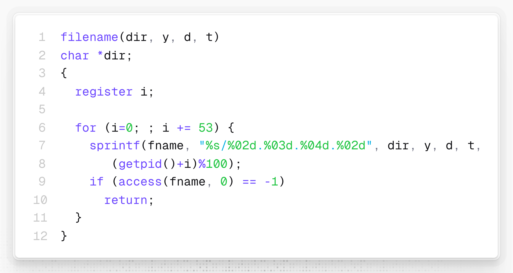

# 早期Unix开发者一夜间能产出多少成绩和Bug？

**Stephen Johnson**（史蒂芬·约翰逊）是 Bell 实验室 UNIX 阵营的早期核心开发者之一，与 Ken Thompson、Dennis Ritchie、Brian Kernighan 和 Doug McIlroy 是同事。

虽然名气不如前几位——甚至除了 Ken 和 Dennis 外，其他人都算不上“门面级人物”——但他还是做了很多幕后工作，功不可没：包括 **Yacc**（语法解析器生成器）、**Lint**（C 语言静态检查）、**Portable C Compiler**（跨平台的 C 编译器）和 **spell**（拼写检查工具），推动了 Unix 和 C 语言的普及。

正如标题所说，我们不禁好奇：这样一位 Unix 开发者，一夜之间能产出多少成绩，又会带来多少 Bug 呢？故事是这样的。

早期计算机系统都是多人共享的，为了让长时间运行的任务不会干扰其他人的工作，人们需要把这类笨重的任务安排在非工作时间执行。要让任务延迟执行，就必须编辑格式晦涩的“时刻表”（这里指的应该是 `/etc/crontab`）。

有一天，Stephen 在又一次不得不编写那个让人头疼的“时刻表”时，突然灵光一现：为什么不把“几点执行什么任务”整理成一个简单的命令呢？比如，“我想让这个任务**在**凌晨 2 点运行”，那就输入

`at 2AM run_this_command`

想让它在下周一执行，就输入

`at monday run_this_command`

于是，他仅仅熬了几个小时的夜，第二天一早就和同事分享起自己的成果——一个**能够理解英语时间短语**的 **at** 命令。

翻开 Unix Research V7 版本的代码库，虽然里面的 **at** 命令应该不是 Stephen 熬夜写出的最初版本，但我觉得应该也没怎么改进过——因为代码里还能看到 2 处 Bug。

## 成绩

还是应该先说成绩。

**at** 命令由 2 个源文件构成，`at.c` 和 `atrun.c`。前者负责解析用户输入的英语时间短语，并将待执行的命令写入队列文件。后者则负责扫描任务队列，执行到期的任务。

两个源文件合起来**大概有 400 多行 C 语言代码**，其中包括大量解析各种日期时间格式的代码。想想要让以下的排列组合都是合法的参数，需要花多少功夫：

* `3, 330, 3:30`：都可表示 3 点半
* `3am, 3pm`：时间可带 AM/PM 修饰
* `noon, midnight`：中午或午夜（不区分大小写）
* `feb 14, FEB 14, february 14`：都可表示 2 月 14 日
* `tuesday, Tuesday, TUESDAY`：都可表示周二，且能够根据当前日期自动判断是本周二还是下周二
* ……

## 两处 Bug

通读这份源代码，不难发现两处 Bug。第一处是判断闰年：

我们知道判断闰年的完整方法是：能被 4 整除的是闰年，但能被 100 整除的不是，除非还能被 400 整除。

不过，按照代码里的“简化算法”，首个出错的年份要等到 **2100 年**——距离 Unix Research V7 发布的 **120 多年**后。也许 Stephen 已经盘算好了，到了 2100 年还会有人用 **at** 命令吗？不可能！于是理直气壮地简写了。

另一处 Bug 位于为任务文件“随机”生成后缀序号的地方，

这里采用的是最朴素的试探法：如果文件已经存在，即序号 `(getpid()+i)%100` 已经使用过了，就换一个“随机”数再试，直到找到第一个不存在的为止。

但这个循环没有额外的退出条件，一旦在同一时刻创建了 100 个任务，所有后缀序号都被占用后，就会**因为再也找不到新的序号而直接陷入死循环**。

但有可能 Stephen 又盘算好了，以当时的机器性能，根本不会有人在同一分钟提交 100 个任务，所以又理直气壮地简写了。
