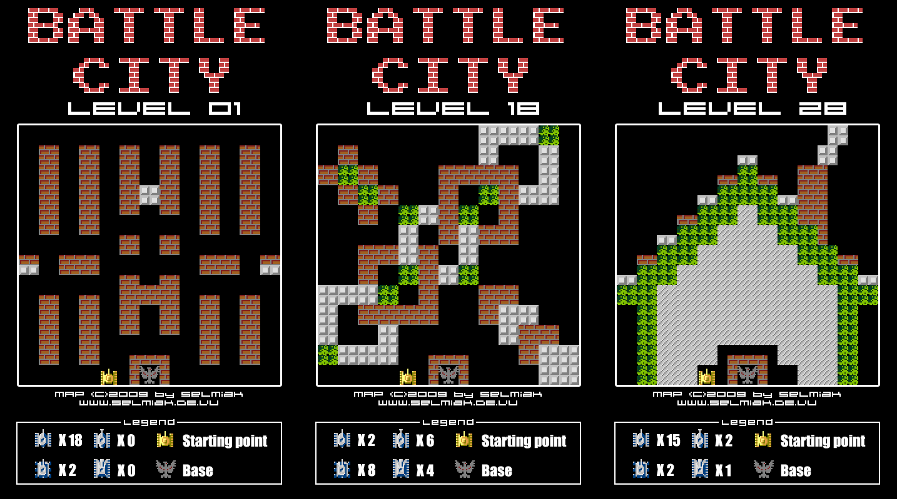
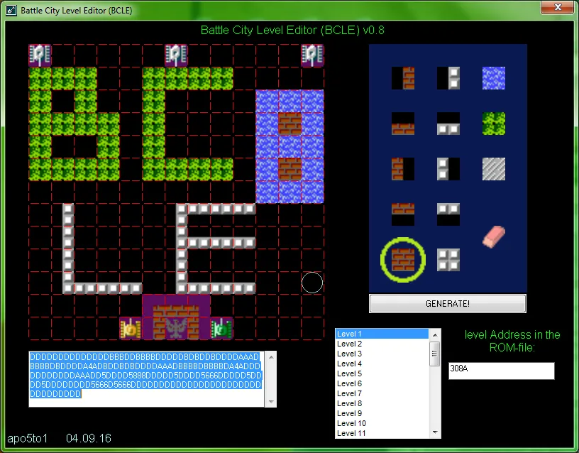
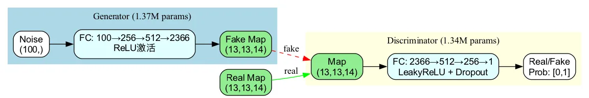
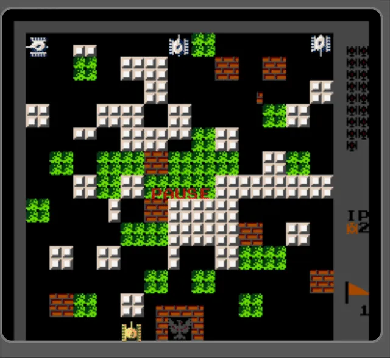
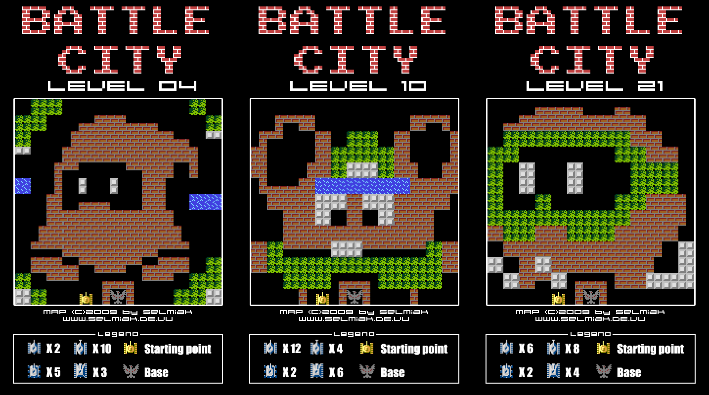

# 能用GAN生成FC《坦克大战》的关卡地图吗？

本文记录了这两天一次挺有意思的技术验证（POC）——**能否使用 GAN（生成对抗网络），绘制出以假乱真的 FC 《坦克大战》的关卡地图**？

我对机器学习、神经网络什么的一直停留在入门阶段，还没逼自己系统学习。但这些年多少听说过一些 **GAN** 的经典案例。比如用 GAN 生成真假难辨的虚假地图，用来干扰敌方判断；又比如某些看起来像是把马赛克“还原”成原图的应用，本质上也是模型在进行“合理脑补”。反正你从没见过原图，模型给你的那张“像真的一样”的图，那就是真的——正所谓“假作真时真亦假”。

生成对抗网络 **GAN** 的全称是 **Generative Adversarial Network**，是一种典型的深度学习架构。它由两部分组成：**生成器**（Generator）和**判别器**（Discriminator）。

**生成器**负责“造假”，努力生成看起来像真的数据；**判别器**负责“打假”，判断输入的数据是真是假。两者在持续对抗中相互博弈、不断进化，形成一种“魔高一尺，道高一丈”的训练过程。

回到这次的试验对象：《坦克大战》的 FC 原版一共包含 36 个关卡（其中有 1 关仅用于演示），也就是 36 张地图。每一关的地图，本质上是一个 **13×13 的网格**。网格中的每一个格子，用一个取值范围为 0～13 的整数表示不同地形，总共有 **14 种地形**，例如：4 表示砖墙，10 表示海洋，11 表示草丛，等等。

于是问题就变得很清晰了：**能不能让 GAN 学会这些 13×13 的地图特征，然后生成新的地图，让玩家第一眼觉得“这就是原版关卡”？**

不得不说，现在的 AI 工具确实强得离谱。这之前我从未写过训练 GAN 的代码，但仅仅是把“想做什么”描述清楚，AI 分分钟就帮我生成从模型定义、训练流程到调试测试的完整代码。

简单来看，GAN 采用生成器 + 判别器结构。

**生成器**以一个 100 维的随机噪声向量作为输入（也就是 100 个随机数），通过 3 层全连接网络，逐步映射为一个 **13×13×14** 的张量。其中，13×13 表示地图尺寸，14 是每个格子在 14 种地形中的概率分布。

**判别器**则将输入的 13×13×14 的地图张量展平，同样通过 3 层全连接网络逐步降维，最终输出一个 0～1 之间的数值，用来表示“这张地图是真实关卡的概率”。

为了更直观地验证生成效果，我还写了一个注入脚本。将 GAN 生成的 13×13 地图编码后，直接覆盖 ROM 中第 1 关的地图数据，然后在模拟器里跑起来看了看效果。

可见，GAN 确实可以随机生成“合法”的地图，但缺乏原版地图那种明显的空间结构。《坦克大战》中有些关卡具有相当规则的几何布局，而有些关卡则是明显的图案化设计；相比之下，GAN 生成的地图更像是“地形的随机拼贴”（拼好图），显然还有很大的改进空间。

---

这次 POC 至少验证了一点：虽然当前生成的地图质量距离“可玩”和“像人类设计的”还有不小差距，但**机器已经能够通过学习人类设计的关卡模式，生成全新的游戏关卡**。

🔚