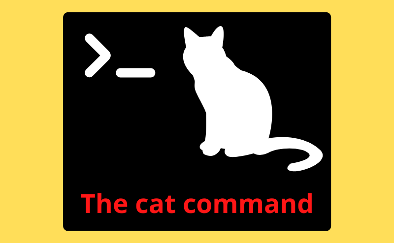

# `cat -`命令不能立即复写你输入的每个字符吗？

如果在终端里输入

```bash
cat -
```

或不带任何参数的

```bash
cat
```

然后开始随意按下一些字母键，比如 `abcde`，屏幕上会显示什么呢？

`cat -` 或 `cat` 的行为是从标准输入（键盘）读取内容，然后原样输出到屏幕上，也就是回显输入的内容。

屏幕上会出现 `aabbccddee` 吗？



下面，我们来揭晓答案。

结果是，屏幕上**只会显示刚刚敲下的每个字符 1 次**，而不是每输入 1 个字符，`cat` 都立刻复写 1 遍，就好像手指粘在按键上过长时间，导致相同的字符输入了 2 个。

而当按下回车键⏎后，刚刚输入的整行文字会重复显示在下一行。

这到底是为什么呢？

## 背后的原因：Canonical Mode

其实 Linux 的终端有两种输入模式。

第一种是**规范模式**（Canonical Mode），也叫**行缓冲模式**。在这种模式下，输入的内容会先缓存在内核里，直到用户按下回车键⏎，程序（进程）才会收到整行数据。这是大多数终端的默认模式，便于我们在提交前先用 Backspace 键⌫删除错误字符，修改后再一次性提交给程序。

第二种**非规范模式**（Non-Canonical Mode）则没有这种行缓冲，每个字符都会立即传给程序，程序可以实时处理每次输入，适用于游戏中响应玩家的按键，移动角色等场景。

当运行 `cat -` 时，终端**默认处于规范模式**，每个字符都会先被终端缓存，程序收到的是按下回车键⏎后的整行输入。所以，我们敲的单个字母不会立即被 `cat` 重复输出。

## 如何让 `cat -` 一个个字符实时显示呢？

如果我们通过以下命令把终端切换到**非规范模式**，再运行 `cat -`，

```bash
$ stty -icanon
$ cat -
aabbccddeeffgg^C
```

就能成对输入字符了，每对中的第 1 个字符是通过键盘输入的，第 2 个字符是 `cat` 原样重复的。

别忘了恢复终端的默认设置

```bash
$ stty icanon
```

---

总结一句话，`cat -` 不会立刻输出每个输入字符，是因为终端**默认的规范模式**会先行缓冲整行输入。而只要关闭了该模式，输入就会实时传给程序，`cat -` 就能即时显示输入的字符了。

🔚