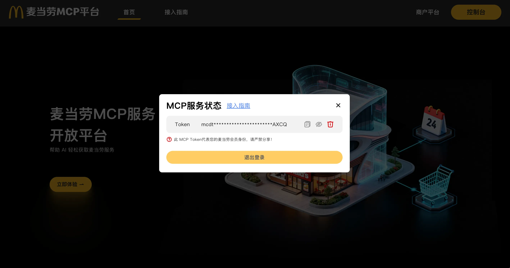
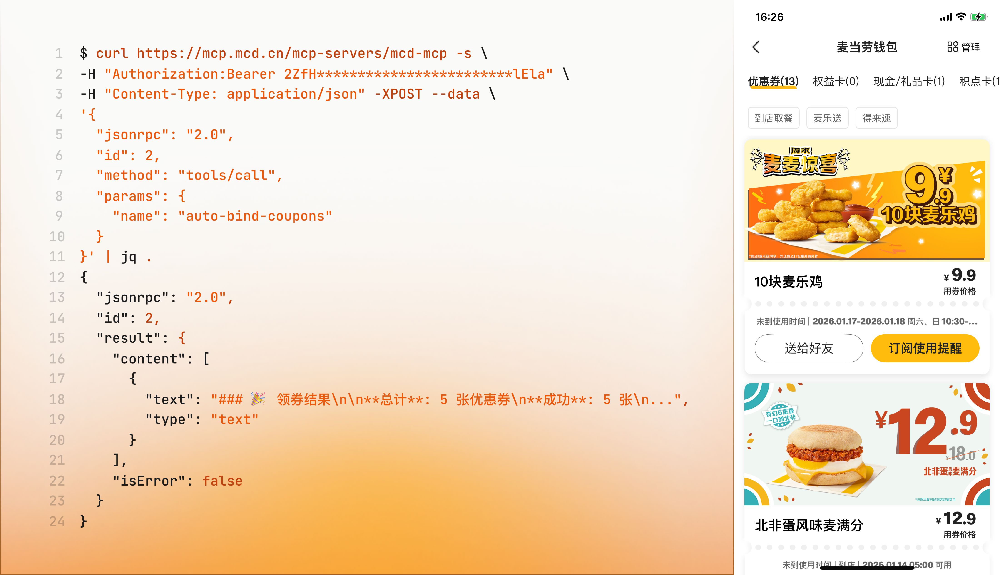

# 一条cURL命令就能领取麦当劳的优惠券

只需执行这条 `cURL` 命令就可以领取麦当劳🍟的优惠券！

```bash
$ curl https://mcp.mcd.cn/mcp-servers/mcd-mcp -s \
-H "Authorization:Bearer <MY-MCP-Token>" \
-H "Content-Type: application/json" -XPOST --data \
'{
  "jsonrpc": "2.0",
  "id": 2,
  "method": "tools/call",
  "params": {
    "name": "auto-bind-coupons"
  }
}'
```

不过，执行前需要先登录“麦当劳 MCP 平台”（🔗https://open.mcd.cn/mcp/login），申请 MCP Token，然后用获取到的 Token 替换命令中的 `<MY-MCP-Token>`。



试着执行一下，**5 张优惠券到手**！



回顾 2000 年前后的 Web，当时呈现出**两种不同的使用形态**：一方面是面向人类的 **human web**，以浏览器为中心，围绕 HTML 页面、超链接和表单展开，强调可阅读性与交互体验；另一方面，随着 XML、JSON、HTTP API 以及自动化与系统集成需求的增长，面向程序调用的 **programmatic web** 也逐渐浮现，Web **不再只是“被人类浏览”，而开始被软件直接访问和消费**。

而随着 LLM 日益强大，HTTP API 是否也在悄悄分化成两种用法？一种仍然供程序员对照着文档调用，另一种则面向 AI，由 MCP 自动调用。

就像给程序用的 programmatic web 人类其实也能看得懂，只是费点劲；给 AI 用的 MCP，程序员只需用原始的工具，也能直接调用。

🔚