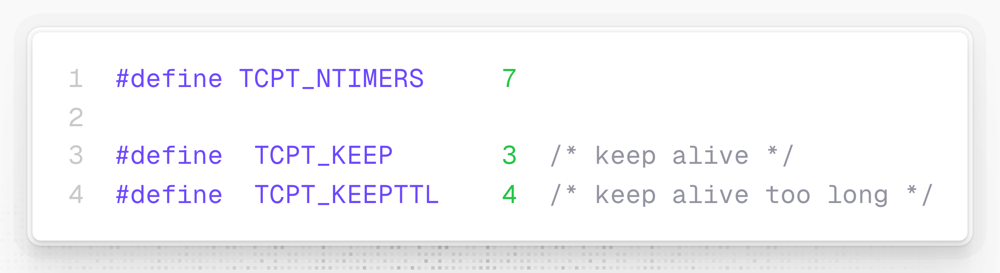
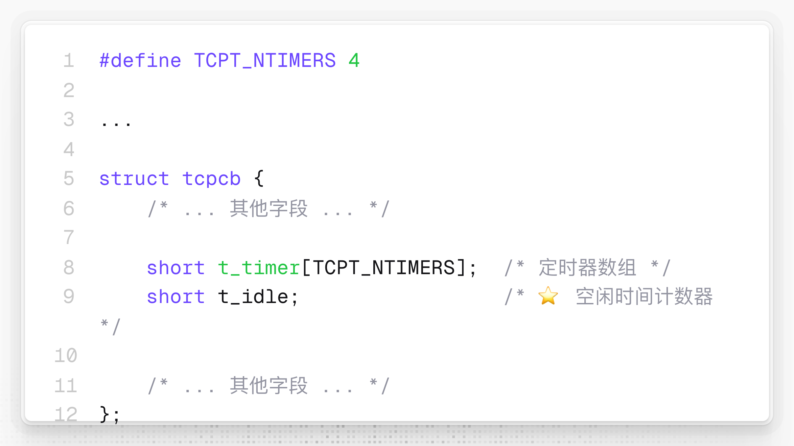
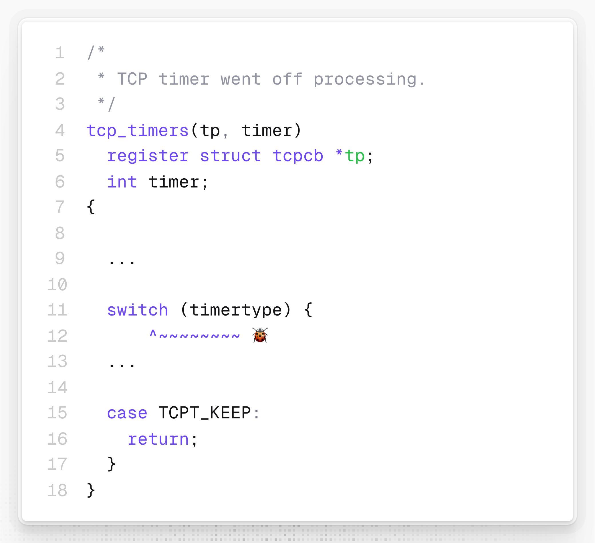
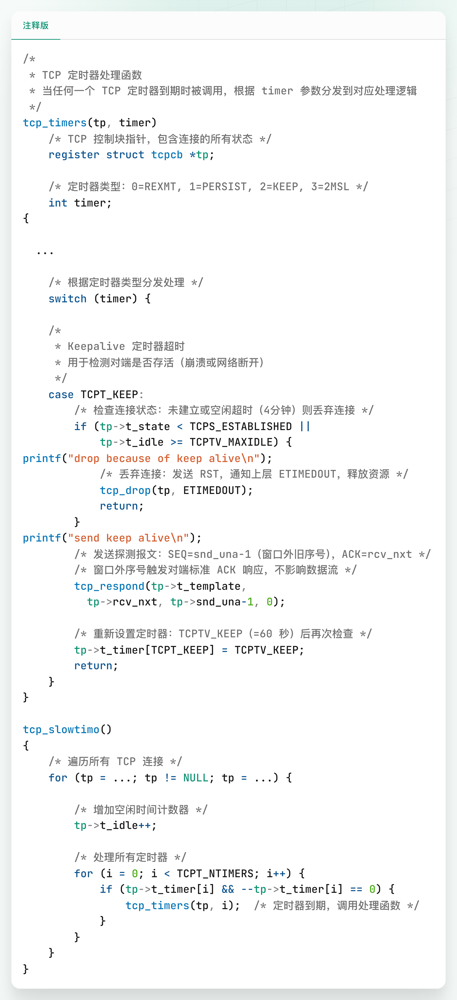

# 比尔·乔伊18天内就做出的“死了么”：TCP Keepalive

**比尔·乔伊**（Bill Joy）何许人也？


他是 **vi 编辑器**的作者，是 **BSD UNIX** 的设计者之一，还是 **Sun** Microsystems 公司的联合创始人，被《Fortune》杂志誉为**互联网时代的爱迪生**（The Edison of the Internet）。

很多程序员崇拜的 Bill，不是 Bill Gates，而是 Bill Joy。

**1981 年** 9 月，RFC 793 发布，定义了 TCP 协议的核心规范。这份长达 85 页的文档详细描述了 TCP 的连接建立、数据传输、流量控制、拥塞避免等机制，但有一个关键的功能完全没有提及：TCP Keepalive，连接存活检测——Hi，TCP 连接，你死了么？

然而，仅仅 2 个月后的 1981 年 11 月，比尔·乔伊就在 BSD Unix 的 TCP 实现中独立发明了这个机制。这个“标准之外”的创新，因成功解决了已“死亡”的连接永久占用系统资源的问题，最终成为了事实标准，并在 8 年后被写入 RFC 1122，成为 TCP 实现的正式要求。

本文将带你走进比尔·乔伊发明 TCP Keepalive 的 18 天旅程（1981-11-25～1981-12-12），看他如何一步步从零开始，创造出这个影响 40 多年的经典设计。

## 要新加入两种定时器

1981 年 11 月 25 日。

比尔·乔伊在 TCP 协议的实现代码中，于已有 5 种定时器的基础上，加入了 2 种新的定时器：



```c
#define TCPT_NTIMERS 7

#define  TCPT_KEEP       3  /* keep alive */
#define  TCPT_KEEPTTL    4  /* keep alive too long */
```

周期性心跳探测定时器（`TCPT_KEEP`）和总超时定时器（`TCPT_KEEPTTL`）。前者用于每隔固定时间发送探测报文，相当于打卡；后者用于控制 keepalive 的总时长，也就是容忍未打卡（认为还“活着”）的总时长，超时则强制关闭连接。因为是强制关闭，也就不通知 TCP 连接的“紧急联系人”了。

此时，比尔·乔伊只是为这两种定时器分配了编号，还未开始编写实现代码，可能是把主要精力放到了重构其他 TCP 模块的代码上。

## 推翻前一天的设计继续设计

大概 24 小时后，1981 年 11 月 26 日，比尔·乔伊刚完成了对 `mount` 命令功能的扩充，就投入到 TCP Keepalive 的工作中，一上来就推翻了前一天的设计。把 `TCPT_KEEPTTL` 定时器从 `t_timer` 数组挪出，增加了一个空闲时间计数器 `t_idle`。



```c
#define TCPT_NTIMERS 4

...

struct tcpcb {
    /* ... 其他字段 ... */

    short t_timer[TCPT_NTIMERS];  /* 定时器数组 */
    short t_idle;                 /* ⭐ 空闲时间计数器 */

    /* ... 其他字段 ... */
};
```

收到任何报文后（相当于家人打卡了），`t_idle` 都会重置为 `0`，重新计时；而一旦超过 `TCPTV_MAXIDLE`（240 秒）这个阈值，连接就会被关闭。

在 11 月 26 日这一天，比尔·乔伊应该还是在设计，只是把处理定时器事件的架子搭好了，并没有实际实现，而是直接 `return`：



```c
/*
 * TCP timer went off processing.
 */
tcp_timers(tp, timer)
	register struct tcpcb *tp;
	int timer;
{

	...
	
	switch (timertype) {
			^~~~~~~~~ 🐞
	...
	
	case TCPT_KEEP:
		return;
	}
}
```

代码甚至无法编译，因为 `switch` 那里把参数 `timer` 误写成 `timertype` 了。

## “with crud (first working version)”

15 天后，1981 年 12 月 12 日，比尔·乔伊在提交记录里写道：*with crud (first working version)*。首个 TCP Keepalive、TCP 连接“死了么”诞生了！crud 有“污垢”的意思，在这里应该是指首个实现代码并不优雅、可能还有 Bug 的意思。

比尔·乔伊能干 **crud** 增删改查那脏活吗？

对具体代码感兴趣的读者应该也不多，就不详述了，可以参考文末的注释版代码片段。

----

比尔·乔伊何许人也？

* 从 TCP 连接“死了么”的架构设计（11-25）到完整实现（12-12），仅 18 天
* 18 天内完成 60 余次的代码提交
* 实现了一个 RFC 793 中不存在的功能，为后续 40 多年的发展——TCP 是**可靠**的连接——奠定了基础



🔚

----

注释版

```c
/*
 * TCP 定时器处理函数
 * 当任何一个 TCP 定时器到期时被调用，根据 timer 参数分发到对应处理逻辑
 */
tcp_timers(tp, timer)
    /* TCP 控制块指针，包含连接的所有状态 */
    register struct tcpcb *tp;    
    
    /* 定时器类型：0=REXMT, 1=PERSIST, 2=KEEP, 3=2MSL */
    int timer;                    
{

	...

    /* 根据定时器类型分发处理 */
    switch (timer) {

    /*
     * Keepalive 定时器超时
     * 用于检测对端是否存活（崩溃或网络断开）
     */
    case TCPT_KEEP:
        /* 检查连接状态：未建立或空闲超时（4分钟）则丢弃连接 */
        if (tp->t_state < TCPS_ESTABLISHED ||
            tp->t_idle >= TCPTV_MAXIDLE) {
printf("drop because of keep alive\n");
            /* 丢弃连接：发送 RST，通知上层 ETIMEDOUT，释放资源 */
            tcp_drop(tp, ETIMEDOUT);
            return;
        }
printf("send keep alive\n");
        /* 发送探测报文：SEQ=snd_una-1（窗口外旧序号），ACK=rcv_nxt */
        /* 窗口外序号触发对端标准 ACK 响应，不影响数据流 */
        tcp_respond(tp->t_template, 
          tp->rcv_nxt, tp->snd_una-1, 0);

        /* 重新设置定时器：TCPTV_KEEP（=60 秒）后再次检查 */
        tp->t_timer[TCPT_KEEP] = TCPTV_KEEP;
        return;
    }
}

tcp_slowtimo()
{
    /* 遍历所有 TCP 连接 */
    for (tp = ...; tp != NULL; tp = ...) {

        /* 增加空闲时间计数器 */
        tp->t_idle++;

        /* 处理所有定时器 */
        for (i = 0; i < TCPT_NTIMERS; i++) {
            if (tp->t_timer[i] && --tp->t_timer[i] == 0) {
                tcp_timers(tp, i);  /* 定时器到期，调用处理函数 */
            }
        }
    }
}
```


```c
# Author: Bill Joy <root@ucbvax.Berkeley.EDU>
# Date:   Sat Dec 12 20:59:45 1981 -0800

/*
 * TCP timer processing.
 */
tcp_timers(tp, timer)
	register struct tcpcb *tp;
	int timer;
{

	...

	switch (timer) {

	...
	
	/*
	 * Keep-alive timer went off; send something
	 * or drop connection if idle for too long.
	 */
	case TCPT_KEEP:
		if (tp->t_state < TCPS_ESTABLISHED ||
		    tp->t_idle >= TCPTV_MAXIDLE) {
printf("drop because of keep alive\n");
			tcp_drop(tp, ETIMEDOUT);
			return;
		}
printf("send keep alive\n");
		tcp_respond(tp->t_template, tp->rcv_nxt, tp->snd_una-1, 0);
		tp->t_timer[TCPT_KEEP] = TCPTV_KEEP;
		return;
	}
}
```

