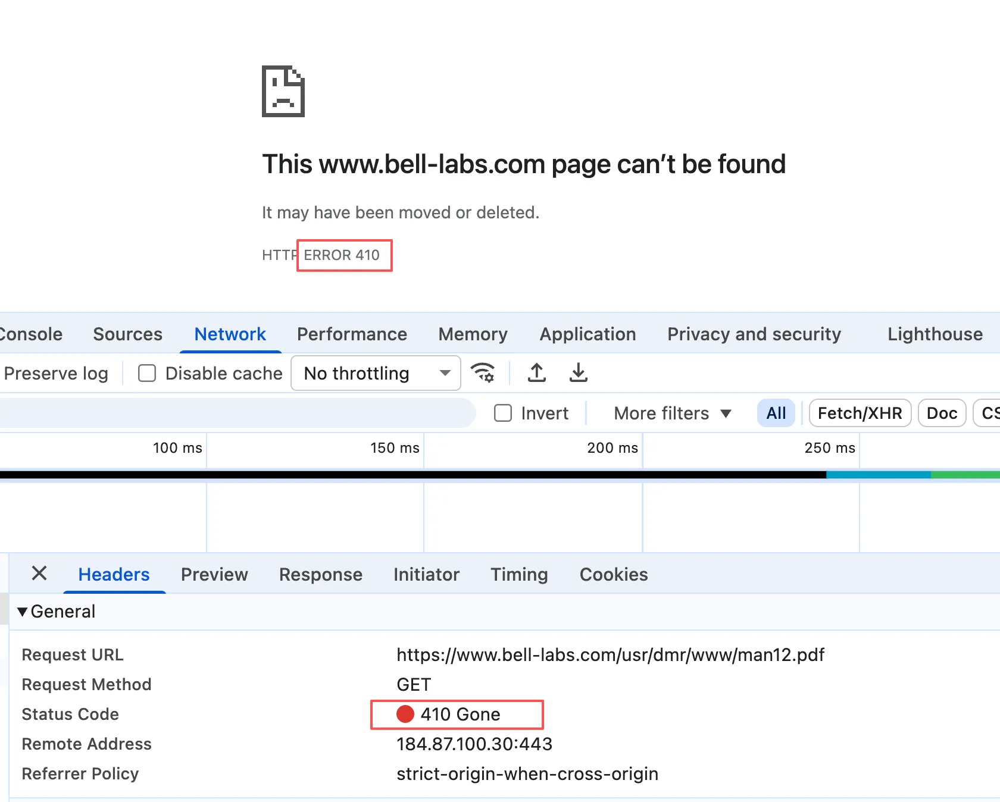
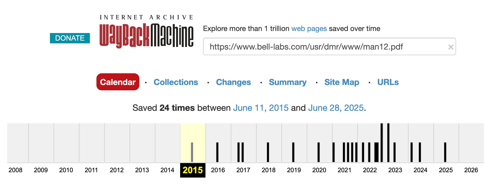
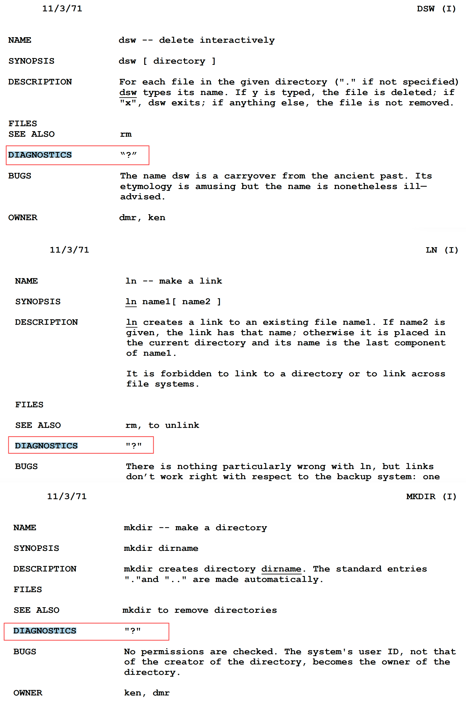

# 1971年的《UNIX程序员手册》没了！但不是404

在这两天的计算机“考古”工作中，我“挖”到了 `mail` 命令维基页面上的一个 URL，指向了 Unix 之父 Ken Thompson（肯·汤普森） 和 Dennis Ritchie（丹尼斯·里奇）在 1971 年 11 月合著的 PDF 版《UNIX 程序员手册》（_UNIX Programmer's Manual_）。

顺带提一句，之所以会查到 `mail` 命令的维基页面，是因为一名叫作 Kurt Shoens 的程序员开发了 `mail` 命令的升级版，这哥们在源代码的注释中多次使用了“b_tch”一词。

当下载这个“UNIX 程序员手册.pdf”时，网页一片空白，又“page can’t be found”了。本以为不过又是常见的 404，但下意识扫了眼状态码，竟发现了一个之前**没见过的“410 Gone”**。

一查才明白：网页找不到不仅有 404，还有 **410 Gone**——内容曾存在，但已永久删除，以及 **451 Unavailable For Legal Reasons**——法律原因不可用。

相比 404，410 更明确地告诉浏览器和搜索引擎，网页曾经存在，但已经永久删除，不会再出现了。你们用不着为了看是否恢复，时不时再过来检查一下。返回 410 还可以让搜索引擎及时从索引中移除已删除的页面，节省爬虫抓取资源。

而返回 451 意味着网页因法律要求、法院命令或政府规定被禁止访问，比如版权问题导致下架或法院要求删除特定页面等。据说这个状态码取自《华氏 451 度》，一部讲禁止人们阅读及拥有书籍的反乌托邦小说。

好在还有 Web Archive 这架互联网的“时光机”，回到 2015 年便可以“200 OK”地下载这份 PDF 版的手册了。这本 1971 年的《UNIX 程序员手册》不过是把一页页零散的 `man` 命令输出装订成册，不过似乎这是一个关于 Ken 的笑话的来源。

> 据说 Ken 有一辆他亲自设计的汽车。与大多数汽车不同，这辆汽车没有速度表、油量表，也没有其他常见的指示灯。如果出现故障，仪表盘中央会亮起一个**巨大的“?”号**。Ken 认为：“有经验的驾驶者通常会知道哪里出了问题。”

在这本手册中，孤零零的一个 `"?"` 不止一次出现在各命令的“DIAGNOSTICS”（诊断）一节。

有经验的开发者看到这个 `?` 还是能知道问题出在哪里了吧。就像虽然有些东西“404 Not Found”或“410 Gone”消失了，但只要足够敏感，还是能跟着留下的线索“挖”到点什么吧。

🔚