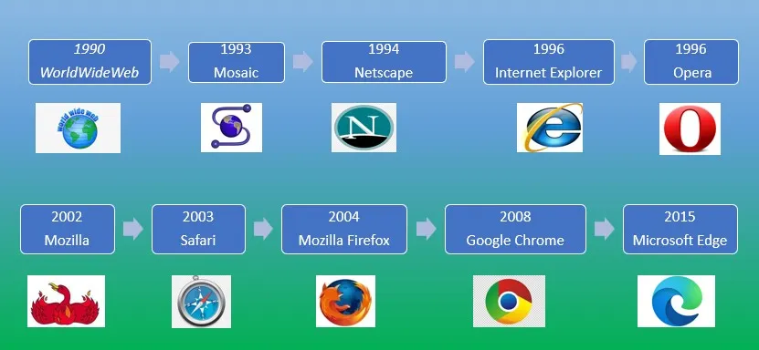
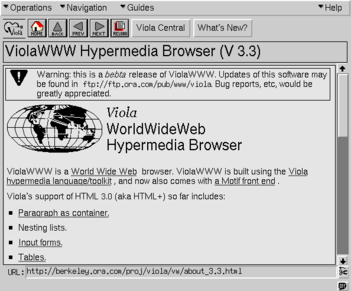

# 无名之人：魏培源与ViolaWWW

> 彼は歴史の舞台に一度だけ、ほんの一瞬登場します。
> 在历史舞台上他只出现过一次，而且只是短暂的一瞬间。
> —— 《無名の人》· 司馬遼太郎

历史的光芒总是照耀着少数伟大的名字。我们往往乐于记住发明者、行业先驱或是站在风口浪尖的人，却忽视了那些默默无闻的身影。他们虽未留下过响亮的名号，但其思想却在时代深处留下了不可抹去的印记。

纵观 Web 和浏览器的演进历程，

- 1968 年，Douglas Engelbart 在 SRI（Stanford Research Institute，斯坦福研究所）的 “Mother of All Demos”（所有演示之母）中展示了**超链接的雏形**
- 1980 年代，Apple 的 HyperCard 用“卡片 + 按钮”带来了“点击即跳转”的交互体验
- 1991 年，Tim Berners‑Lee 提出**万维网设想**，将超链接与互联网结合，构建起开放、可扩展、人人可用的全球信息网络
- 1993 年，Mosaic 浏览器让文字与图片首次并肩出现，鼠标点击成为常态，让上网变得直观有趣
- 1994 年，Netscape 浏览器接过 Mosaic 的火炬，迅速成为主流浏览器
- 1995 年，Sun Microsystems 发明了运行在浏览器中的 Java 小程序 applet，让人们认识到“动态网页”的创造力；同年，Netscape 推出 JavaScript 语言，让网页真正“动”了起来
- 1995 年，微软通过 Windows 捆绑策略推出新版本 Internet Explorer，一举占领市场，掀起“浏览器大战”，重挫 Netscape 的市场份额
- 1998 年，Netscape 开源了浏览器代码，催生 Mozilla 项目，最终诞生 Firefox，树立起自由浏览器的标杆
- 2008 年，谷歌推出 Chrome，以极速引擎和简洁设计重塑浏览器格局，开启现代浏览器新篇章。
- ……
- 

每一次技术突破，不仅改变了浏览网页的体验，更一步步构建起我们今天熟悉的互联网世界。

在这部热闹的万维网舞台剧中，有一位华裔开发者的身影却被人遗忘——早期 Web 技术的重要推动者**魏培源**。

**魏培源**生于台湾屏东县，在加州大学伯克利分校就读期间，受到 Apple HyperCard 的启发，于 1992 年独立发布了 **ViolaWWW** ——世界上首款支持网页脚本、样式表和表格的图形浏览器。

ViolaWWW 不仅可以在网页中嵌入小型应用程序（类似当年的 Java applet），还先于 CSS 规范实现了简单的样式机制，并提供书签、历史记录、前后导航等现代浏览器的基础功能。

ViolaWWW 的底层，是魏培源开发的 **Viola** 可视化交互编程语言。该语言为开发者在网页上创建应用程序奠定了基础。其名字源于 “**V**isually **I**nteractive **O**bject-oriented **L**anguage and **A**pplication”。

尽管功能先进，但因 **ViolaWWW** 只能运行在 Unix 的 X Window 系统之上，最终在浏览器普及竞赛中被淘汰。不过，它的技术生命并未就此终结，反而在多年后的一场关键诉讼中，迎来了历史性的“翻案时刻”。

1999 年，Eolas Technologies 这一“专利流氓”公司起诉微软，指控其 Internet Explorer 侵权，并在 2003 年一度赢得高达 **5.21 亿美元**的赔偿裁决。这一案件震动了整个 Web 行业，因为如果该专利——“在网页中嵌入并运行可交互对象”的专利——被认定，那么，几乎所有支持嵌入对象的**浏览器和网站都可能面临侵权的风险**。

微软及后续多家“被告”指出，Eolas 所主张的“发明”早已有公开实现，尤其是**魏培源的 ViolaWWW**，在 1993 年之前就早已实现网页内嵌的可执行对象功能。最终，在 2012 年的陪审团裁决中，Eolas 宣称的专利被认定无效，其对 Web 核心技术的法律威胁也随之瓦解。

从这个意义上说，ViolaWWW 不只是启发了 Mosaic、Netscape 等后继者，更在历史的关键关口，**守护住了 Web 的开放性**。

遗憾的是，魏培源本人始终远离聚光灯。2023 年，不幸因病去世，年仅 54 岁。
