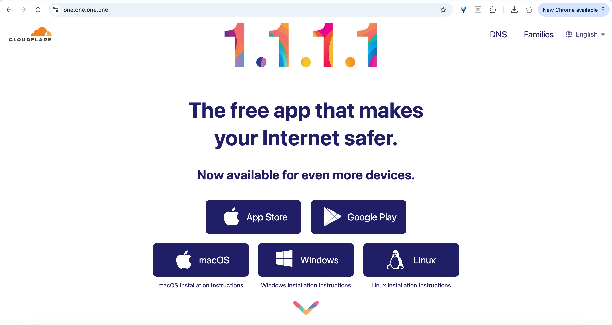
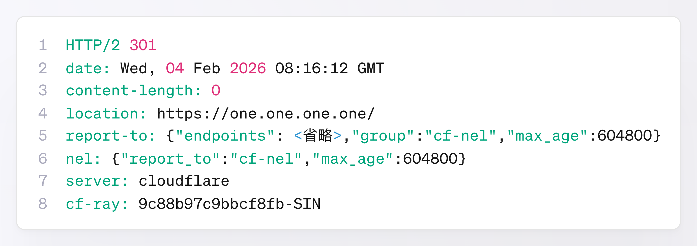
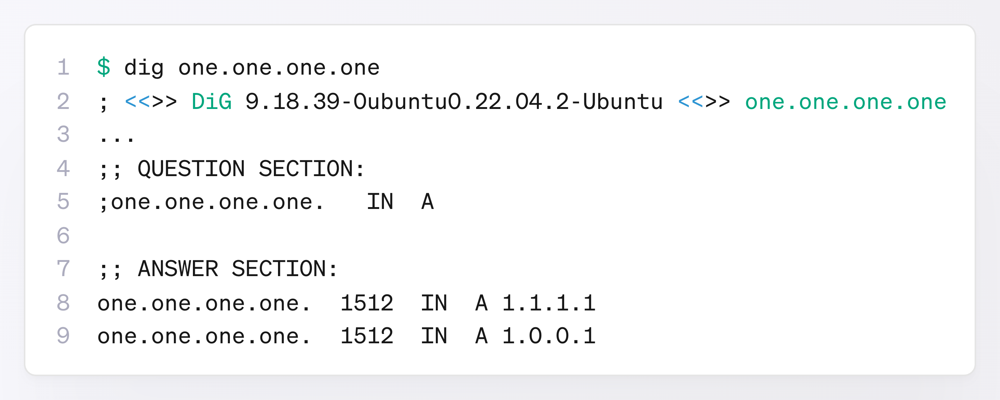
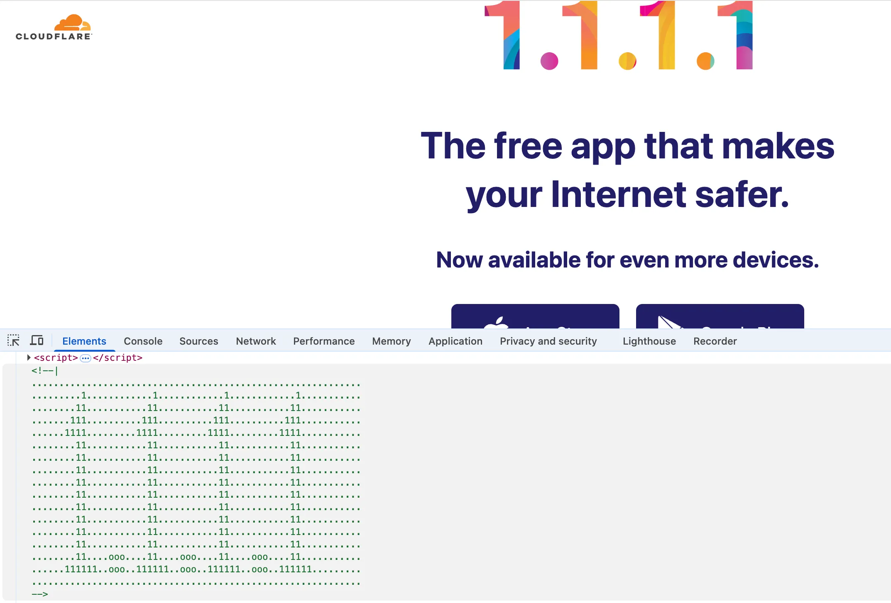
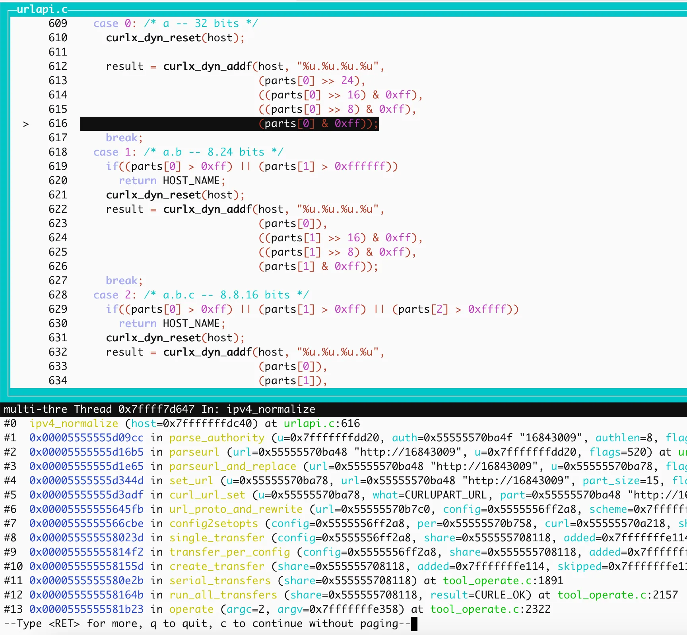

# https://16843009是网址吗？是什么网站的？

https://16843009 怎么看都不像一个网址。

连赵本山饰演的临江村大明白心理诊所的主治医生赵大宝都知道，网址要像“大不溜大不溜大不溜坑你点儿大不了“那样，要有 **3w**，还要有**点儿**（.），结尾还往往是“坑母”（`com`），不“坑你”。


不管是不是网址，先在浏览器的地址栏中输入 `https://16843009` 试试吧。

按下回车键，一个精美的页面展现在眼前，这是 Cloudflare（就是去年导致大量网站出现故障的那个 Cloudflare）提供的公共 DNS 服务的主页。此时，地址栏中的网址变成了 `https://one.one.one.one/`。



我们可以用 `curl` 命令来探索一下：**在浏览器中按下回车键后，究竟发生了什么**。
执行下面这条命令：

`$ curl -i https://16843009`

可以看到返回结果如下：



```bash
HTTP/2 301
date: Wed, 04 Feb 2026 08:16:12 GMT
content-length: 0
location: https://one.one.one.one/
report-to: {"endpoints": <省略>,"group":"cf-nel","max_age":604800}
nel: {"report_to":"cf-nel","max_age":604800}
server: cloudflare
cf-ray: 9c88b97c9bbcf8fb-SIN
```

这里最关键的一行是：

`location: https://one.one.one.one/`

这表示服务器明确告诉浏览器：**“你要访问的地址实际在这里，请跳转过去”**。

换句话说，访问 `https://16843009`，实际上会被重定向到`https://one.one.one.one/`。

那么，问题来了：`16843009` 明明只是一个普通的整数，它和看起来更像域名的 `one.one.one.one` 之间，究竟有什么关系？

既然 `one.one.one.one` 是域名，那它对应的 IP 地址是什么呢？答案也不出所料，正是网页上色彩缤纷的 `1.1.1.1`：



```bash
$ dig one.one.one.one
; <<>> DiG 9.18.39-0ubuntu0.22.04.2-Ubuntu <<>> one.one.one.one
...
;; QUESTION SECTION:
;one.one.one.one.		IN	A

;; ANSWER SECTION:
one.one.one.one.	1512	IN	A	1.1.1.1
one.one.one.one.	1512	IN	A	1.0.0.1
```

查看网页的源代码，还能看到用字符拼出来的 `1.1.1.1` 呢。



也就是说，`one.one.one.one` 解析到的 IP 地址正是 `1.1.1.1`（以及备用的 `1.0.0.1`）。

于是，问题进一步变成了：**整数 `16843009` 和 IP 地址 `1.1.1.1` 到底是什么关系？**

答案其实很简单：**IP 地址（IPv4）本质上就是一个 32 位无符号的整数**，形如 `a.b.c.d` 的**点分十进制**只是便于人类查看的表示方式。

IPv4 的计算规则是：

`a.b.c.d = a×256³ + b×256² + c×256 + d`

把 `1.1.1.1` 套进公式：

`1×256³ + 1×256² + 1×256 + 1 = 16843009`

所以：

`16843009` 等价于 `1.1.1.1`!

二者只是**同一个 IPv4 地址的不同表示形式**。

这就解释了为什么在浏览器里访问`https://16843009` ，等价于访问`https://1.1.1.1`。而 Cloudflare 正好在 `1.1.1.1` 上挂了一个 Web 服务，并把请求重定向到了 `https://one.one.one.one/`。

## IPv4 地址有几种写法？

事实上，IPv4 地址并不只限于 `a.b.c.d` 的**四段式点分十进制**。早期的实现里，还支持多种表示方式，例如：

- **32 位整数**：`16843009`
- **十六进制**：`0x01010101`
- **八进制**：`001.001.001.001`
- **`a.b` 两段式点分十进制**：`1.65793`（65793=1×256² + 1×256 + 1）
* **`a.b.c` 三段式点分十进制**：`1.1.257`

今天这些写法已经很少使用，但在协议和实现层面仍然被保留。至少在 `curl` 的源码中可以找到历史的痕迹，


