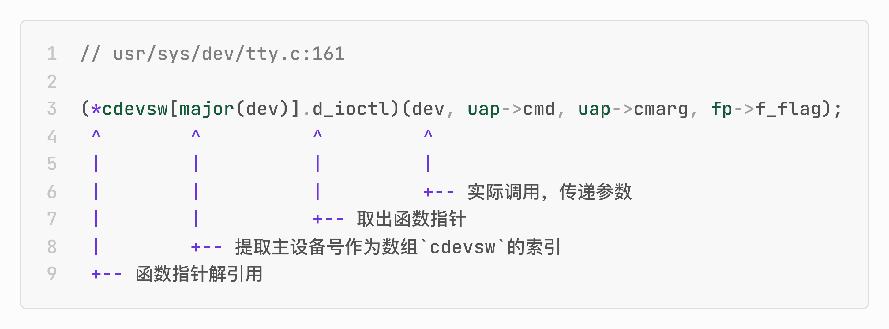
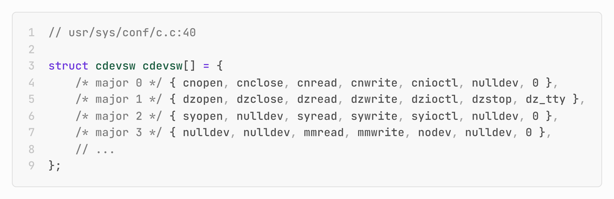

# 1979年 UNIX V7中的一行C代码展现出了面向对象多态的精髓

1979 年 1 月，贝尔实验室发布了 UNIX V7。

那时面向对象编程 OOP 还只是个模糊的学术概念。Smalltalk-76 刚刚在施乐帕克研究中心崭露头角；而 C++ 要到 1985 年才会问世。不过，C++之父 Bjarne Stroustrup 那时已经开始开发 C++ 的前身——“C with Classes”了。

然而，在 UNIX V7 的内核代码中，**仅一行 C 代码就展现出了面向对象多态的精髓**：

```c
(*cdevsw[major(dev)].d_ioctl)(dev, uap->cmd, uap->cmarg, fp->f_flag);
```

```c
// usr/sys/dev/tty.c:161

(*cdevsw[major(dev)].d_ioctl)(dev, uap->cmd, uap->cmarg, fp->f_flag);
 ^        ^          ^         ^
 |        |          |         |
 |        |          |         +-- 实际调用，传递参数
 |        |          +-- 取出函数指针
 |        +-- 提取主设备号作为数组`cdevsw`的索引
 +-- 函数指针解引用
```



这行代码是 UNIX V7 新增的系统调用`ioctl()` 的核心调度逻辑。`ioctl()` 用于对设备文件进行特定的控制操作，比如设置终端模式、获取硬件状态或控制硬件行为等。这里用纯粹的 C 语言，在**没有 `class`、没有继承、没有虚函数**的年代，实现了一个优雅的多态系统。

相当于今天“接口”或“抽象基类”的“契约”定义在 `struct cdevsw`中：

```c
// usr/sys/h/conf.h:18

/*
 * Character device switch.
 */
extern struct cdevsw
{
	int	(*d_open)();
	int	(*d_close)();
	int	(*d_read)();
	int	(*d_write)();
	int	(*d_ioctl)();
	int	(*d_stop)();
	struct tty *d_ttys;
} cdevsw[];
```


相当于“实现类”的设备驱动必须提供这些函数的实现。UNIX V7 在 `cdevsw[]` 中构建了全局驱动表：



```c
// usr/sys/conf/c.c:40

struct cdevsw cdevsw[] = {
    /* major 0 */ { cnopen, cnclose, cnread, cnwrite, cnioctl, nulldev, 0 },
    /* major 1 */ { dzopen, dzclose, dzread, dzwrite, dzioctl, dzstop, dz_tty },
    /* major 2 */ { syopen, nulldev, syread, sywrite, syioctl, nulldev, 0 },
    /* major 3 */ { nulldev, nulldev, mmread, mmwrite, nodev, nulldev, 0 },
    // ...
};
```

这是一个**二维的函数指针表**：第一维是主设备号（major number）；第二维是操作类型（open/close/read/write/ioctl/stop）。当用户调用 `ioctl(fd, cmd, arg)` 时，该系统调用的逻辑是：

1. 设备识别：从文件描述符 `fd` 获取设备号 `dev`
2. 索引计算：`major(dev)` 提取主设备号（如 `1` 代表设备 `DZ11`）
3. 函数查找：`cdevsw[1].d_ioctl` 找到 `dzioctl` 函数的实现
4. 动态调用：通过函数指针调用，传递参数

多态的本质是，**同一个操作作用于不同的对象，可以有不同的解释和实现**。在 `ioctl()` 这个系统调用中：

- 统一接口：所有设备驱动都提供 `d_ioctl()` 函数的实现（相当于重写抽象方法）
- 不同实现：该函数的具体实现 `dzioctl()`、`cnioctl()`、`syioctl()` 各不相同
- 动态绑定：根据设备类型在运行时选择正确的实现
- 封装细节：调用者不需要知道具体设备类型

2026 年的今天，我们已经习惯了 `abstract class`、`interface` 或 `trait`。但在 1979 年，用纯粹的 C 语言构建实现多态，需要的不仅是技术能力，更是设计洞察力。

这一行 C 代码告诉我们：

1. **多态不依赖语言特性**：核心是思想，而非语法糖
2. **约束激发创造力**：C 语言的限制反而促成了更清晰的设计
3. **简单性是终极复杂性**：看似简单的一行代码，背后是整个架构的支撑
4. **好的设计超越时代**：47 年后，这个模式依然在无数系统中使用