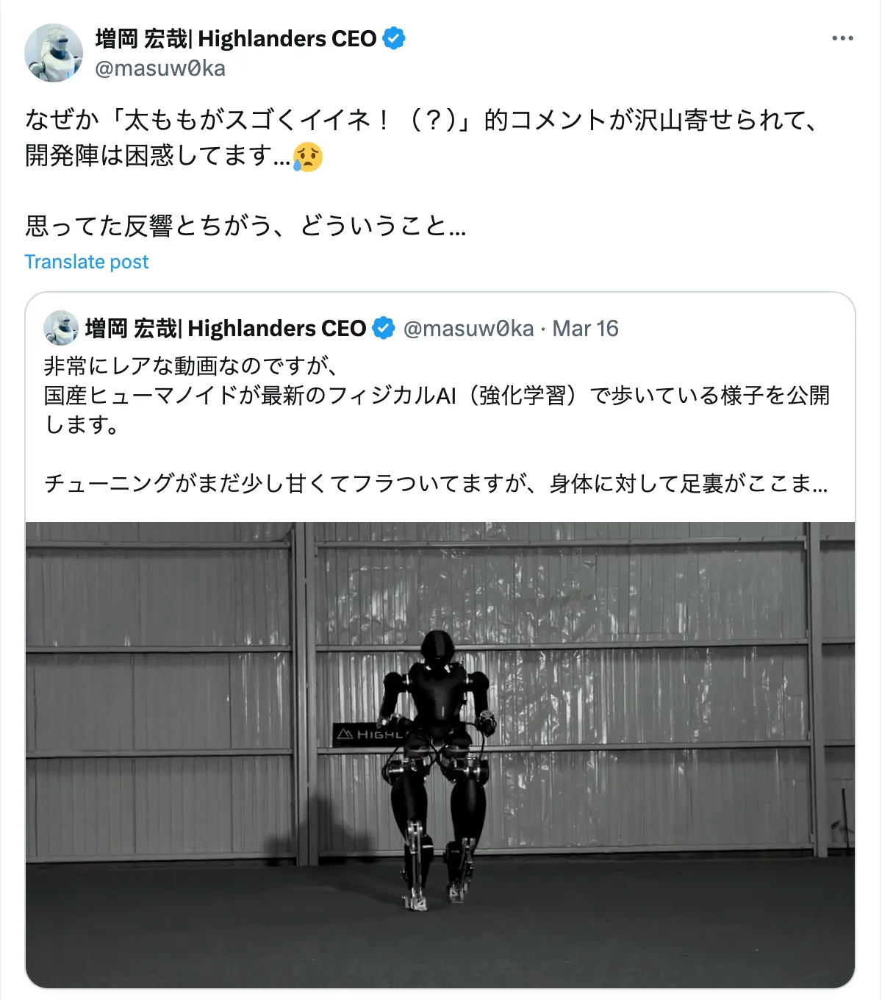
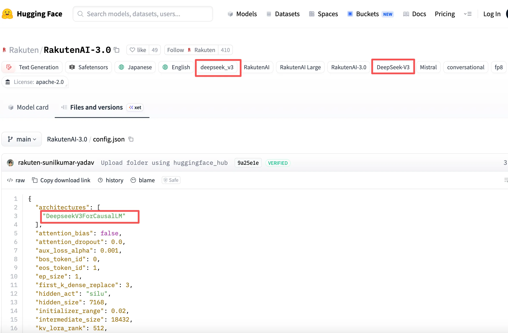

# 日本AI产业近日的尴尬小时刻：机器人靠大腿出圈，模型被扒“套壳”

这两天，日本 AI 圈接连发生了两件有点尴尬、甚至略带讽刺意味的事。一个是机器人，一个是大模型，合在一起看，还挺能说明一些问题的。

## 机器人的大腿意外“走红”

3 月 16 日，东京大学背景的创业公司 Highlanders 放出了一段人形机器人走路的视频。

🎬

该公司成立于 2023 年，口号是“用机器人消除劳动”（労働をロボットで一掃する）。这段视频的本意很明确——展示基于强化学习的机器人双足行走能力。

CEO 增岡宏哉还专门解释说：虽然现在走得还不太稳，但证明已经可以用比较小的足底面积完成行走了。

按理说，这应该是个偏技术向的展示，评论也应该围绕着技术。结果网友的关注点完全跑偏。

评论区画风大概是这样：

> "太ももがスゴくイイネ！"（这大腿也太可以了）

技术细节没人细看，反倒是机器人的“大腿”意外出圈。

面对铺天盖地的“大腿”，CEO 只能无奈发帖：“开发团队完全困惑了……”

当然，也不是完全没有人讨论技术。有不少人直接点破：

和中国的人形机器人相比，稳定性差距还是挺明显的。

## 楽天 AI 模型：一场“是不是日本自研”的风波

几乎在同一时间，楽天集团发布的日语大语言模型“**Rakuten AI 3.0**”也陷入了争议。

3 月 17 日，该模型在 Hugging Face 平台上以 Apache 2.0 开源许可发布。楽天强调这是“高性能的日语处理”的**自研 AI**。该项目还获得了日本经济产业省 GENIAC 项目的补助支持，牌面不小。

但细心的开发者很快发现，在 Hugging Face 页面中，多处出现了中国 AI 公司 DeepSeek 的标记，特别是在配置文件 `config.json` 文件中，明确指定了“**DeepSeek-V3**”作为架构基础。

这引发了日本网民的质疑风暴。面对质疑，楽天的回应却显得遮遮掩掩，只解释说 Hugging Face 页面上的 DeepSeek 标记是“系统自动生成的”。

但技术人员指出，`config.json` 中的架构声明是人为配置的，不太可能由系统自动生成。

有网友犀利评论道：“海外 AI 模型做底座，日本企业做微调，这本身没问题。问题是为什么不能坦诚相告？”

----

一个是机器人：能走，但不够稳；一个是大模型：能做，但底座依赖海外。两件事都折射出日本在 AI 和机器人领域面临的技术追赶压力与透明度困境。

毕竟，在全球化的开源时代，“站在巨人肩膀上”并非耻辱，讳莫如深才会失去信任。
